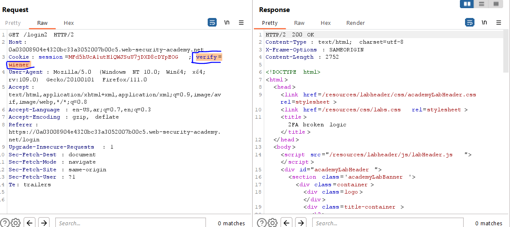
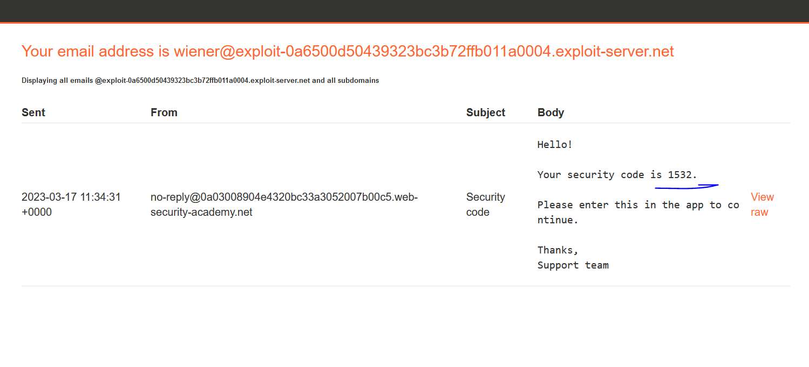

# Lab: 2FA simple bypass

**Link**: https://portswigger.net/web-security/authentication/multi-factor/lab-2fa-simple-bypass

**Solution**:

The normal flow is navigate user to /login2 to enter the verification code and after that redirect it /my-account

To bypass it, after logging, just navigate manually to /my-account

  

change /login2 to /my-account

  

