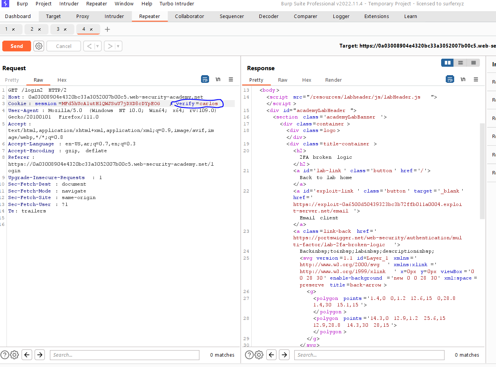
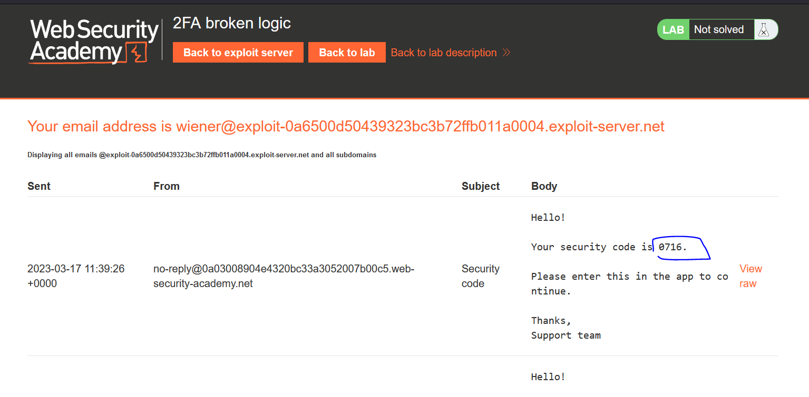
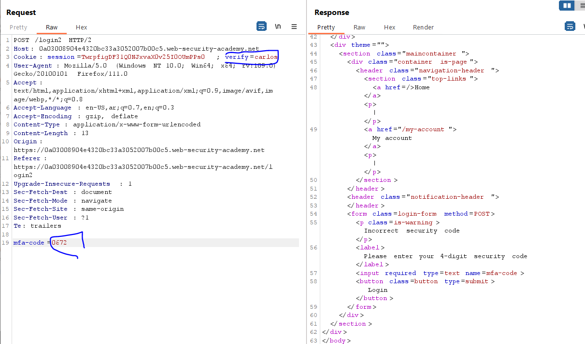
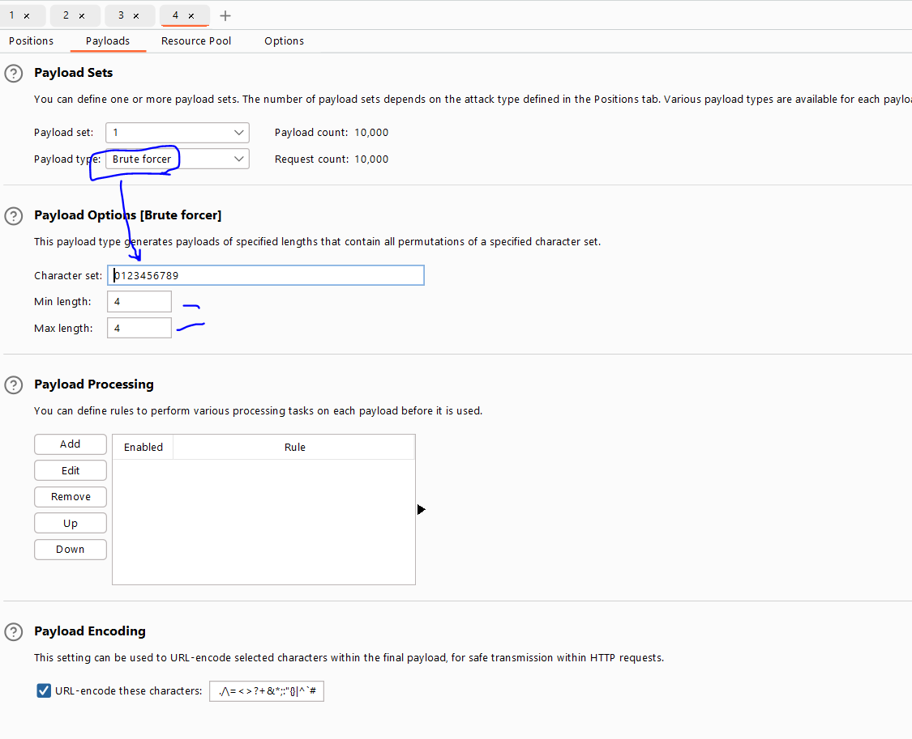
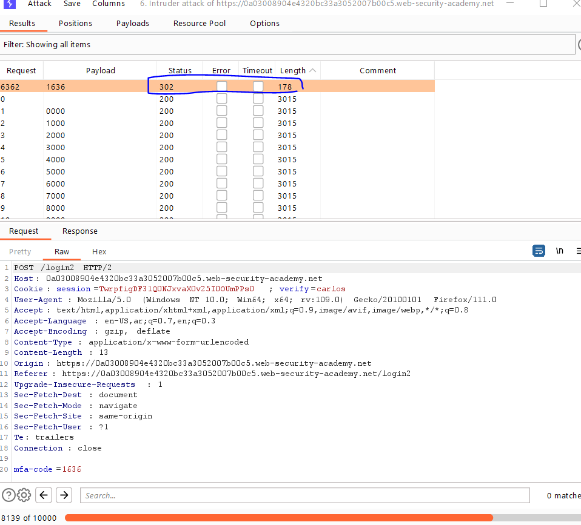
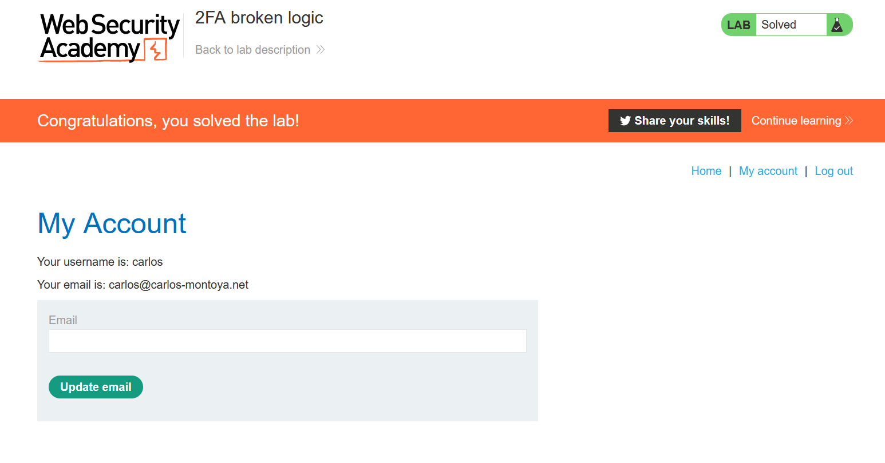

# Lab: 2FA broken logic

**Link**: https://portswigger.net/web-security/authentication/multi-factor/lab-2fa-broken-logic

**Solution**:

This lab needs to access Carlos account without any password with your 2FA.

If we discover the login flow with our credentials.

We will notice in GET request /login2, it takes the username which will send the verification code to my email.

  

  

If we changed this flag to 

  

  

And in the POST request of /login2, there it takes 2fa-code parameter

  

we will brute-force this code using burp intruder.

  

  

  

