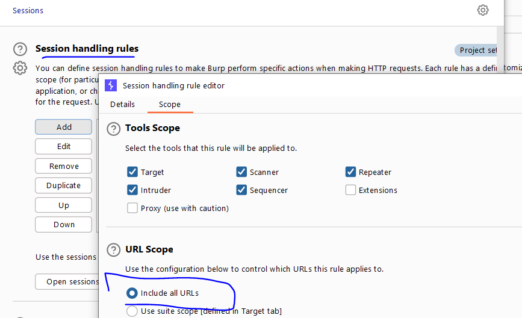
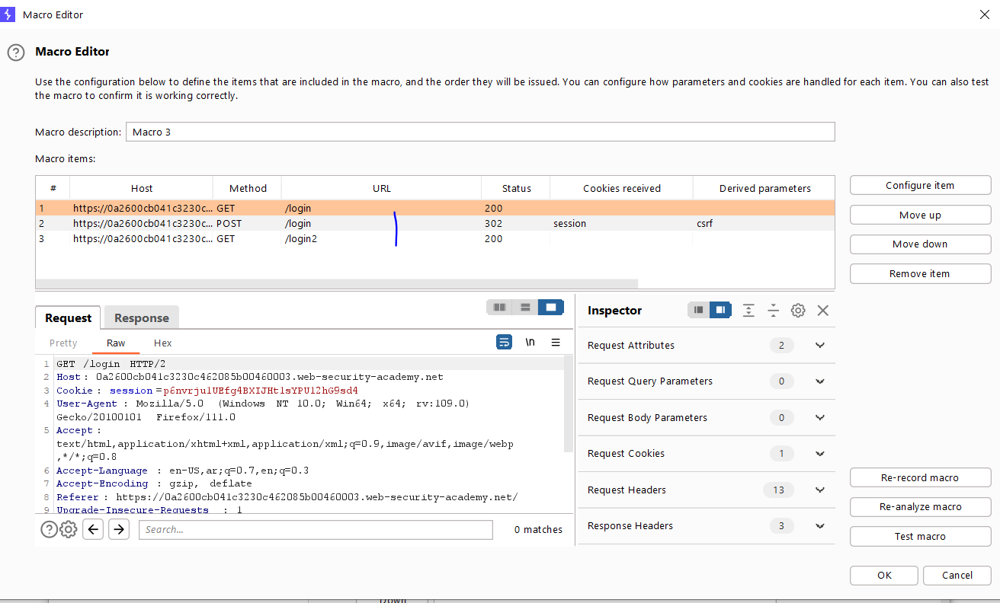
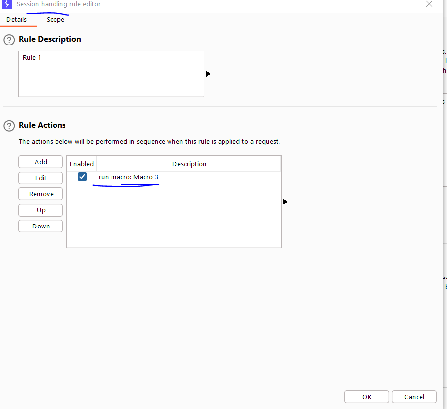
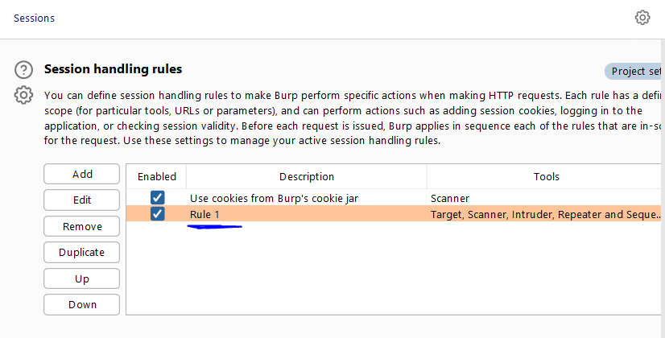
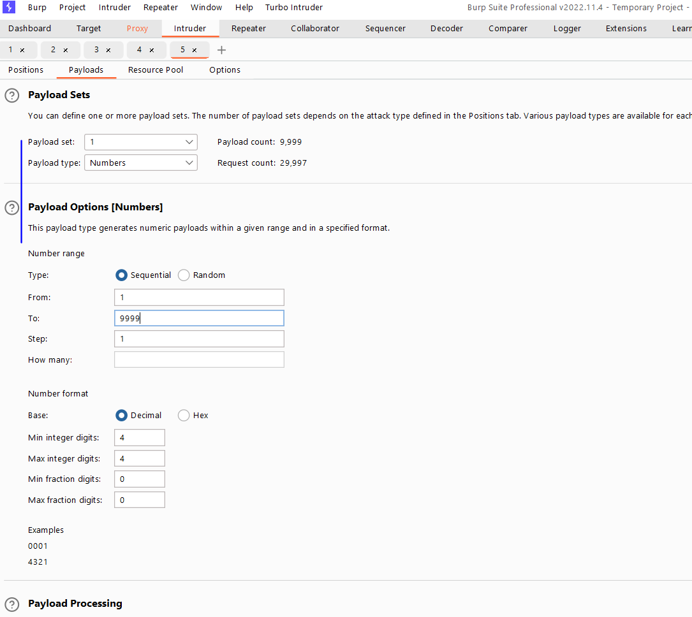
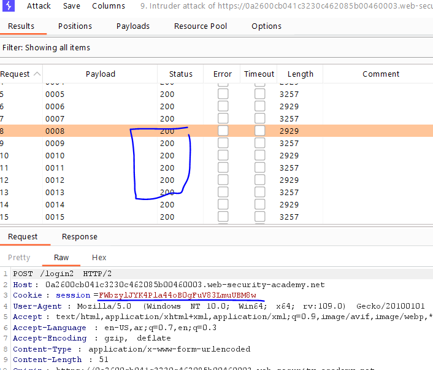
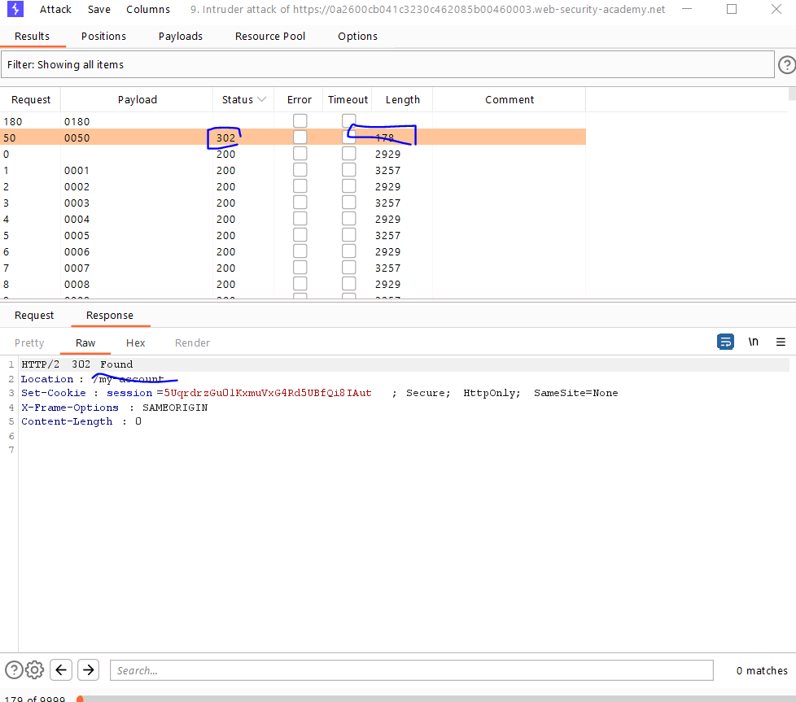
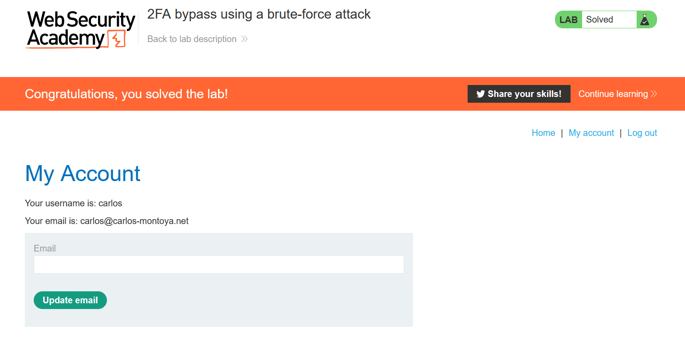

# Lab: 2FA bypass using a brute-force attack

**Link**: https://portswigger.net/web-security/authentication/multi-factor/lab-2fa-bypass-using-a-brute-force-attack

**Solution**:

This lab, If I entered a wrong 2fa-code twice, it return me to login page with different session token and CSRF.

We will brute force using [Macros](https://portswigger.net/burp/documentation/desktop/settings/sessions#macros) which we define a sequence of requests which if the request failed, it will update the session and CSRF token with new ones in the next requests.

Burp Setting > sessions > session handling rules

Change scope

  

Add new Rule Action

with the following requests sequence

- GET /login (to get new sessions)
- POST /login (add the credentails)
- GET /login2
  

  

  

  

And in the POST request of 2fa-code, send it to the intruder to brute force 2fa codes

  

And change the concurrent request pool to 1 max

You will find in the requests, it automatically changes the session token and CSRF token when failed

  

here we find the code `0050`

  

Show the response in the browser.

  

