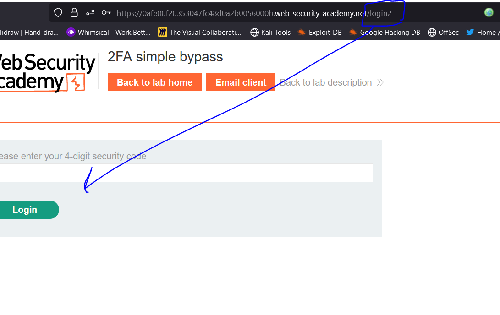
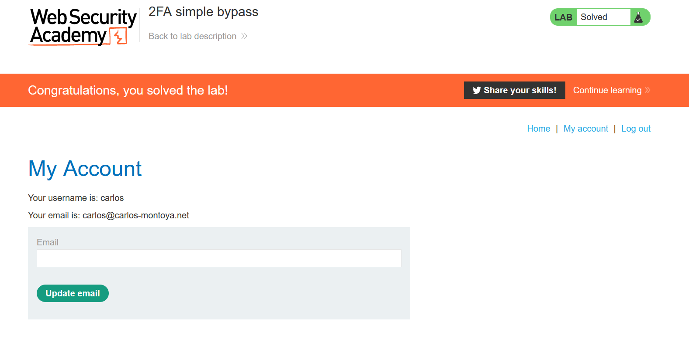

# Lab: Broken brute-force protection, multiple credentials per request

**Link**: https://portswigger.net/web-security/authentication/password-based/lab-broken-brute-force-protection-multiple-credentials-per-request

**Solution**:

This lab, the username and password is send through the request body in JSON format

  

So, In password Instead of passing it string, we will pass it list of strings

  

return 302 redirect, show the response in the browser

  

