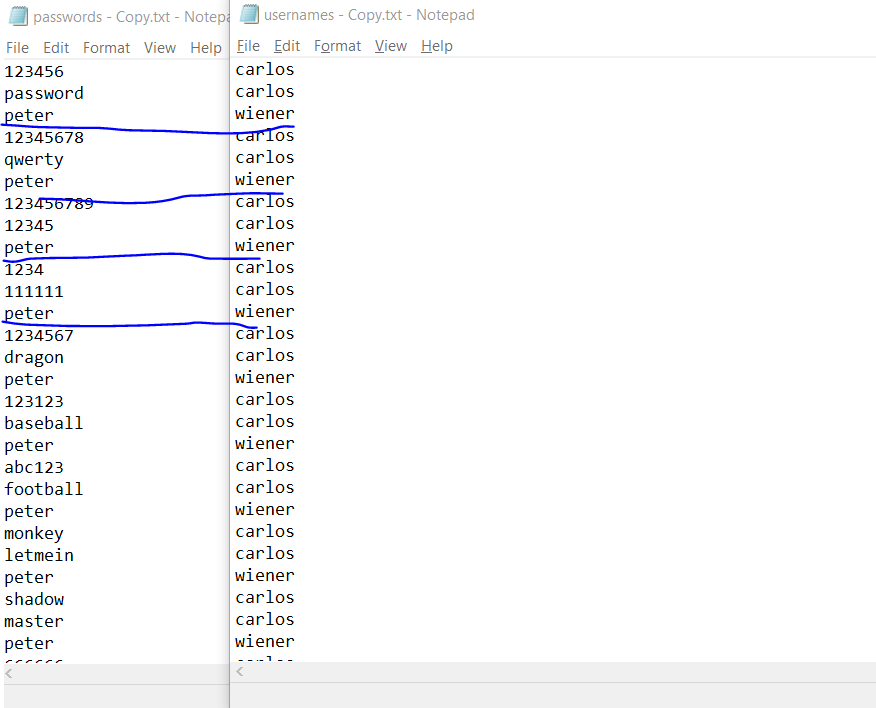
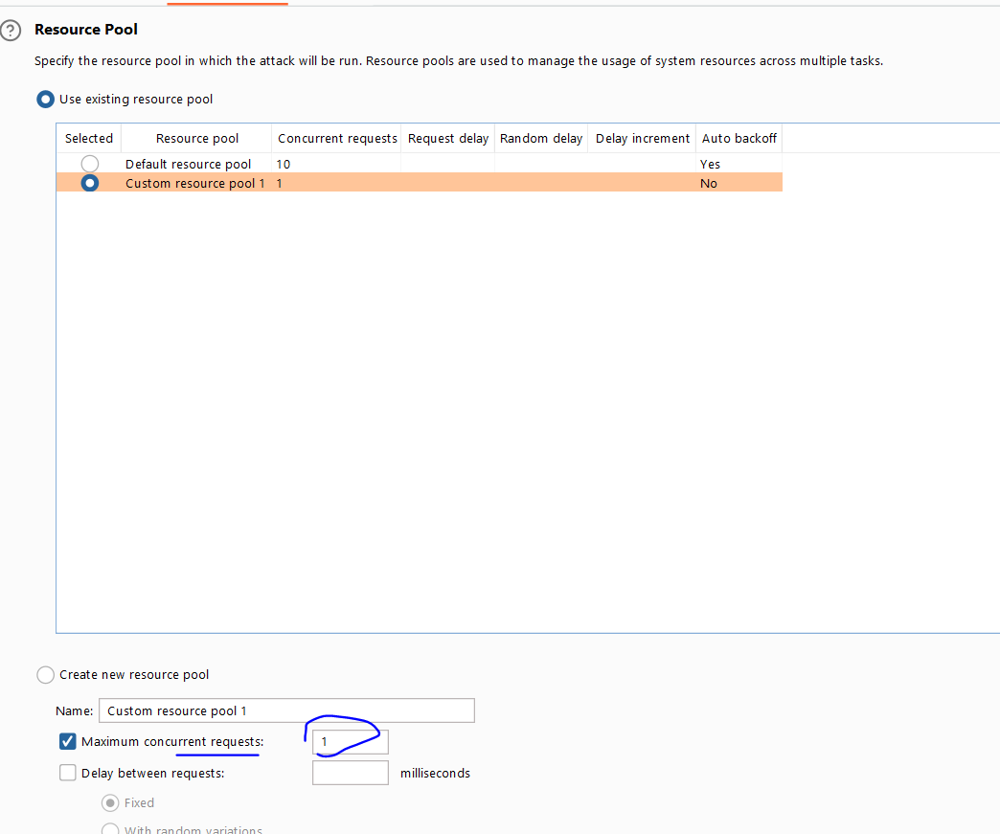
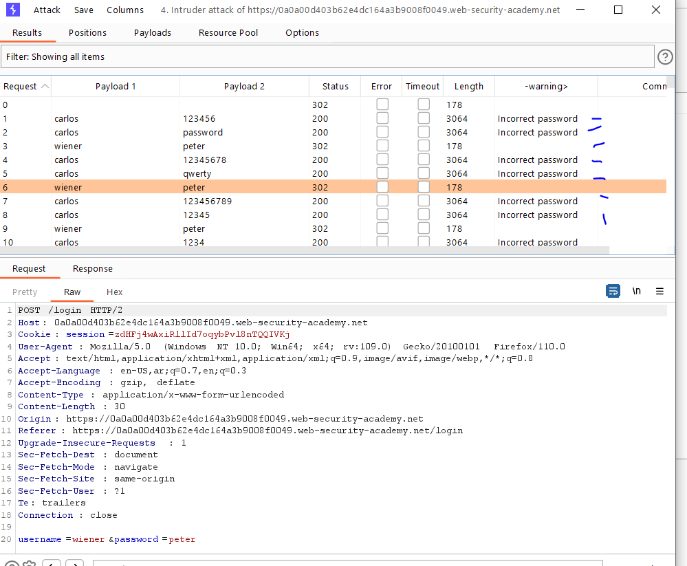
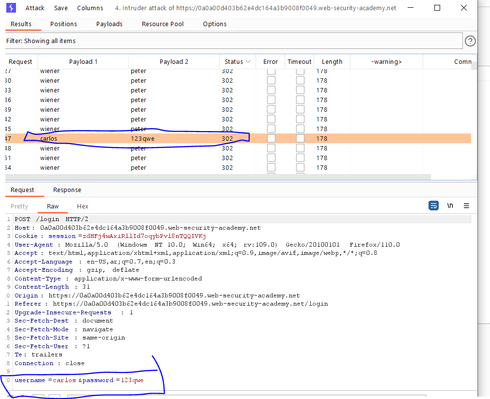

# Lab: Broken brute-force protection, IP block

**Link**: https://portswigger.net/web-security/authentication/password-based/lab-broken-bruteforce-protection-ip-block

**Solution**:

في اللاب دا هو بيعمل بلوك ليك بعد عدد 3 محاولات .. وانت اوريدي معاك ايميل صحيح وايميل الضحية

محتاج تقعد تجرب في الباسوردات

ف الحل انك تبعت اثنين غلط وواحد صح بحيث كأنة رجع تاني للصفر

We can make it using Turbo Intruder or just manually through create two txt files to switch between them.

I have created manually two txt files to simulate this scenario

  

Added [passwords.txt](passwords - Copy.txt) and [usernames.txt](usernames - Copy.txt) to Intruder.

  

You will find we bypassed the IP protection

  

Here is the password

  

