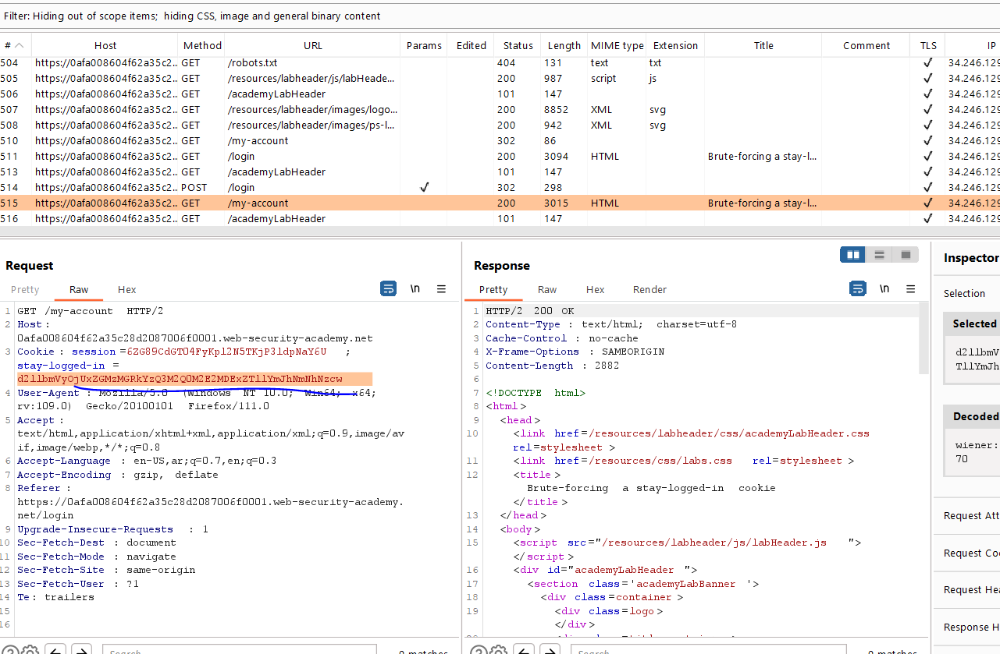
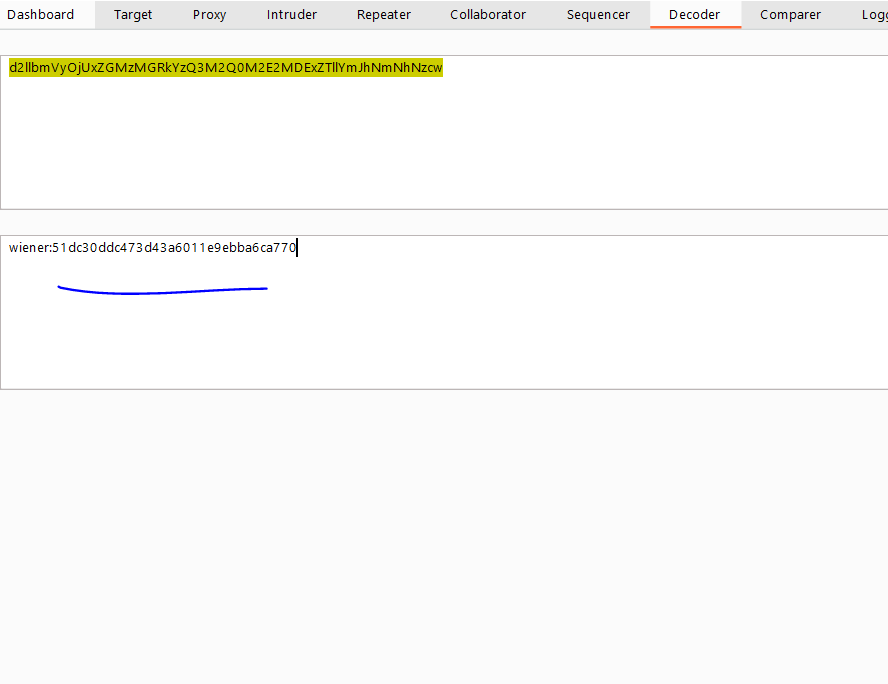
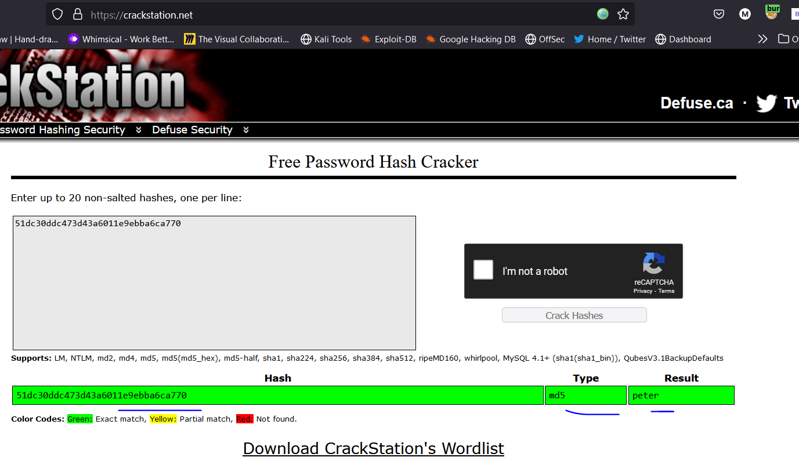
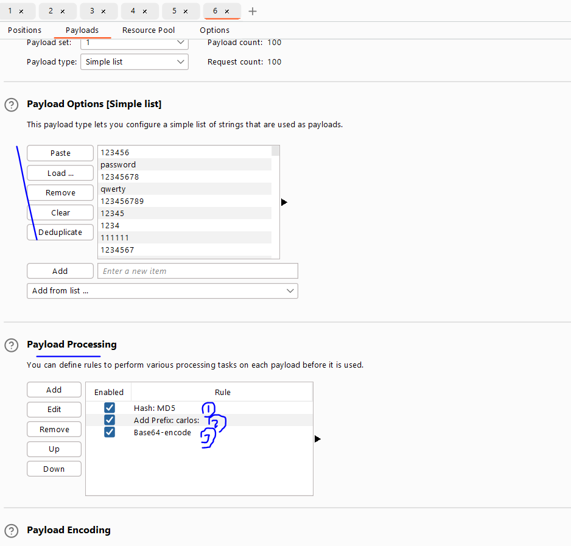
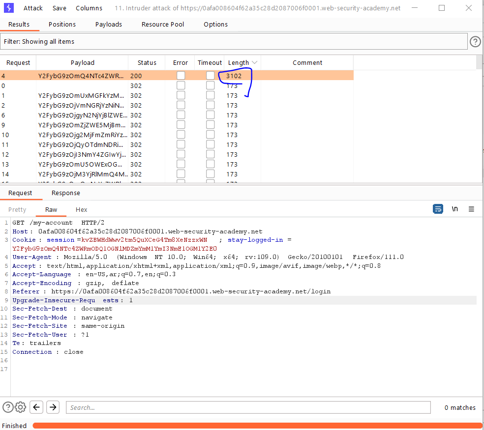
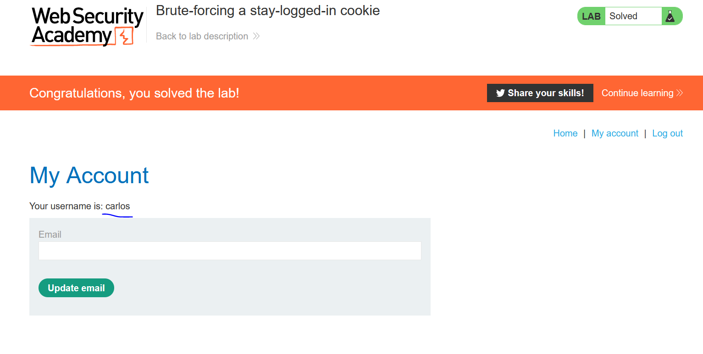

# Lab: Brute-forcing a stay-logged-in cookie

**Link**: https://portswigger.net/web-security/authentication/other-mechanisms/lab-brute-forcing-a-stay-logged-in-cookie

**Solution**:

In this lab, we found stay-logged-in header which have the username and password encoded into base64, and the password is hashed into md5

  

  

  

So, we will send this request to intruder with changing the value of stay-logged-in header

In the payloads, we will add payload processing to match the exact shape it provide.

  

  

  

