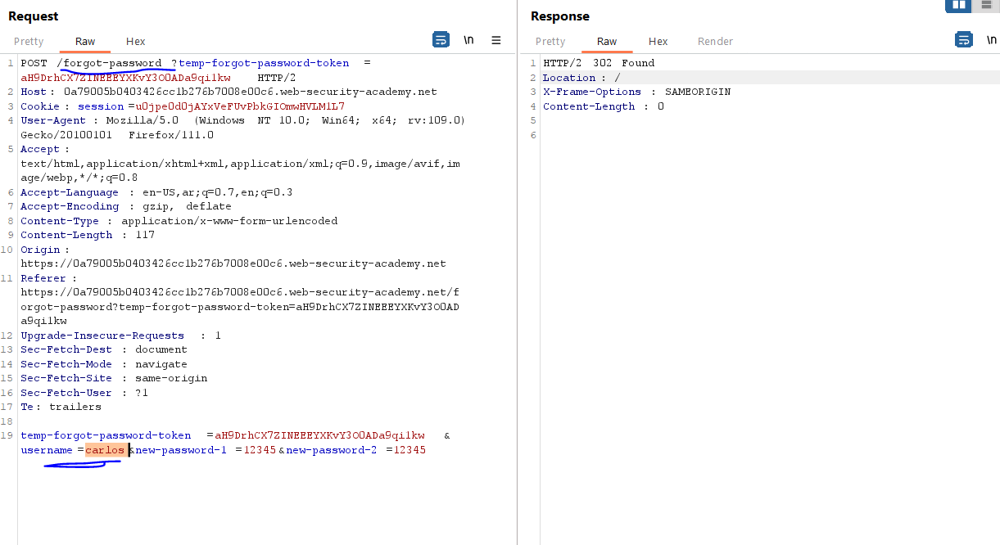
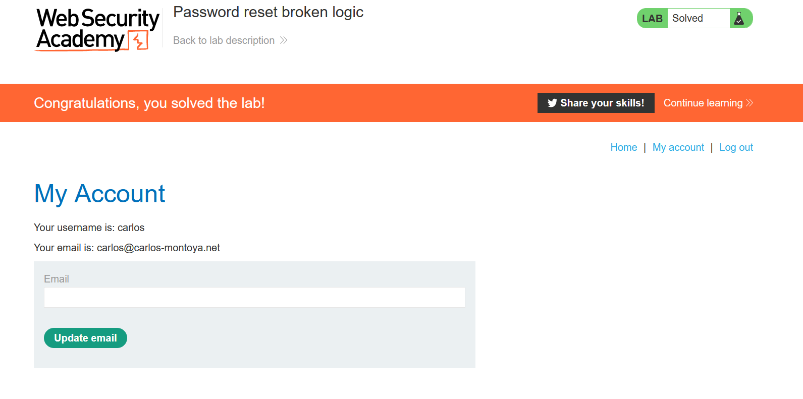

# Lab: Password reset broken logic

**Link**: https://portswigger.net/web-security/authentication/other-mechanisms/lab-password-reset-broken-logic

**Solution**:

In this lab, if we follow the flow of rest password, and click in the email sent.

It takes the username in the forget-password.

  

if we change the username, it will accept it

  

