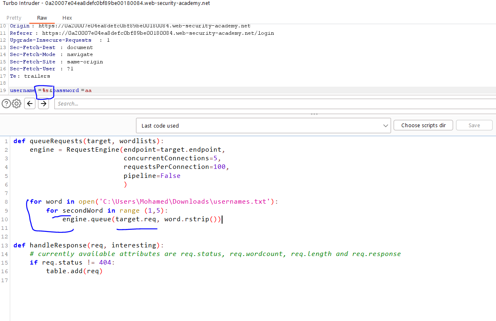
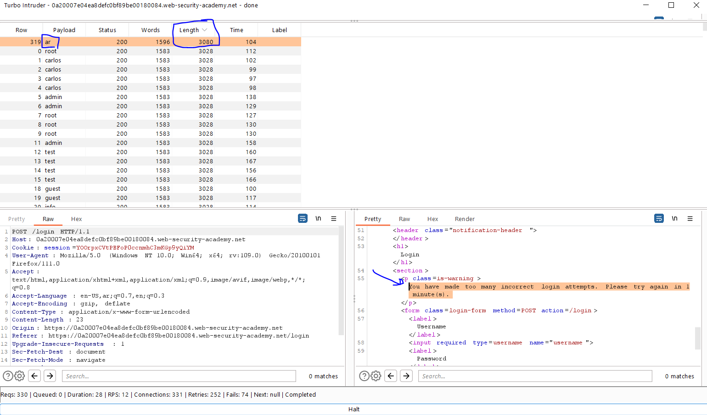
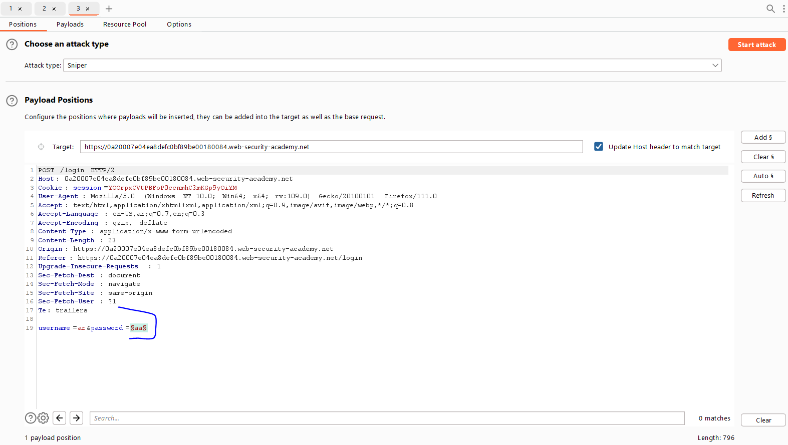
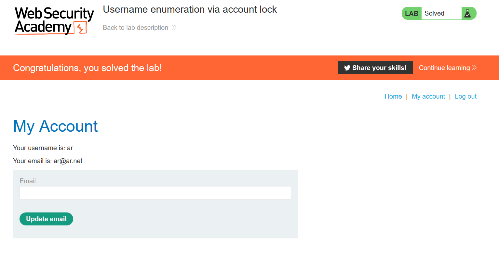

# Lab: Username enumeration via account lock

**Link**: https://portswigger.net/web-security/authentication/password-based/lab-username-enumeration-via-account-lock

**Solution**:

The logic flaw behind this lab, that its block only valid username attempts (the invalid username is not getting blocked).

To solve this lab, we will brute-force using Turbo Intruder with the list of usernames to see which one will be block (in this case will be a valid username).

- Repeat the same username with 5 requests

  

After starting attack.

We will see different length types for different message

  

so `ar` is a valid username, we brute-force passwords.

  

In the passwords lists, we will notice that the valid password don’t return any error messages.

  

so `username=ar&password=amanda` is the correct username and password

  

