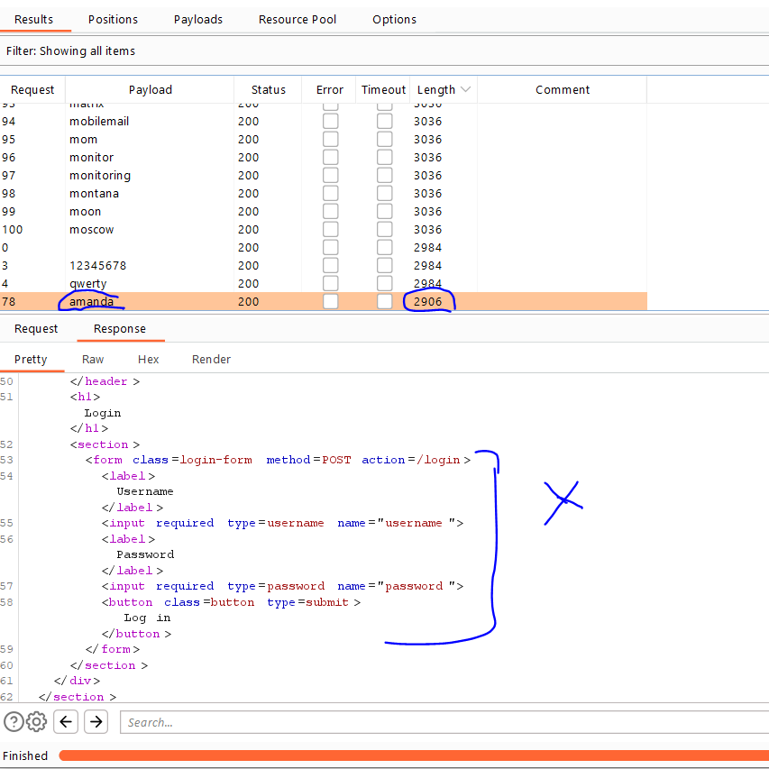

# Lab: Username enumeration via response timing

**Link**: https://portswigger.net/web-security/authentication/password-based/lab-username-enumeration-via-response-timing

**Solution**:

In this lab, we will notice that if the username is valid, it will take much time to response than the normal request.

But there is a IP protection which block your IP if you send it many times.

  

To bypass it, we will spoof it using `X-Forwarded-For` header and define it different IP address

  

So, for now we will send the intruder with different IPs in each request.

  

Notice, here we identified two different places to be changes in each request. So we must choose attack type to `Pitchfork` which treat each place separately.

 For first payload
 

  

For second payload

  

In the results, we will filter it using `Time Completed` column

  

So `vagrant` is the username based on time delay.

We will brute force it with password lists

  

  

