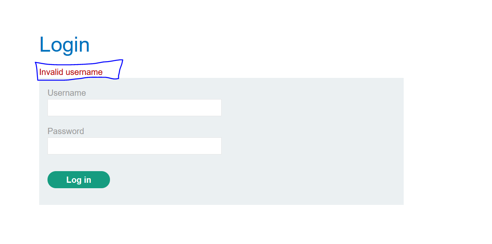
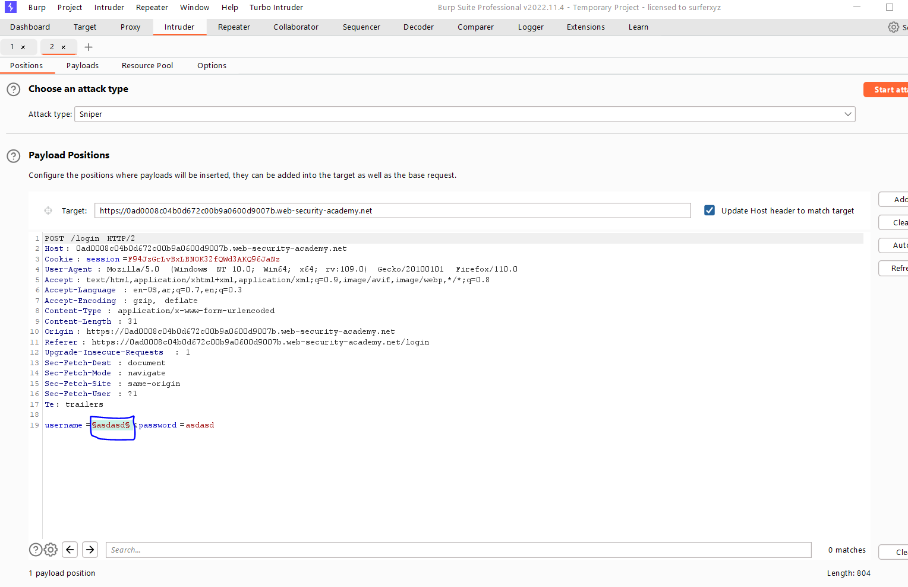
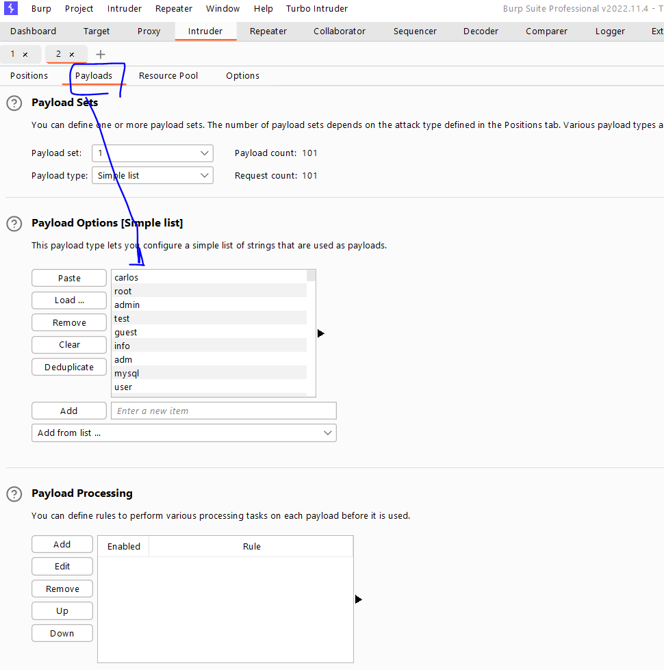
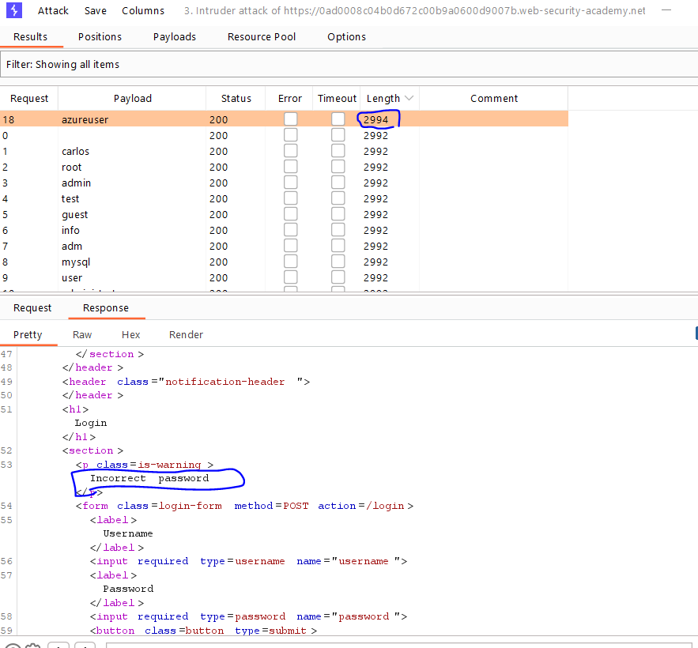
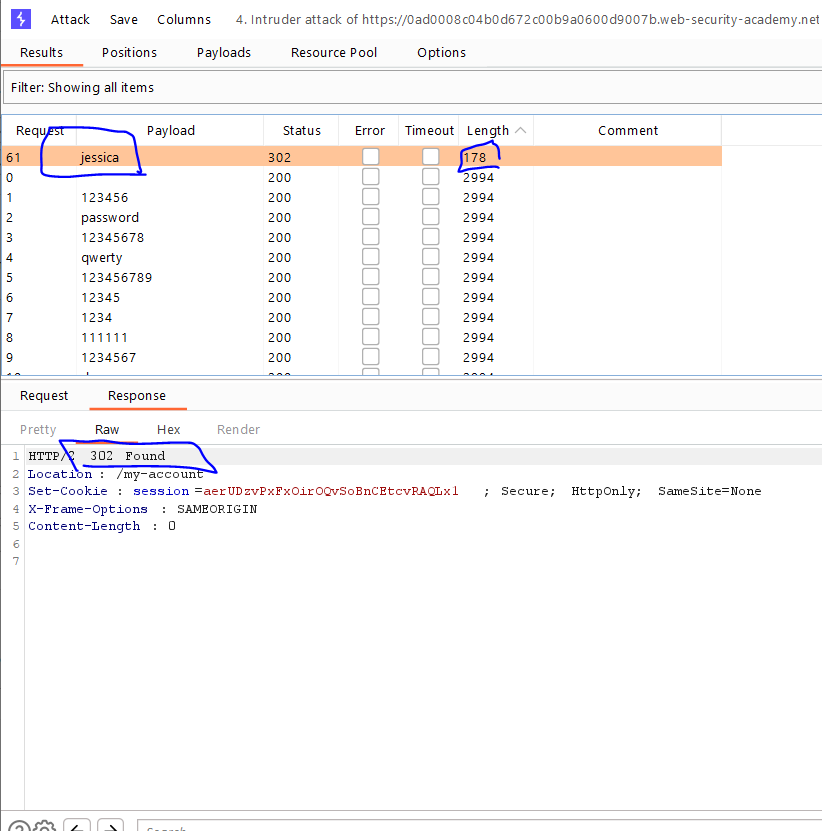
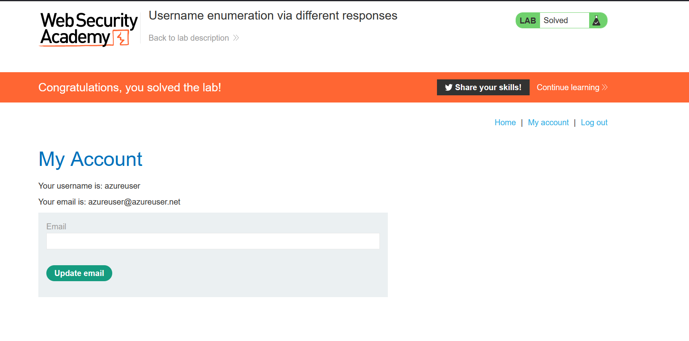

# Lab: Username enumeration via different responses

**Link**: https://portswigger.net/web-security/authentication/password-based/lab-username-enumeration-via-different-responses

**Solution**:

In this lab, we will brute force usernames. 

When I tried to enter a invalid username and password, it gives me that this username only is invalid. So we will enumerate usernames until one of them is valid.

  

We will use this list of usernames and pass it to Turbo Intruder (for concurrently requests) or Intruder [usernames.txt](/usernames.txt)

  

  

  

Click StartAttack, after completed, Check/filter requests length to see different responses

  

This mean that this username is correct

We will freeze this username, and brute-force the password

  

This means the correct password is `jessica`

  

  

