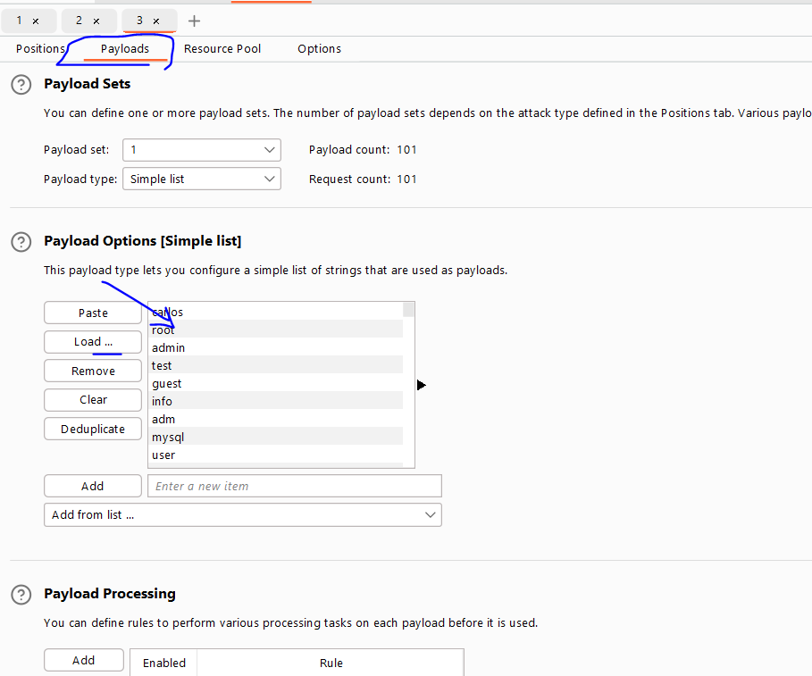
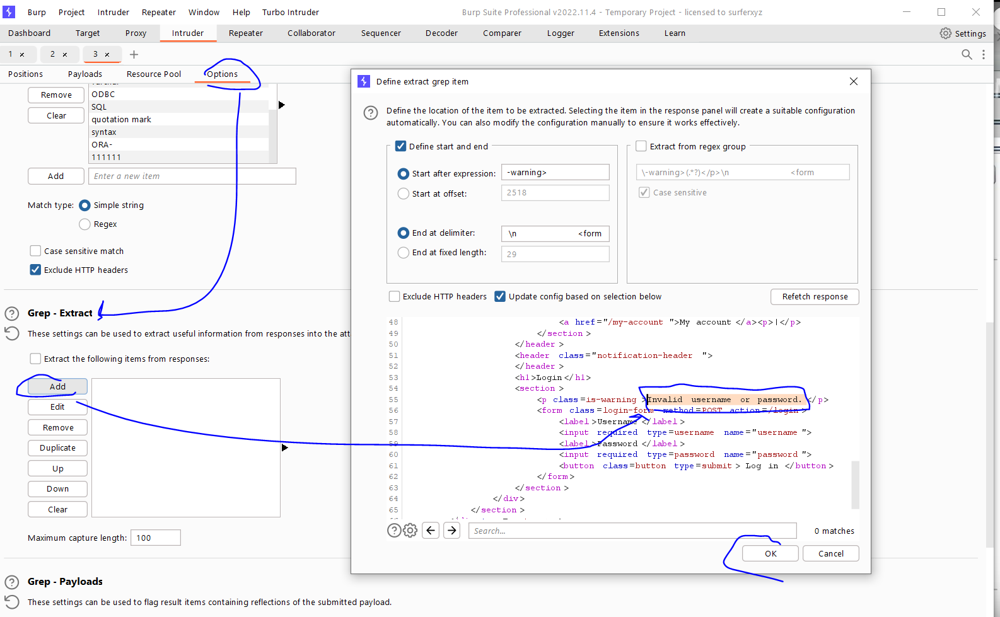
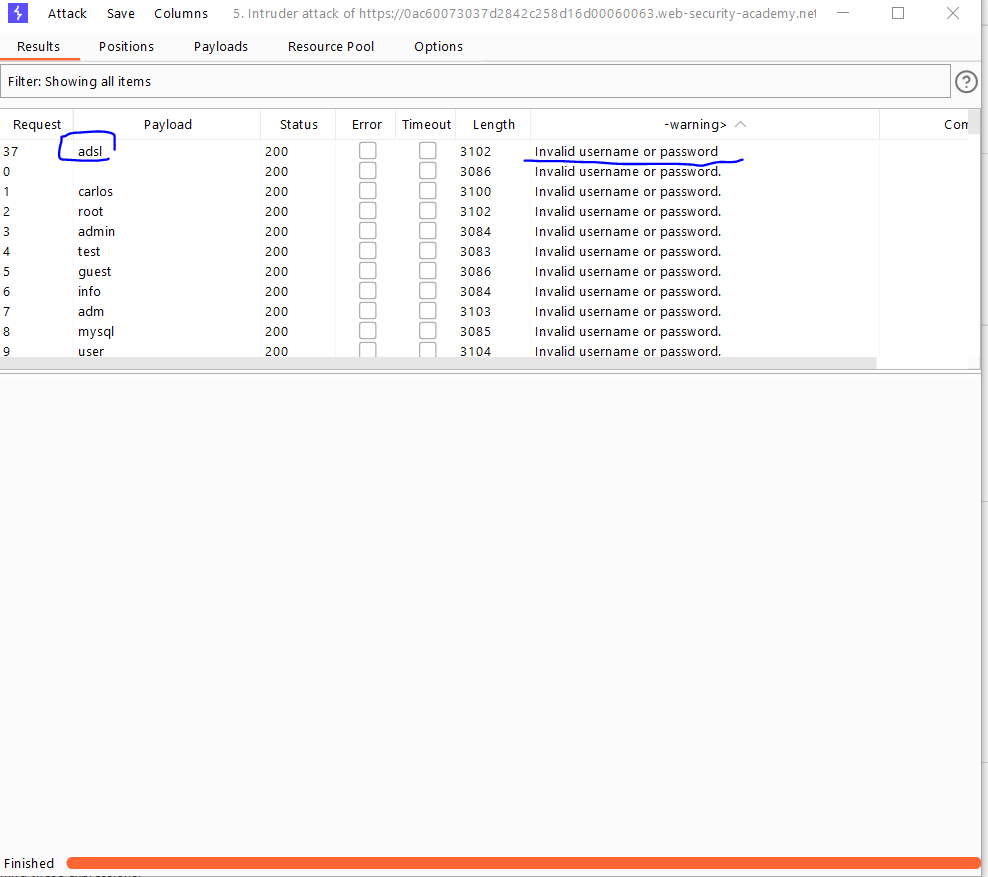
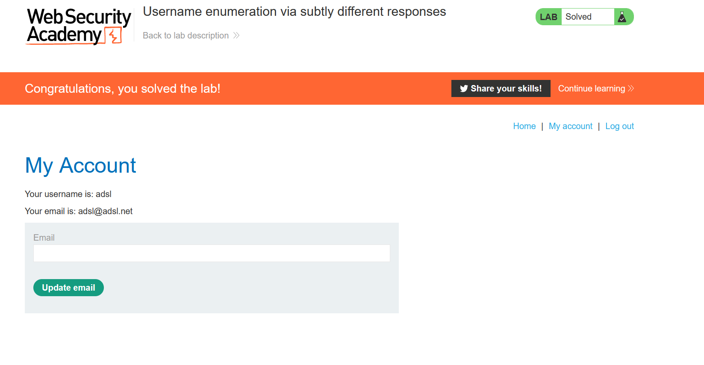

# Lab: Username enumeration via subtly different responses

**Link**: https://portswigger.net/web-security/authentication/password-based/lab-username-enumeration-via-subtly-different-responses

**Solution**:

This lab like the previous one, but it shows `Invalid name or password`

  

So you cannot predict which username is valid.

We will brute brute-force the usernames first to see if there any differences in the error message.

We can make it by Intruder and In Options> Grep - Extract (to extract differences responses based on your selection)

  

  

  

We will see that there is different response message in final dot (.)

  

This means that `asdl` is valid username

We will do the same like previous lab to brute-force the passwords

  

  

