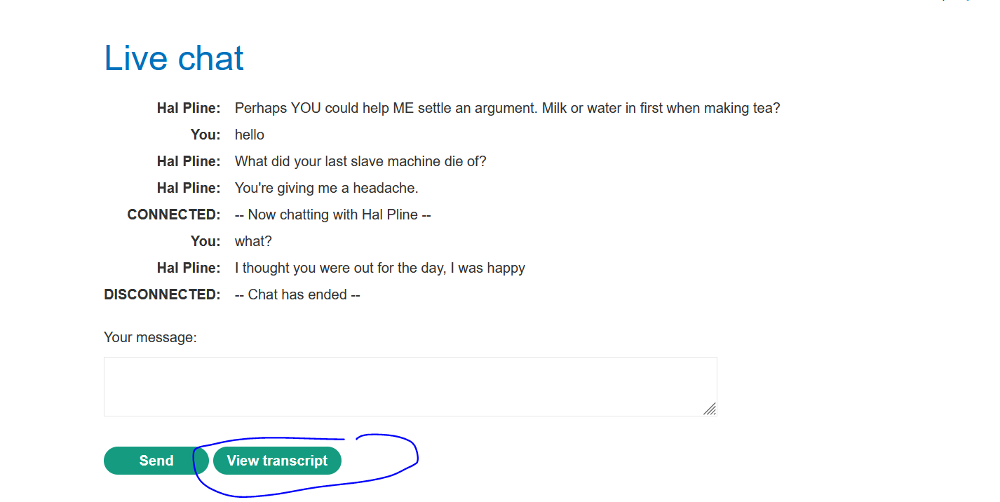
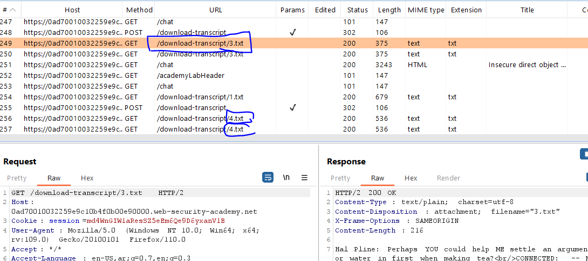
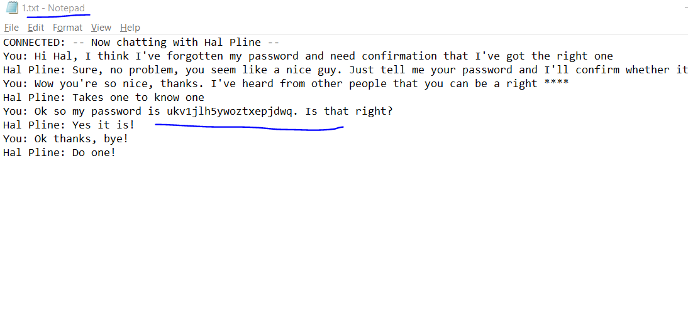
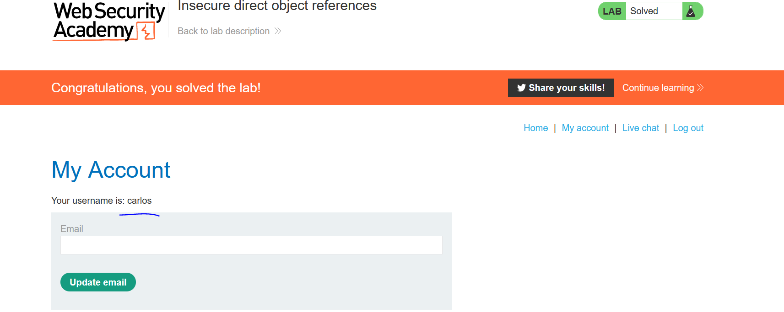

# Lab: Insecure direct object references

**Link**: https://portswigger.net/web-security/access-control/lab-insecure-direct-object-references

**Solution**:

Notice in chat feature, there is view transcript (which created txt file and store it into file system)

  

The problem it download it as `int` with name 2.txt or 3.txt … etc

This is the Full URL

  

we can download any objects that belong to someone else from `/download-transcript/<any-in-secure-object>.txt`

If we navigate to `download-transcript/1.txt` we will see the chat with Calors containing sensitive info

  

  

