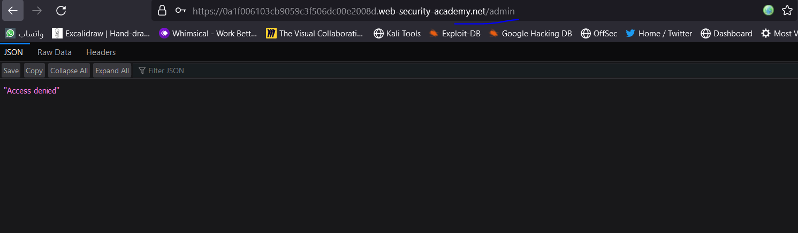
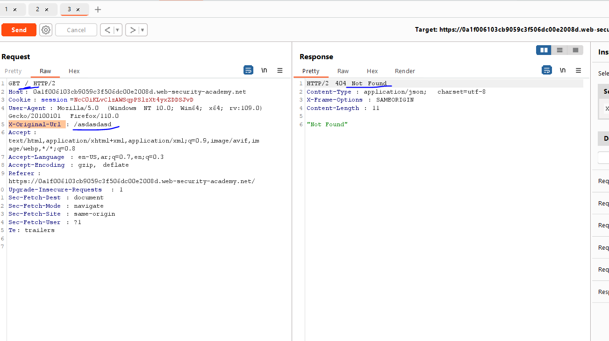
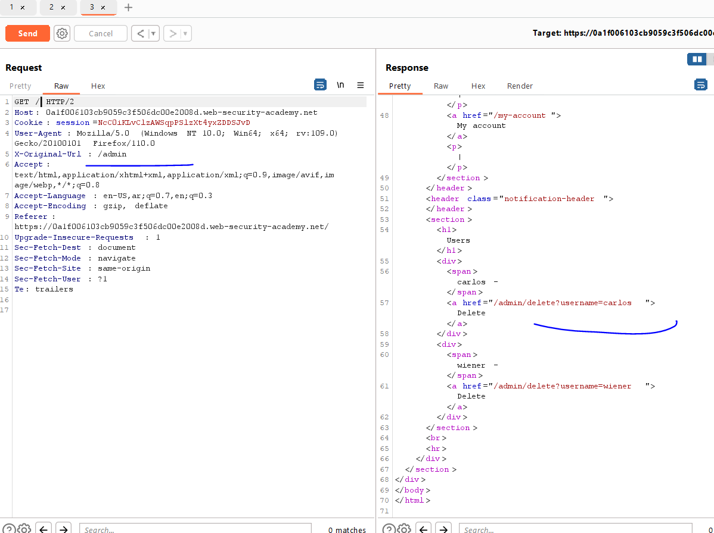
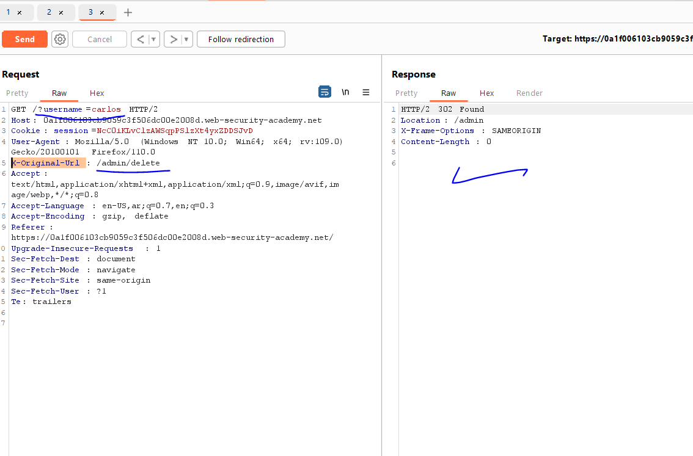
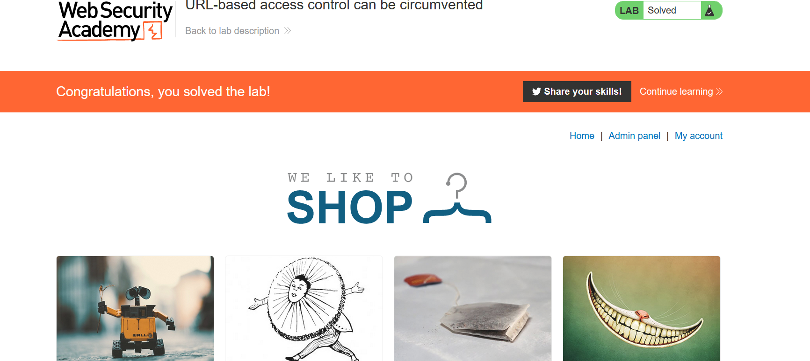

# Lab: URL-based access control can be circumvented

**Link**: https://portswigger.net/web-security/access-control/lab-url-based-access-control-can-be-circumvented

**Solution**:

This is a header attack vulnerability .

If you navigate to /admin will give you Forbidden

  

But if we changed the request to `/` and depends on `X-Original-Url` header (which depends on this header and ignore the above URL), it gives us 404 for invalid page exists

  

So, we can change the value of this header to `/admin` and it works 😊

  

So, we add the query parameter to above URL and the Full path to `X-Original-Url` header

  

  

