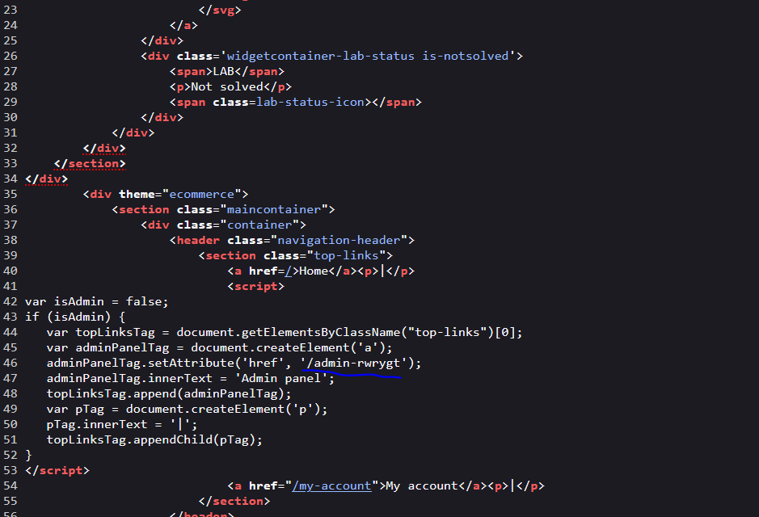
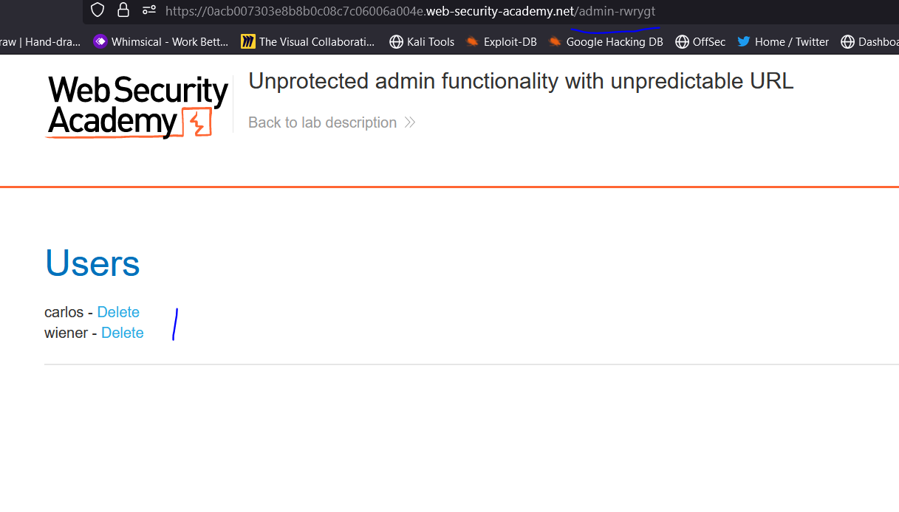

# Lab: Unprotected admin functionality

**Link**: https://portswigger.net/web-security/access-control/lab-unprotected-admin-functionality

**Solution**:

There is admin panel navigation in the web site,

but we can type it manually like

- http://example.com/admin

Or search in metadata files like robots.txt (which tell the search engine to which allowed and disallowed search discover)

Or use in burp pro, right click on target ⇒ Engangment Tools ⇒ Discover content

If we navigate to 

https://0aeb00c803b427f8c2ed3ed3001400c2.web-security-academy.net/robots.txt

you will see

```jsx
User-agent: *
Disallow: /administrator-panel
```

so it hiding the admin panal in /administrator-panel

Now we accessed it 😃


<p align="center" width="100%">
  
</p>

<p align="center" width="100%">
  
</p>
