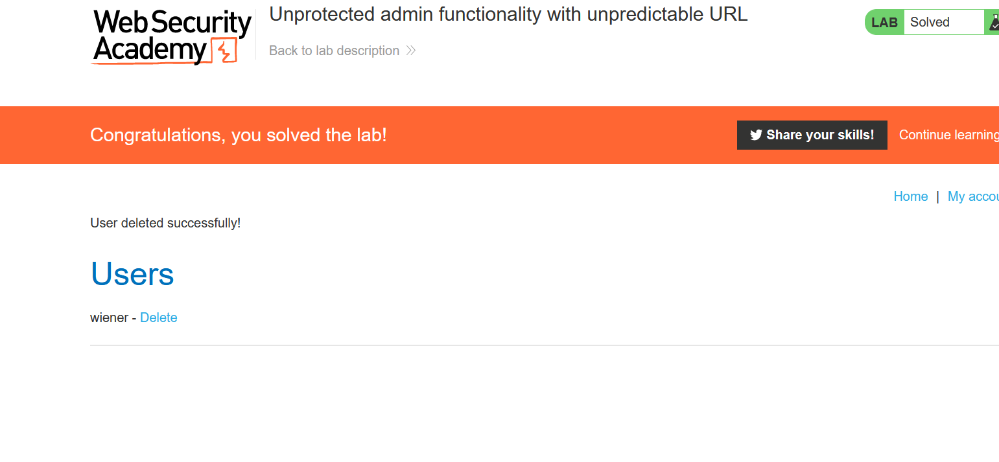

# Lab: Unprotected admin functionality with unpredictable URL (Page source)

**Link**: https://portswigger.net/web-security/access-control/lab-unprotected-admin-functionality-with-unpredictable-url

**Solution**:

The URL in the page source

  

  

  

