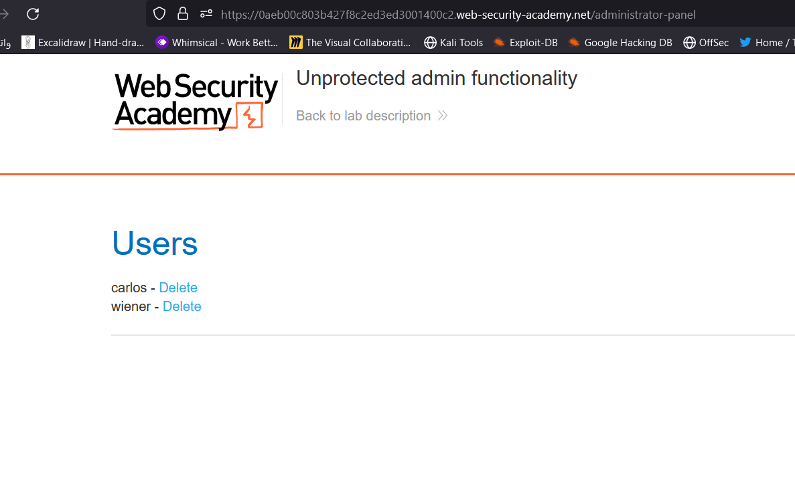
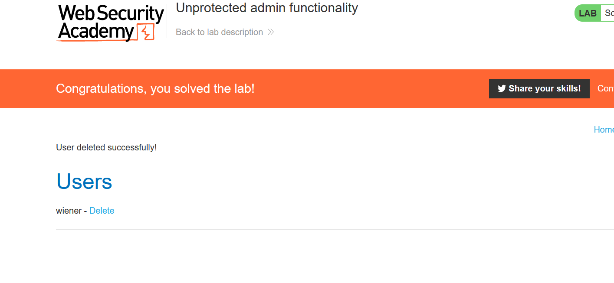

# Lab: SSRF with whitelist-based input filter

**Link**: https://portswigger.net/web-security/ssrf/lab-ssrf-with-whitelist-filter

**Solution**:

This lab, the developer is whitelisted only specific application(stock.weliketoshop.net) to access local app.

  

The only way is the URL must contains this domain [stock.weliketoshop.net](http://stock.weliketoshop.net/). 

We will try adding it but as a useless

Like if we add # id tag like ⇒ www.google.com/admin?page=1#search-section

#search-section ⇒ didn’t effect the URL

Or we can @ in the domain for LDAP domain controller authentication

Like mohamed@google.com ⇒ will understand it  as login with mohamed into google.com

So, we will Add `localhost` as a trusted domain 

  

Here we inject [localhost](http://localhost) without the previous error (accept it), then we can add # to ignore the rest of url and still the app see the whitelisted domain still exists.

But if we added the #, it will detect it

  

we can encode it using URL encoding to baypass the firewall, but it didn’t work, we can do double encoded and its working 😃

  

But it didn’t work if we type /admin here

  

but it works if we type it at last

  

  

  

