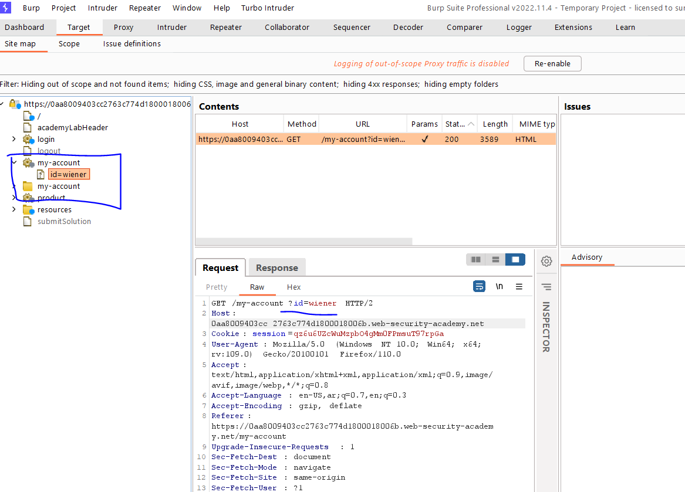
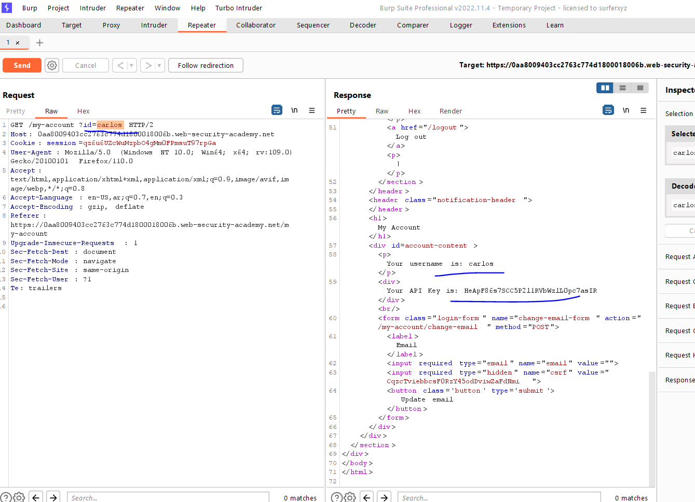
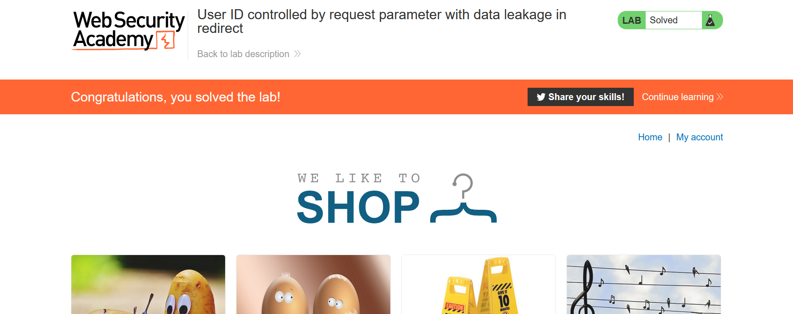

# Lab: User ID controlled by request parameter with data leakage in redirect

**Link**: https://portswigger.net/web-security/access-control/lab-user-id-controlled-by-request-parameter-with-data-leakage-in-redirect

**Solution**:

In site map of the target, you will find /my-account?id=wiener as you will see takes the username as parameter,

  

change it to `carlos`

  

  

