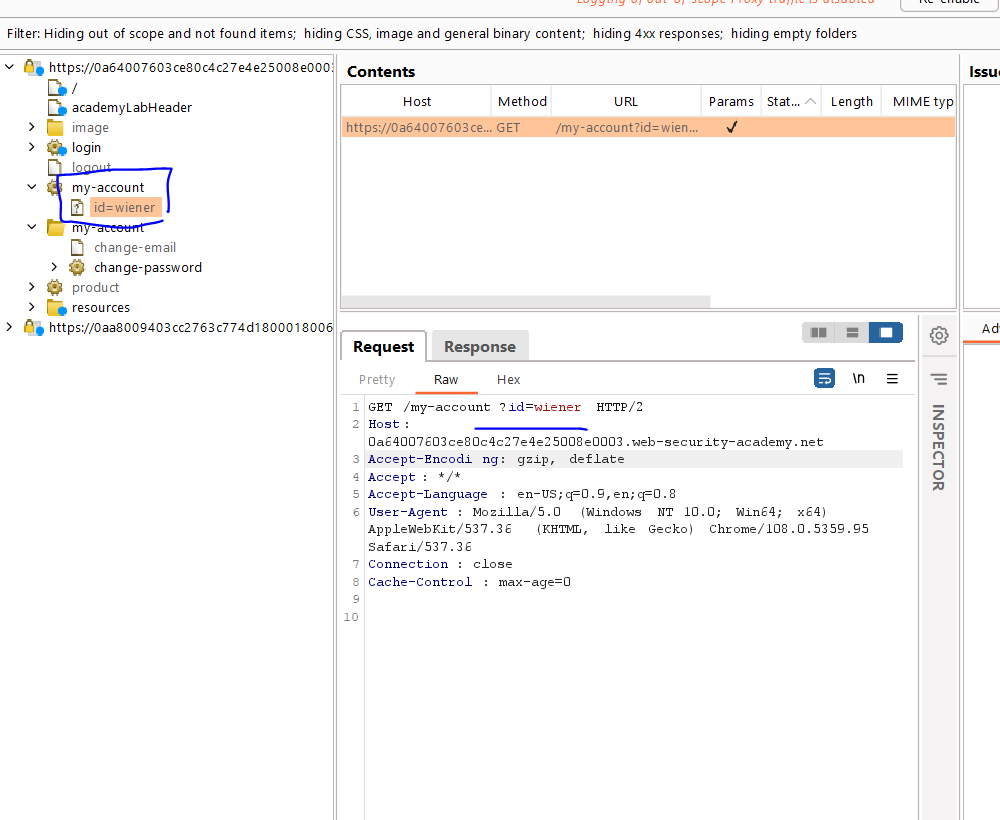
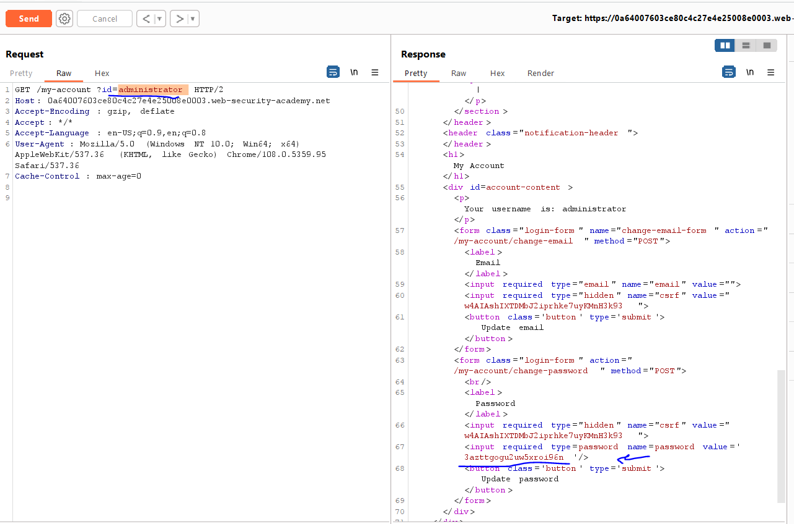
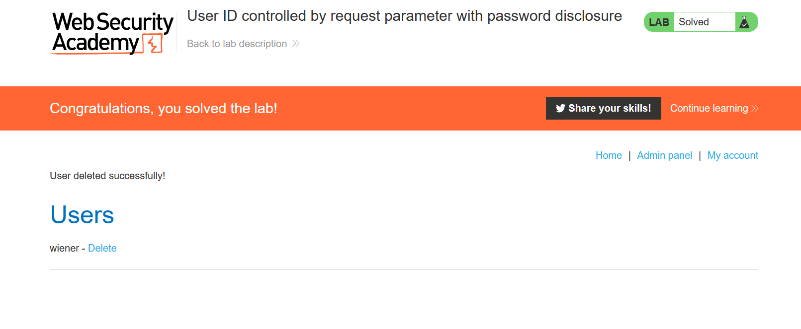

# Lab: User ID controlled by request parameter with password disclosure

**Link**: https://portswigger.net/web-security/access-control/lab-user-id-controlled-by-request-parameter-with-password-disclosure

**Solution**:

In target site map, notice in /my-account?id=username

  

if we change it to `administrator`

  

  

