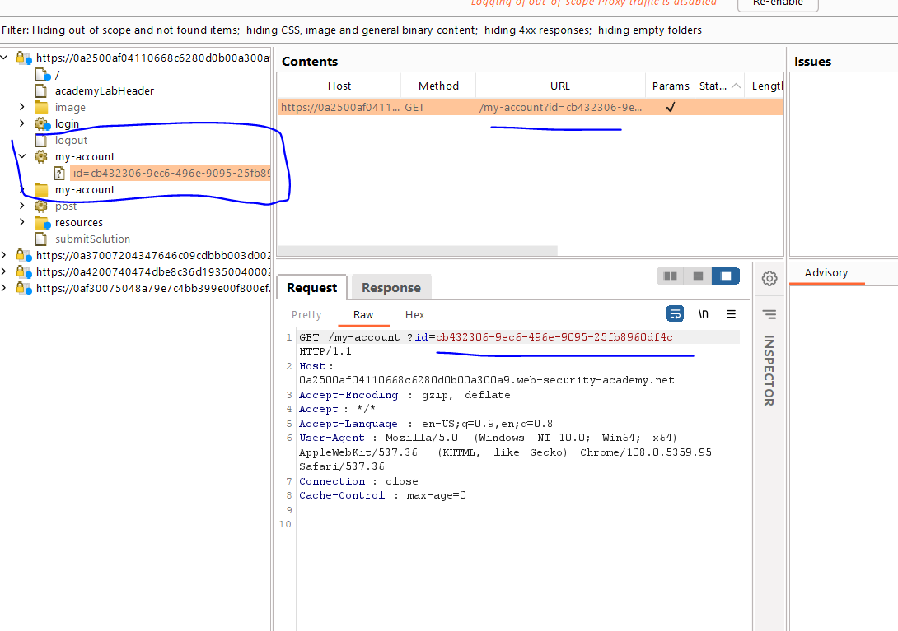
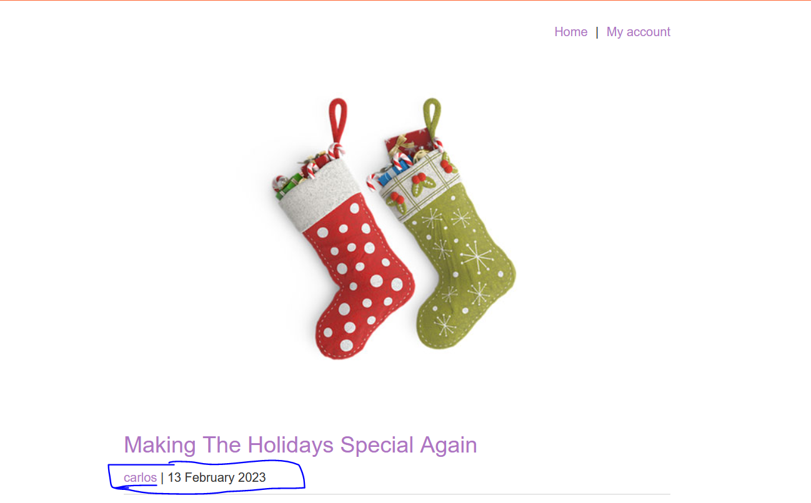
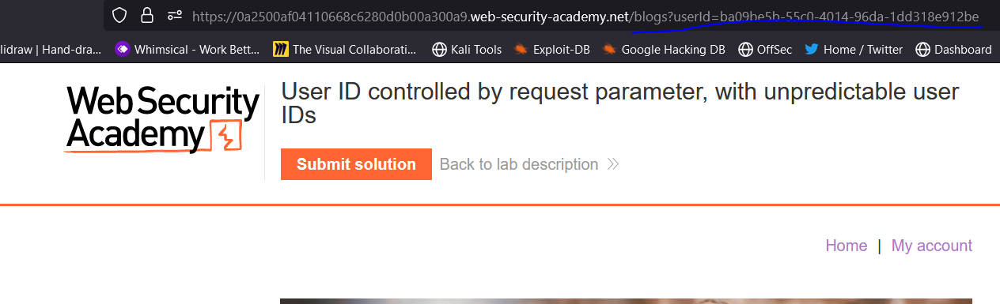
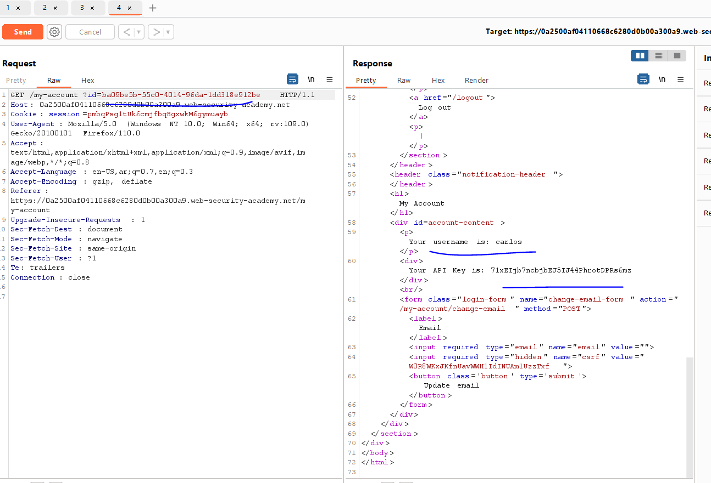
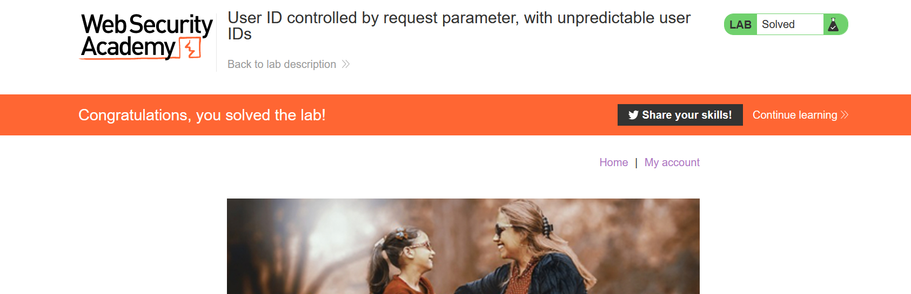

# Lab: User ID controlled by request parameter, with unpredictable user IDs

**Link**: https://portswigger.net/web-security/access-control/lab-user-id-controlled-by-request-parameter-with-unpredictable-user-ids

**Solution**:

Like the previous lab, but takes guid /my-account?id=newGuid

  

So, the target now is to get the GUID of carlos, While surfing the blog/posts

  

This navigate with guid of carlos user,

  

So, if we take it and replace it with my-account?id=ba09be5b-55c0-4014-96da-1dd318e912be

  

  

