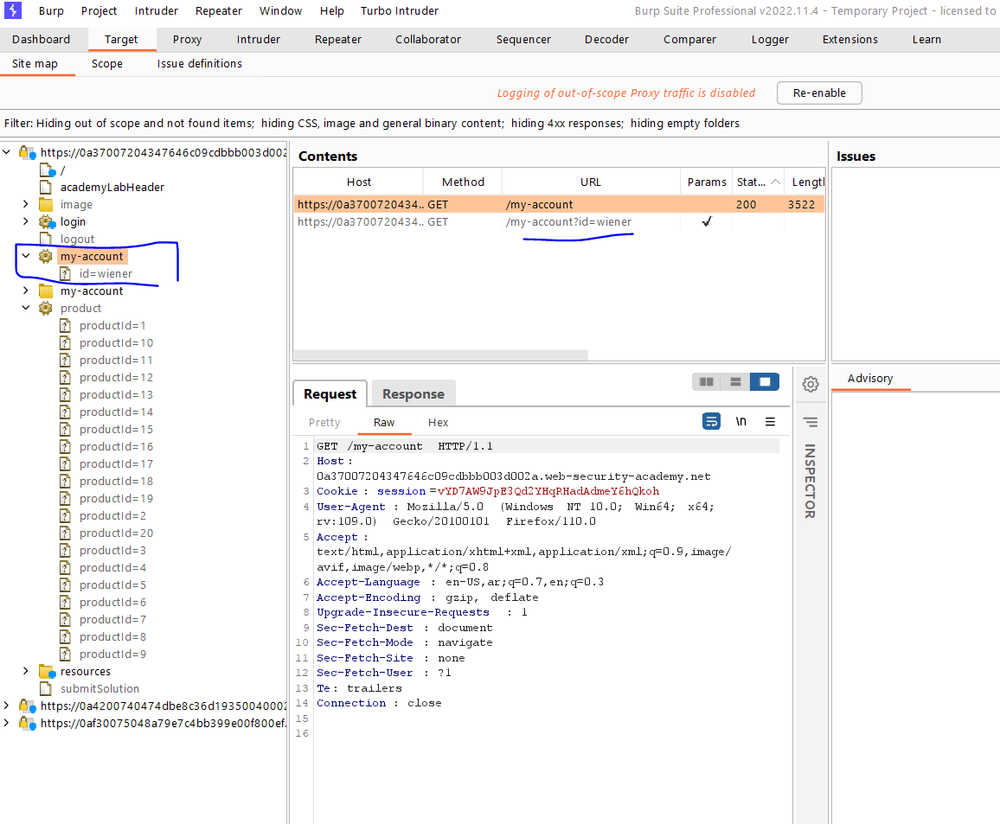
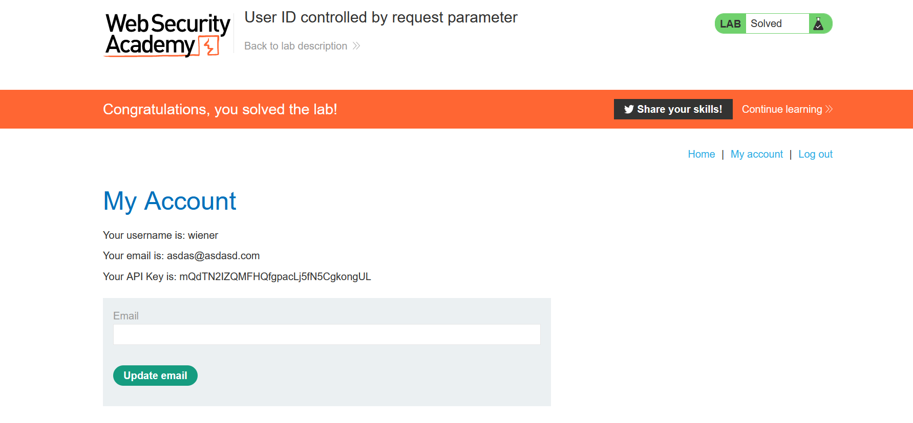

# Lab: User ID controlled by request parameter

**Link**: https://portswigger.net/web-security/access-control/lab-user-id-controlled-by-request-parameter

**Solution**:

If we notice in website spider (site map) in my-account, takes an id query paramters and the username

/my-account?id=mohamed

  

  

  

