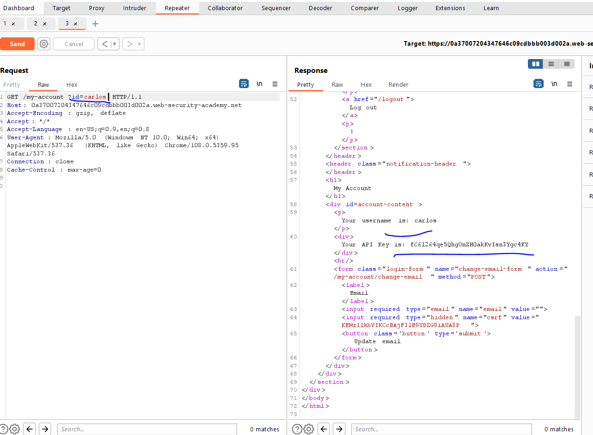

# Lab: User role can be modified in user profile

**Link**: https://portswigger.net/web-security/access-control/lab-user-role-can-be-modified-in-user-profile

**Solution**:

If we navigate to account settings and change email, you will notice that the roleId returned in the response.

  

We will try to add this parameter to the body and it accepts it 😃

  

Then, we are admin now

  

  

