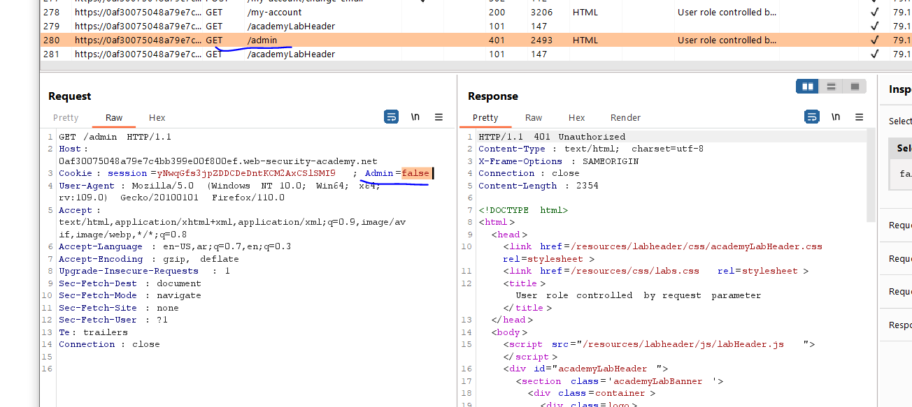
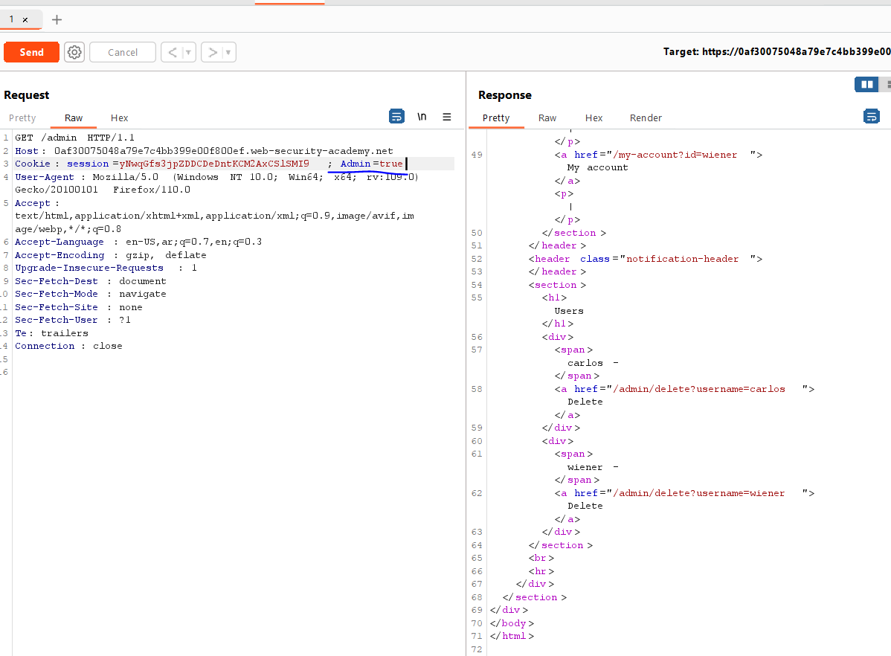
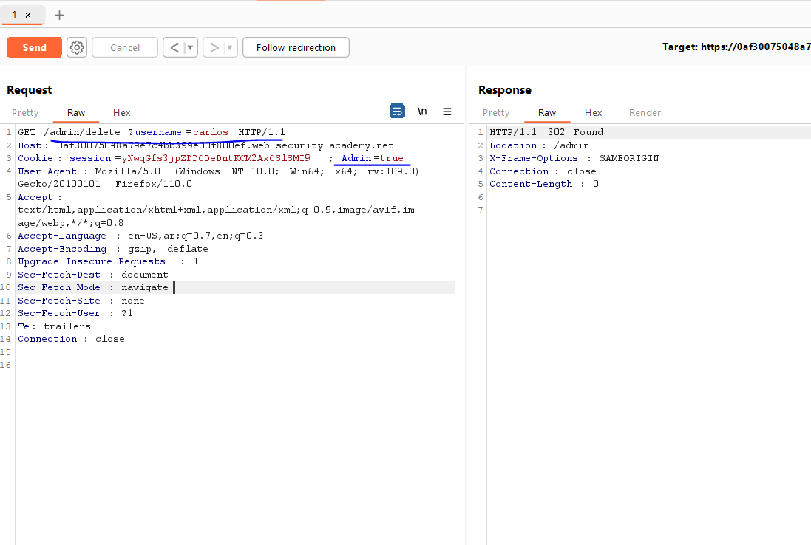
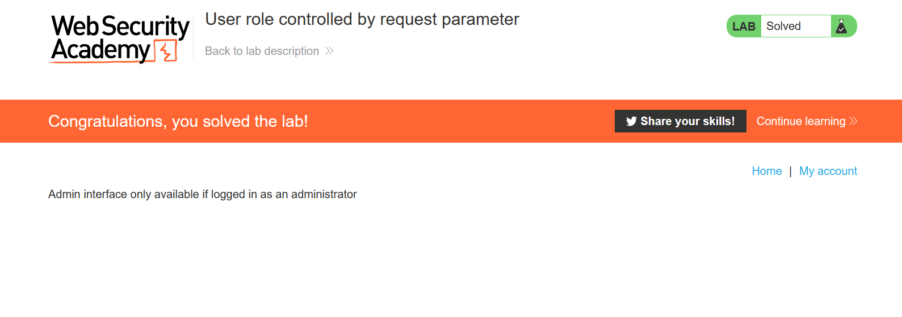

# Lab: User role controlled by request parameter

**Link**: https://portswigger.net/web-security/access-control/lab-user-role-controlled-by-request-parameter

**Solution**:

If we spider the website, we will see that if we navigate to /admin 

  

With normal user, there is in the cookies flag called `Admin=false`

If we changed it to true

  

It gives me the admin panel

  

  

