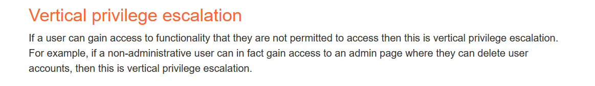
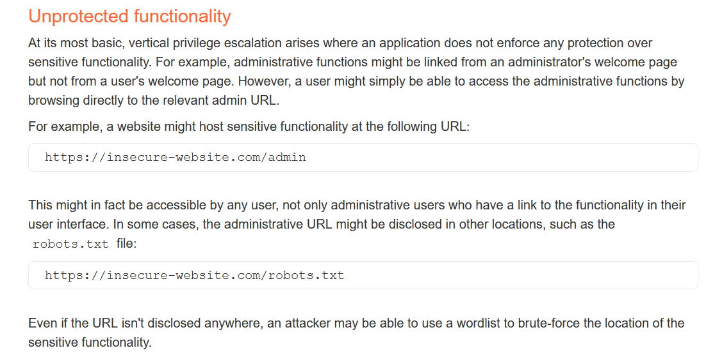

# Broken Access Control
https://portswigger.net/web-security/access-control (should read it)
There are 3 types of access control

- Vertical Access control: Not all people have the permission to do something
- Horizontal Access control: You only authorize to access/manage your own resources.
- Context-dependent access control: depends on the context of logic

### [Examples of Broken Access Control](https://portswigger.net/web-security/access-control#examples-of-broken-access-controls)

- Vertical privilege escalation
    

      
    

    
- Unprotected functionality
    

      
    

- Broken access control resulting from platform misconfiguration
- Broken access control resulting from URL-matching discrepancies
- Horizontal privilege escalation
- Horizontal to vertical privilege escalation
- Insecure direct object references
- Access control vulnerabilities in multi-step processes
- Referer-based access control
- Location-based access control

## Labs
- 
