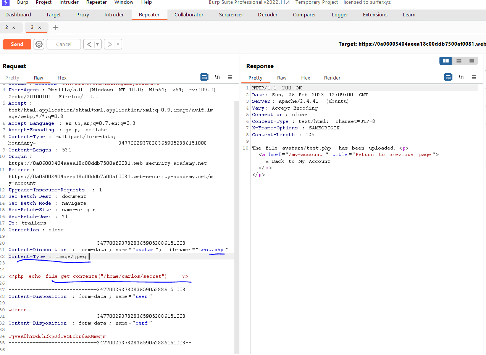
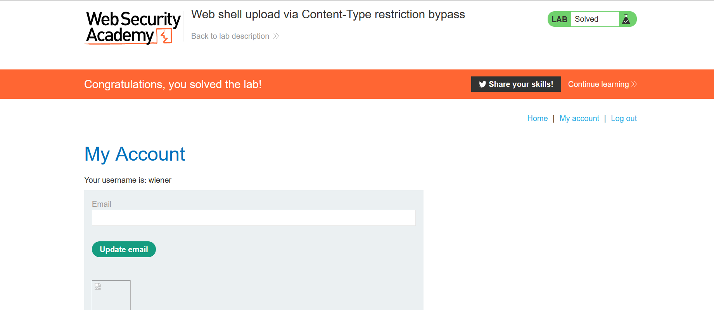

# Lab: simple case

**Link**: https://portswigger.net/web-security/file-upload/lab-file-upload-web-shell-upload-via-content-type-restriction-bypass

**Solution**:
Like the previous lab but just don’t change the content type

  

  

