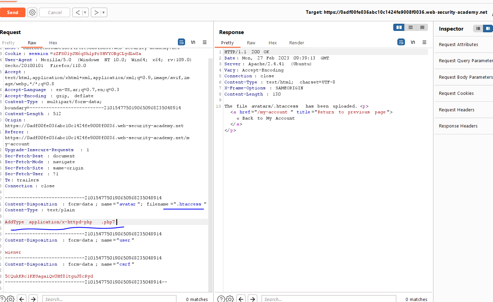
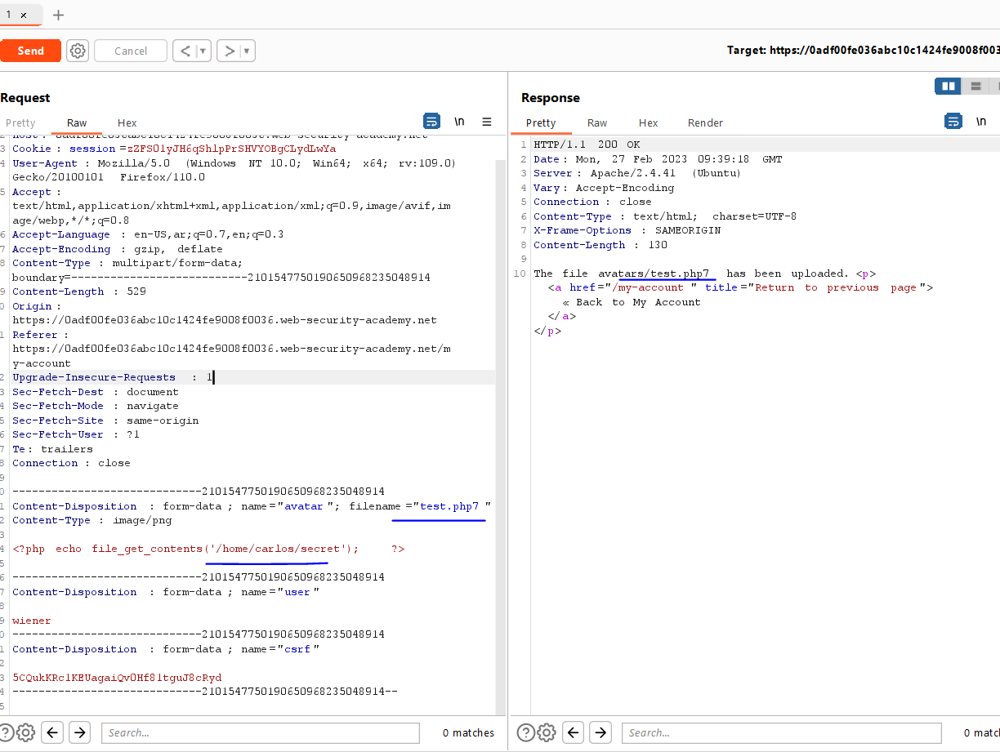
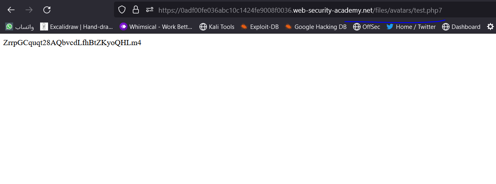
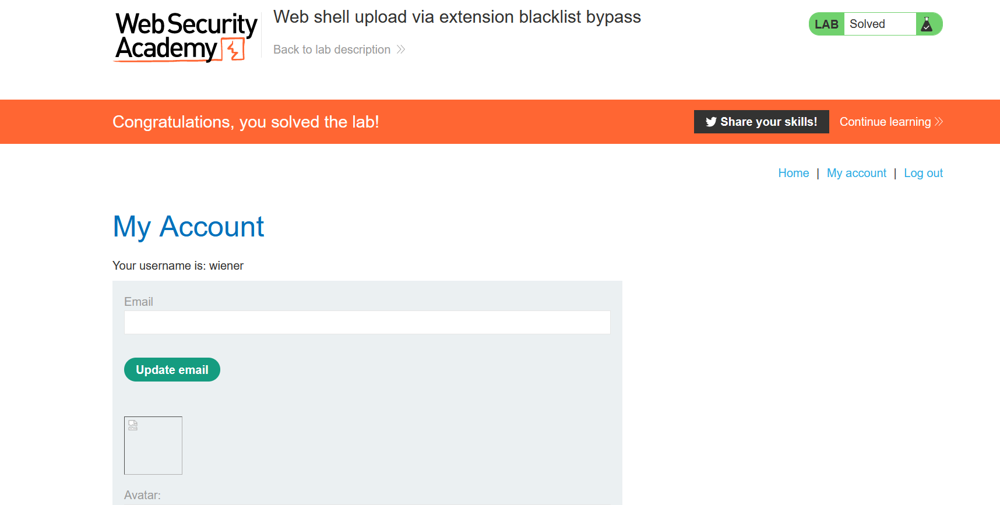

# Lab: Web shell upload via extension blacklist bypass

**Link**: https://portswigger.net/web-security/file-upload/lab-file-upload-web-shell-upload-via-extension-blacklist-bypass

**Solution**:
is to bypass the blacklisted extensions

https://book.hacktricks.xyz/pentesting-web/file-upload

another extensions for php

**PHP**
: *.php*
, *.php2*
, *.php3*
, .*php4*
, .*php5*
, .*php6*
, .*php7*
, .phps, .*phps*
, .*pht*
, .*phtm, .phtml*
, .*pgif*
, *.shtml, .htaccess, .phar, .inc, .hphp, .ctp, .module*

All the above links will not executed, but i notice that we can upload .htacess file (which change the server configuration for directory) https://httpd.apache.org/docs/2.4/howto/htaccess.html

to make the server execute the `.php7` as php code

  

Now, if we 

  

  

  

