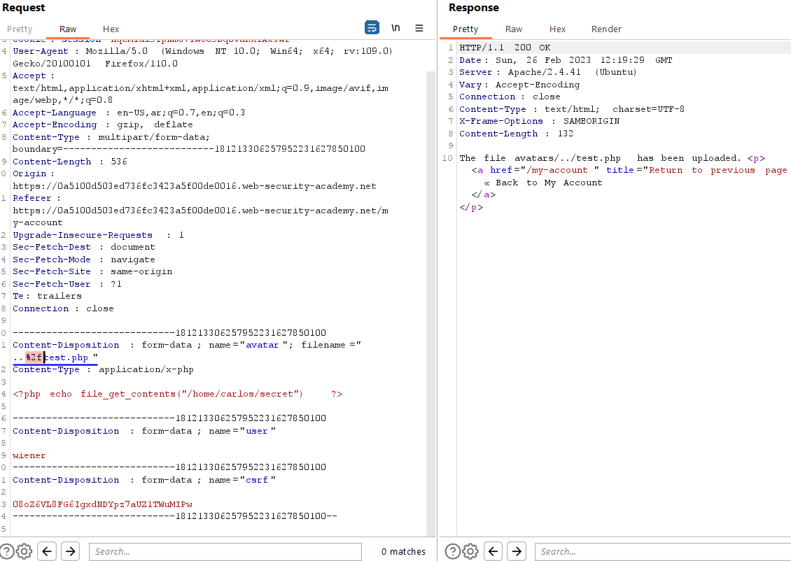
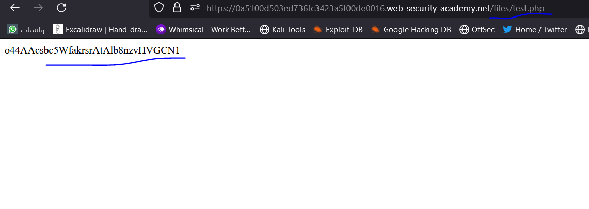
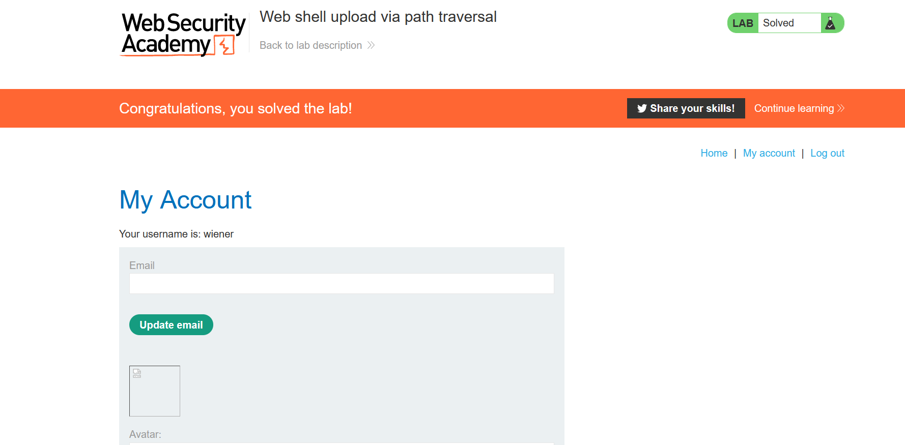

# Lab: Web shell upload via path traversal

**Link**: https://portswigger.net/web-security/file-upload/lab-file-upload-web-shell-upload-via-path-traversal

**Solution**:
the problem is it didn’t execute or render the php code in this directory (restricted by the apache server)

to solve it, we need to upload the file to a different path of this directory (/files) instead of (/files/avators)

in the burp, just modify the filename to `filename="../test.php"`

Upload it as URL encoded to accept it

  

Now, navigate to 

  

  

