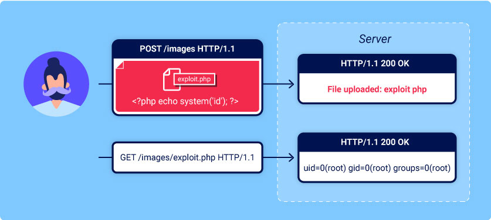

# File Upload
The main steps

- 1- upload vulnerable file
- 2- try access this file for execution

https://portswigger.net/web-security/file-upload

  

# Labs
- [Lab Remote code execution via web shell upload](https://github.com/aboelkassem/portswigger-labs/tree/main/File%20Upload/Lab%20Remote%20code%20execution%20via%20web%20shell%20upload)
- [Lab Web shell upload via Content-Type restriction bypass](https://github.com/aboelkassem/portswigger-labs/tree/main/File%20Upload/Lab%20Web%20shell%20upload%20via%20Content-Type%20restriction%20bypass)
- [Lab Web shell upload via path traversal](https://github.com/aboelkassem/portswigger-labs/tree/main/File%20Upload/Lab%20Web%20shell%20upload%20via%20path%20traversal)
- [Lab Web shell upload via extension blacklist bypass](https://github.com/aboelkassem/portswigger-labs/tree/main/File%20Upload/Lab%20Web%20shell%20upload%20via%20extension%20blacklist%20bypass)
- [Lab Web shell upload via obfuscated file extension](https://github.com/aboelkassem/portswigger-labs/tree/main/File%20Upload/Lab%20Web%20shell%20upload%20via%20obfuscated%20file%20extension)
- [Lab Remote code execution via polyglot web shell upload](https://github.com/aboelkassem/portswigger-labs/tree/main/File%20Upload/Lab%20Remote%20code%20execution%20via%20polyglot%20web%20shell%20upload)
- [Lab Web shell upload via race condition](https://github.com/aboelkassem/portswigger-labs/tree/main/File%20Upload/Lab%20Web%20shell%20upload%20via%20race%20condition)
