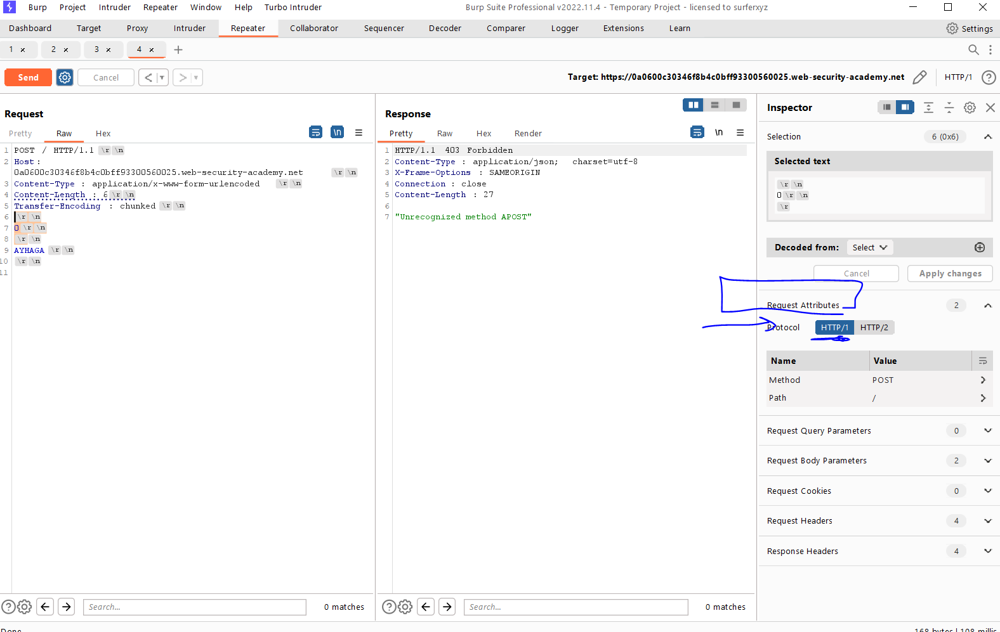
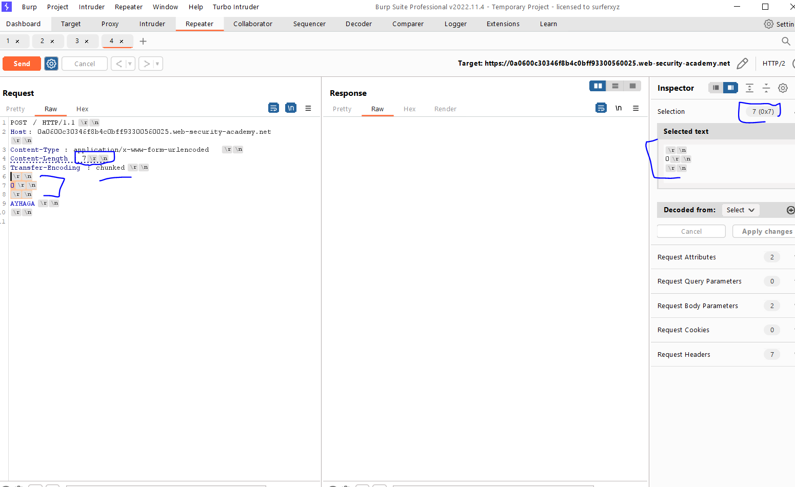

# Lab: HTTP request smuggling, basic CL.TE vulnerability

**Link**: https://portswigger.net/web-security/request-smuggling/lab-basic-cl-te

**Solution**:

[CL.TL](http://CL.TL) = Content Length , Transfer encoding

In this lab, the client understands Content-Length header and the server understand Transfer encoding header

So, we will try to keep modifying Content-Length

We will change the method request to POST

We will give it the content-length = 0 and send multiple times

First thing, disable Update-Content-Length in burp for disable automatically content updates based on request body

  

And use http 1.1 instead of http2

  

In the following screen 

We will send the first (fake) request with bytes 7, to tell the server that request is finished and look after it (any new data after this request, it will consider it as a new separate request)

  

  

  

For real life, instead of `G` we can past a real request like this

  

