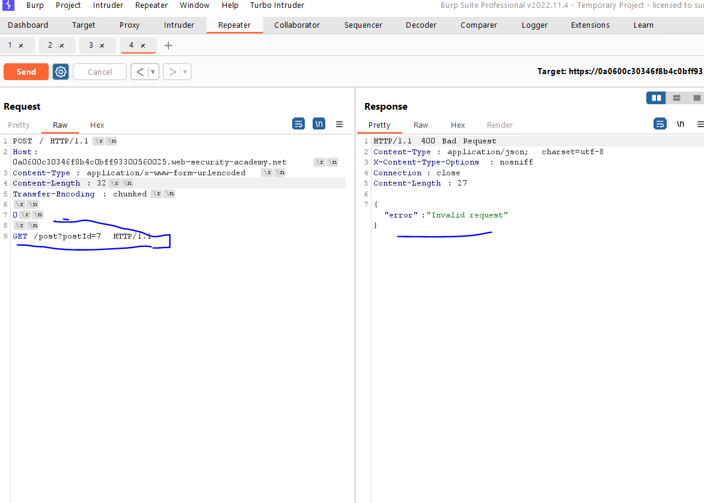

# Lab: HTTP request smuggling, basic CL.TE vulnerability

**Link**: https://portswigger.net/web-security/request-smuggling/lab-basic-cl-te

**Solution**:

[CL.TL](http://CL.TL) = Content Length , Transfer encoding

هنا الفرونت بيفهم الcontent-length والسيرفر بيفهم الTransafer encoding

ف عشان كدا هنلعب ف الcontent-length

We will change method request to POST

كل الي هنعملة اننا نديلة content-length ع قد الريكوست الاول الي هو 0 ونبعتة كذا مرة 

First thing, disable Update-Content-Length in burp for disable automatically content updates based on request body

  

And use http 1.1 instead of http2

  

In the following screen 

هنا هنبعت ريكوست بان الريكوست الاول (المزيف) عدد االبايتز بتاعتة 7 .. وكدا السيرفر هيفهم ان كدا الريكوست خلص وهيبدأ يشوف الي بعدة الي هو اي حاجة انت تكتبها هيعتبر ريكوست جديد 😃

  

  

  

For real life, instead of `G` we can past a real request like this

  

