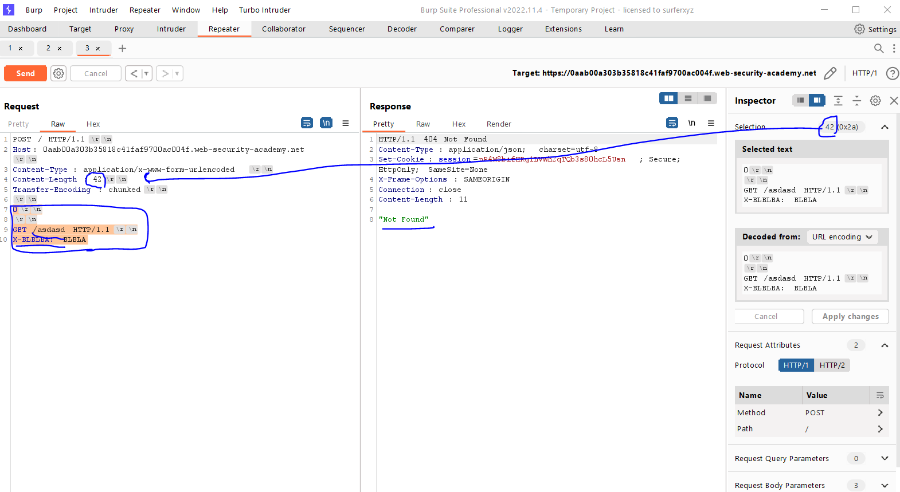
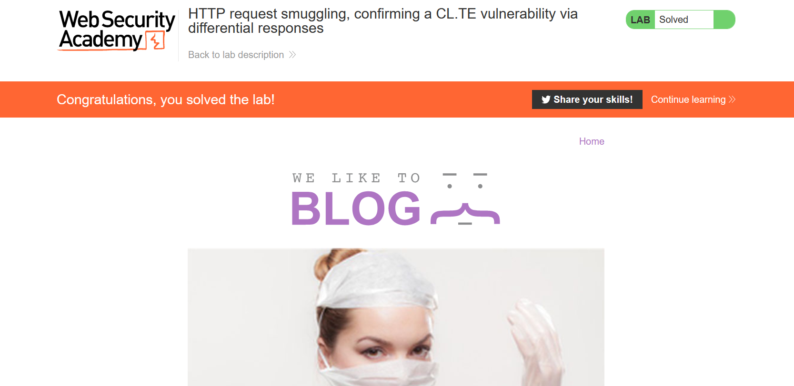

# Lab: HTTP request smuggling, basic TE.CL vulnerability

**Link**: https://portswigger.net/web-security/request-smuggling/lab-basic-te-cl

**Solution**:

دا عكس اللاب الي فات … الفرونت بيدعم الtransfer encoding و السيرفر بيدعم content length

ف عشان كدا هنلعب ف ال transfer-encoding

ف هنا هنديلة حجم الchunk كلها مرة واحدة بالhexdecimal 

وبكدا هيفهم ان الريكوست خلص وينقل علي الي بعدة

The following screen shows

- We need to pass the content-length: xx in the second request to make the server understand it
- If we calculated the selection part in hexadecimal, we will find it `2b`
- So, we but that the chunked size `2b` for then next request to be reflected

  

  

