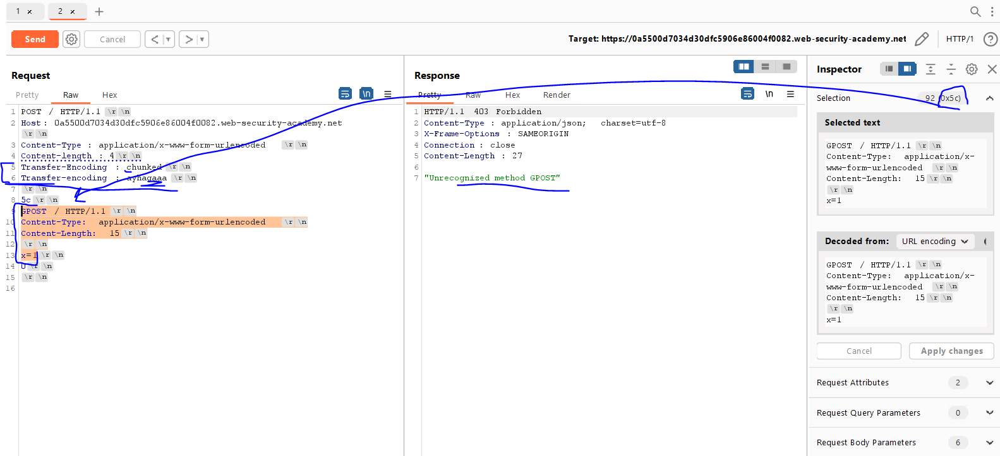

# Lab: HTTP request smuggling, obfuscating the TE header

**Link**: https://portswigger.net/web-security/request-smuggling/lab-obfuscating-te-header

**Solution**:
In this lab, two server (front and back) understand the TE (transfer encoding)

The idea here is the two servers handle duplicate http request headers in different ways..

So, we will give it duplicate TE header with different values

  

  

