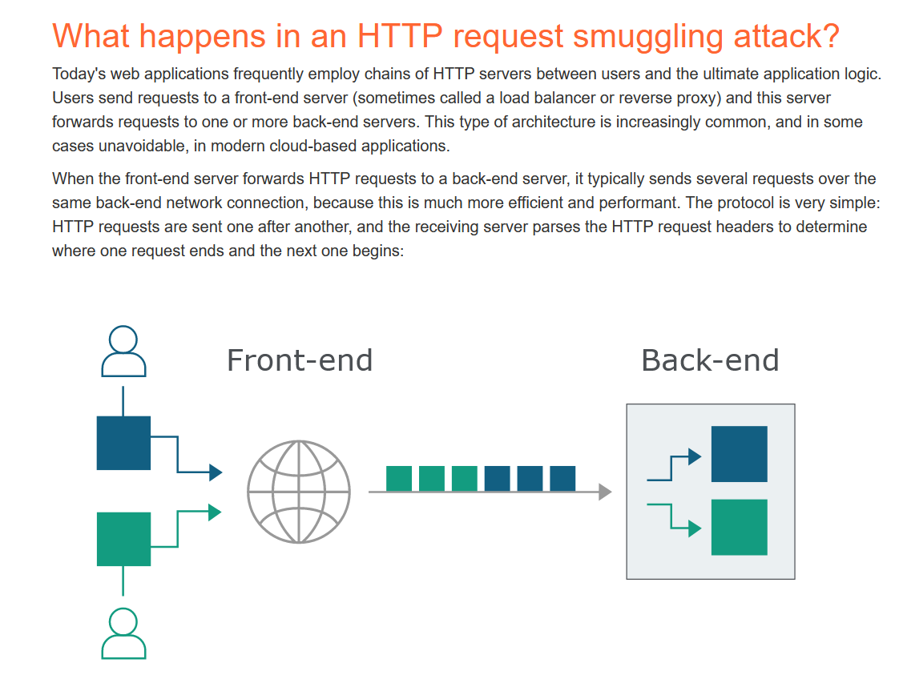
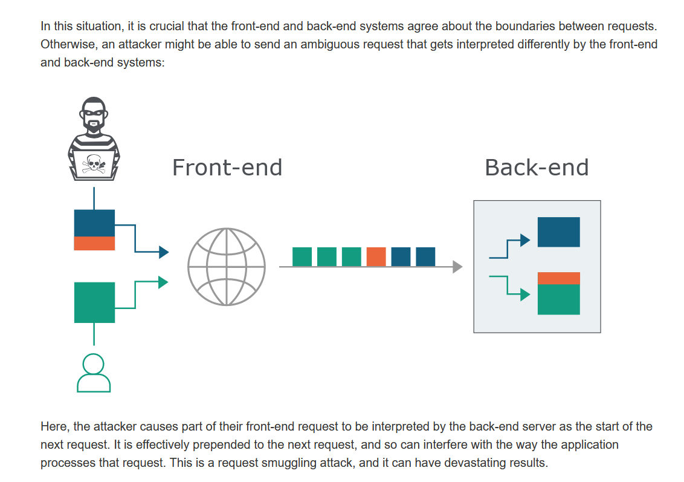

# HTTP request smuggling
https://portswigger.net/web-security/request-smuggling

  

كل الفكرة ان اليوزر بيبعت للفرونت اند ع بروكسي او لود بلانسر والسيرفر بيprocess الريسكوستس دي بطريقة sequential ويبدأ السيرفر يشوف الهيدرز بتاع الريكوست وبناء عليها ياخد قرار

ف هنا احنا ممكن نخدع السيرفر باننا نديلة ريكوست مزيف معناه اننا خلصنا وابدأ بالريكوست الي جاي بعدي

وهنا السيرفر بيعتمد ع اثنين هيدرز عشان يحدد دا

- Content- Length = بيحدد حجم البدي
- Transaction-Encoding = بيحدد نوع النقل = chunked يعني اجزاء وكل جزء مساحتة كذا
    - لو قيمة chunked ب 0 يعني كدا انة خلص الريكوست

  

كل الي هنعملة اننا نشوف السيرفر بي support انهي هيدرز من دول وبيعالجة فعلا 

وبعد كدا نبدأ نلعب بقا 😃

1- Change method request to POST

  

Burp extensions ⇒ [HTTP Request Smuggler](https://portswigger.net/blog/http-desync-attacks-request-smuggling-reborn#demo)

How to know if your request has really passed?

- From response messages (401 or 401)
- Or giving it a bigger content-length bytes than the body (will response with time-out or internal server error)
    - this mean The server still waiting the rest of body content
 
# Labs
- 
