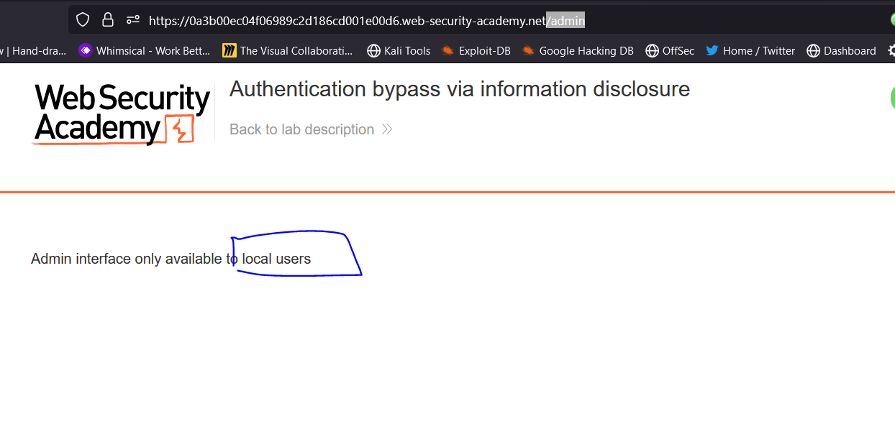
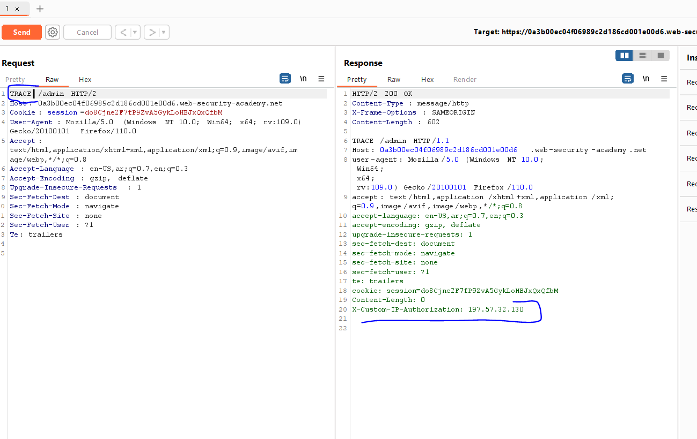
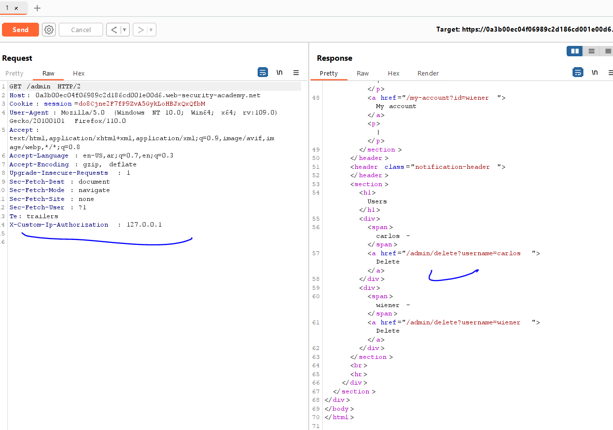
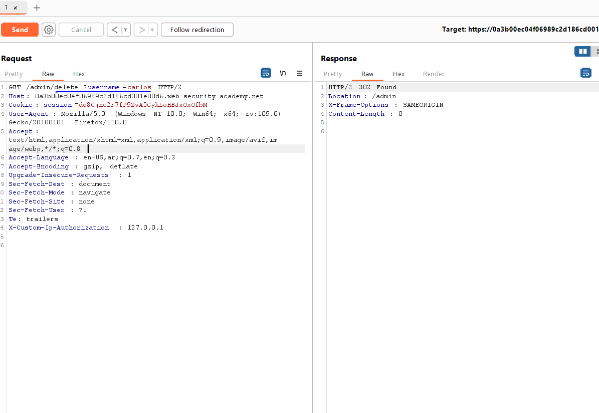
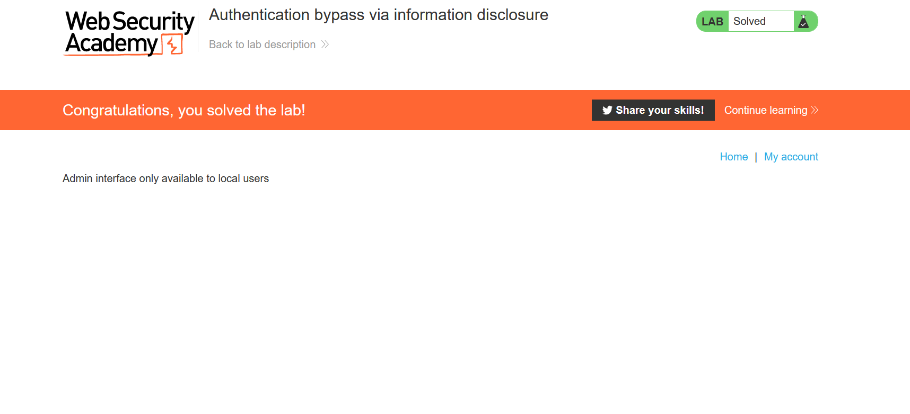

# Lab: Authentication bypass via information disclosure

**Link**: https://portswigger.net/web-security/information-disclosure/exploiting/lab-infoleak-authentication-bypass

**Solution**:
If I navigate to /admin

  

The vulnerability of this lab is the website allow http `Trace` method which enable us to debug the full http request and response

If we resend the /admin request with TRACE method, we will find a custom HTTP header for IP authentication

  

If we added this header with value `127.0.0.1` it will allow us to access the admin panel

  

  

  

