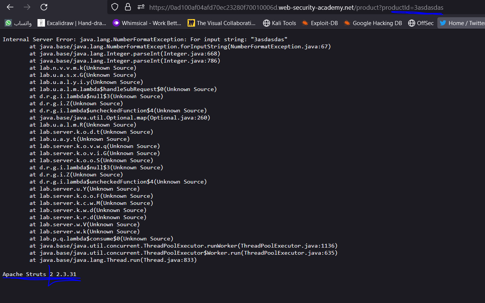

# Lab: Information disclosure in error messages

**Link**: https://portswigger.net/web-security/information-disclosure/exploiting/lab-infoleak-in-error-messages

**Solution**:
We will try to cause error in query parameter,

instead of `/product?productId=3` to be `/product?productId=asdasdasdas`

  

past this `Apache Struts 2 2.3.31` to the solution

  

