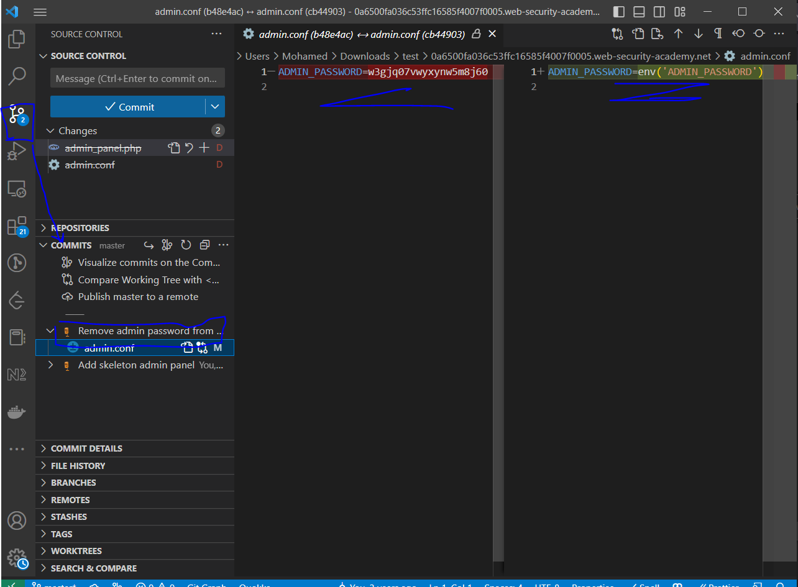

# Lab: Information disclosure in version control history

**Link**: https://portswigger.net/web-security/information-disclosure/exploiting/lab-infoleak-in-version-control-history

**Solution**:
This site uploaded `.git` in the source code

<p align="center" width="100%">
  
</p>

We will download it and open it using any version contol tool to see commit changes

use this command to download it 

```bash
$ wget.exe -r https://0a6500fa036c53ffc16585f4007f0005.web-security-academy.net/.git
```

Open the folder with Visual Studio code or any version control tool and see the commit changes

<p align="center" width="100%">
  
</p>

and here is the password: w3gjq07vwyxynw5m8j60

<p align="center" width="100%">
  
</p>
