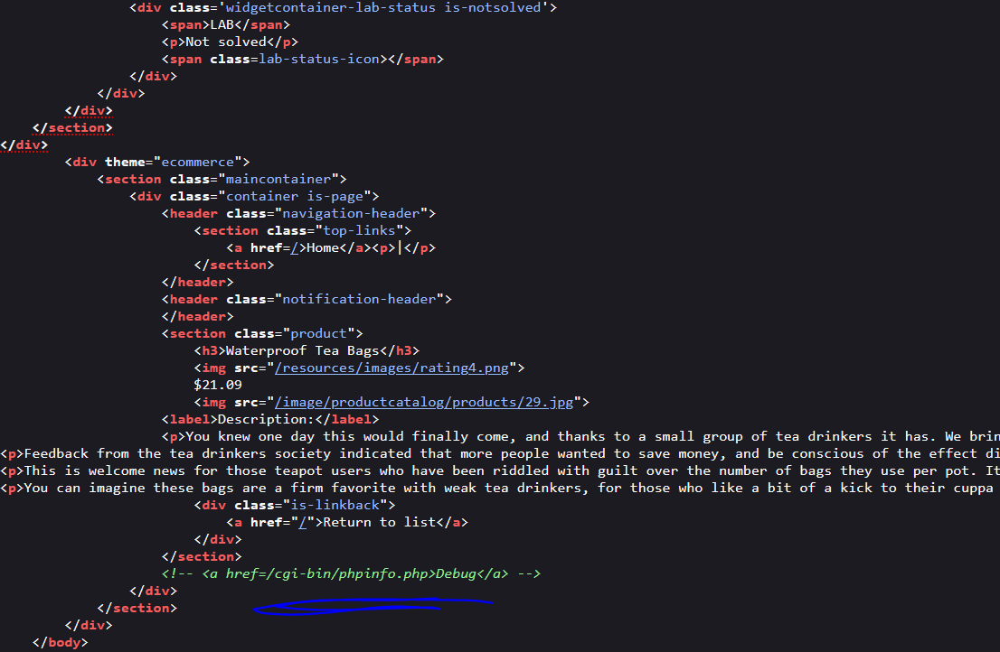
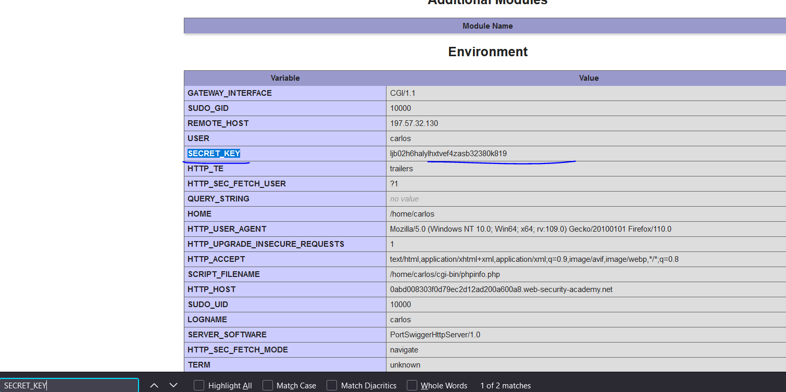
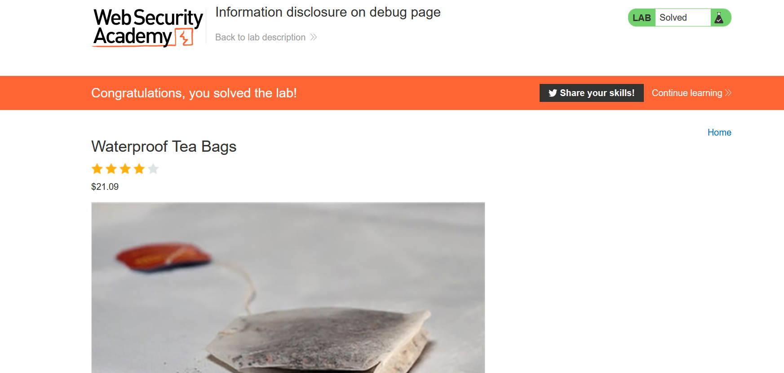

# Lab: Information disclosure on debug page

**Link**: https://portswigger.net/web-security/information-disclosure/exploiting/lab-infoleak-on-debug-page

**Solution**:
If we see the Source code of the page, we will see the path to debug page

  

If we navigate to it `/cgi-bin/phpinfo.php`

  

  

