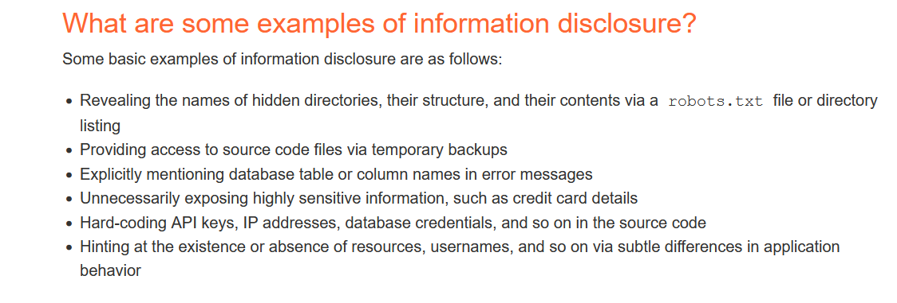

# Information Disclosure

## Explanation
Its all about sensitive data leaks like usernames or commercial data, or APIs keys … etc

https://portswigger.net/web-security/information-disclosure

- Try always cause an errors to see the stackTrace or frameworks versions

  

Where to find it?
- Backup files (zip, tar, tgz, sql, rar, tar.gz)
- Hidden files (.fileName)
- Source code repo (.git, .svn)
- Source code files (.old, .bak, .php~, .swp)
- JS files
- Search Public Github

## Tools
- Git: [DVCS-Pillage](https://github.com/evilpacket/DVCS-Pillage) dump source code from .git folder
- Sample report for which sensitive API key was disclosed: https://hackerone.com/reports/396467
- Tips and trick on searching companies public github repos: https://gist.github.com/EdOverflow/922549f610b258f459b219a32f92d10b
- Mazen Ahmed tool to clone public github projects of companies: https://github.com/mazen160/GithubCloner
- SVN extractor: https://github.com/anantshri/svn-extractor
- Bo0om file names list: https://github.com/Bo0oM/fuzz.txt
- Dirsearch: https://github.com/maurosoria/dirsearch
  
## Labs
- [Lab Information disclosure in error messages](https://github.com/aboelkassem/portswigger-labs/tree/main/Information%20Disclosure/Lab%20Information%20disclosure%20in%20error%20messages)
- [Lab Information disclosure on debug page](https://github.com/aboelkassem/portswigger-labs/tree/main/Information%20Disclosure/Lab%20Information%20disclosure%20on%20debug%20page)
- [Lab Source code disclosure via backup files](https://github.com/aboelkassem/portswigger-labs/tree/main/Information%20Disclosure/Lab%20Source%20code%20disclosure%20via%20backup%20files)
- [Lab Authentication bypass via information disclosure](https://github.com/aboelkassem/portswigger-labs/tree/main/Information%20Disclosure/Lab%20Authentication%20bypass%20via%20information%20disclosure)
- [Lab Information disclosure in version control history](https://github.com/aboelkassem/portswigger-labs/tree/main/Information%20Disclosure/Lab%20Information%20disclosure%20in%20version%20control%20history)
