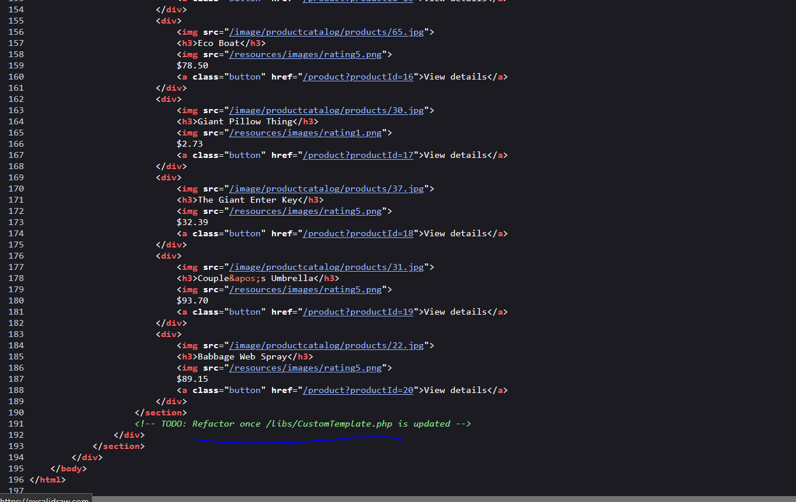
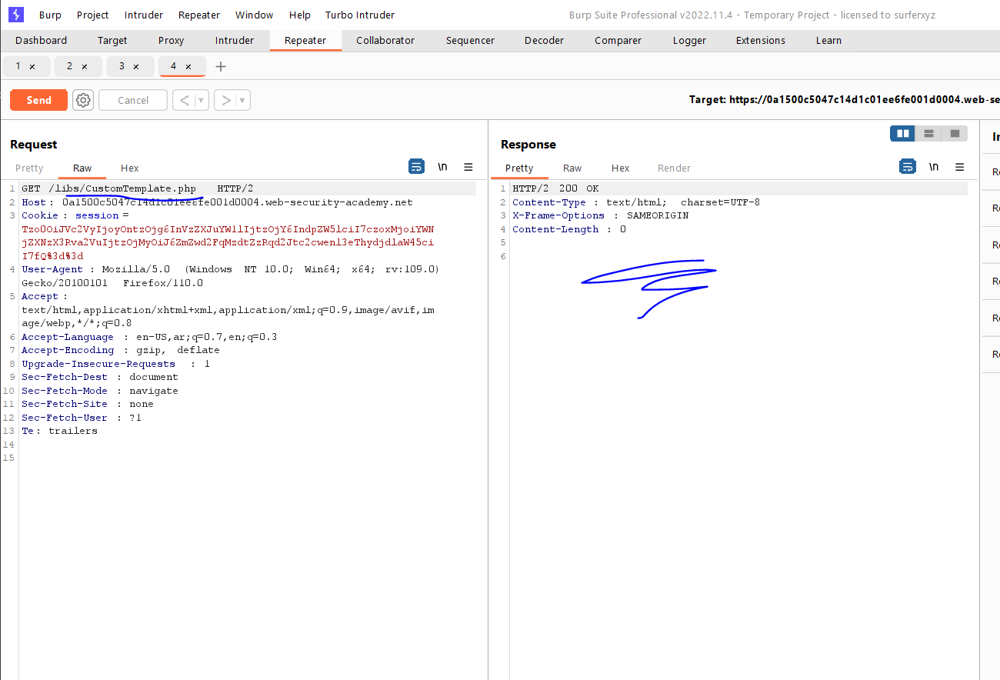
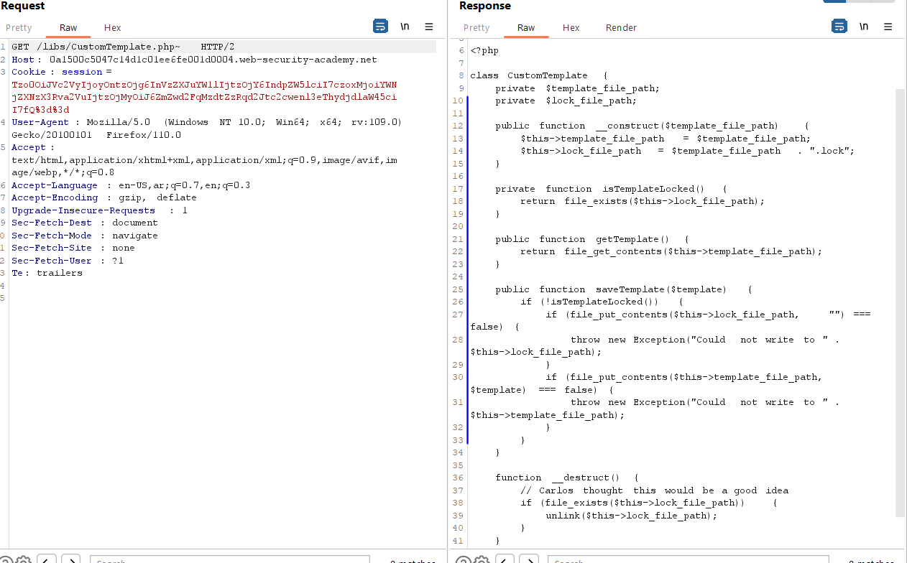

# Lab: Using application functionality to exploit insecure deserialization

**Link**: https://portswigger.net/web-security/deserialization/exploiting/lab-deserialization-using-application-functionality-to-exploit-insecure-deserialization

**Solution**:

In the delete function, by logic it supposed that he deleted the images or anything related to this user.

In delete request, we notice that the serialized object have the path of user’s assets

<p align="center" width="100%">
  
</p>

We will change this path to the file path we need to be deleted

```bash
"avatar_link";s:19:"users/wiener/avatar" => "avatar_link";s:23:"/home/carlos/morale.txt"
```

and then click ApplyChanges and Forward the request

<p align="center" width="100%">
  
</p>

<p align="center" width="100%">
  
</p>


<p align="center" width="100%">
  
</p>
