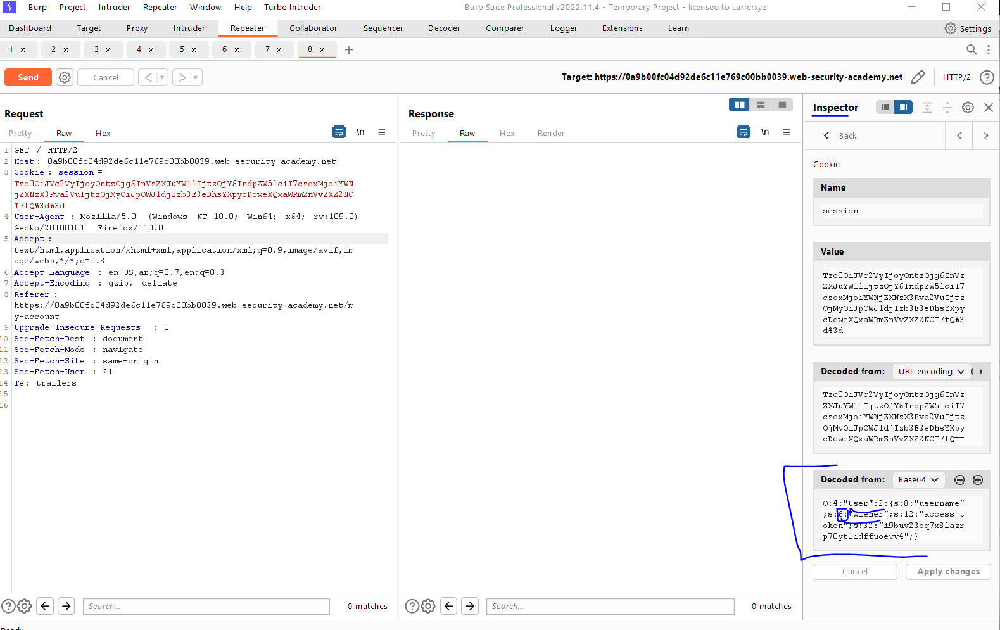
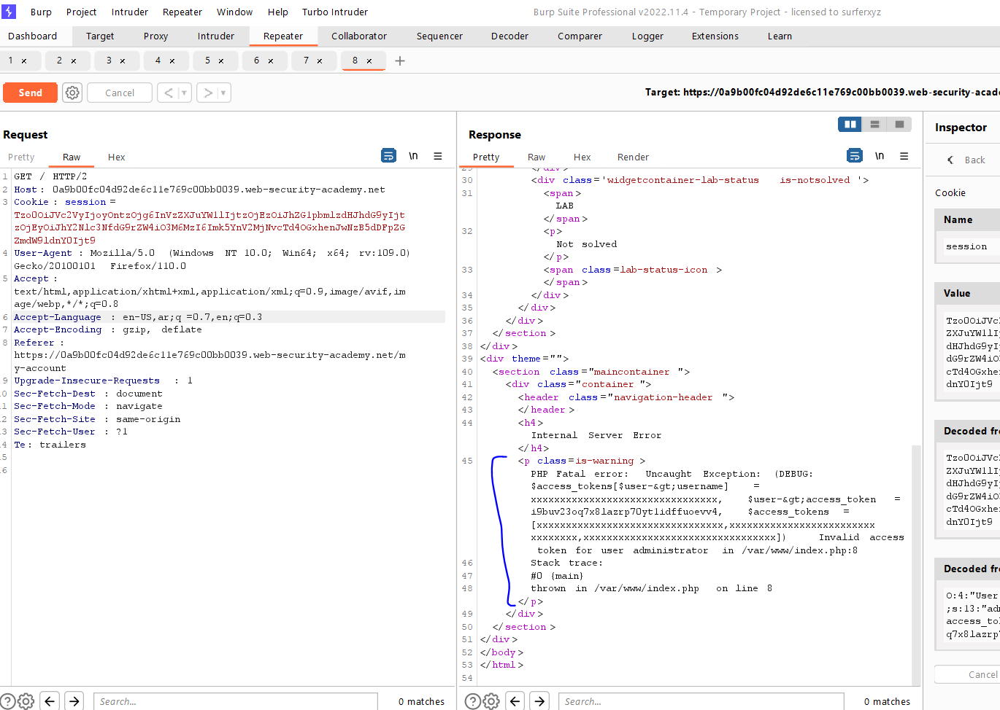
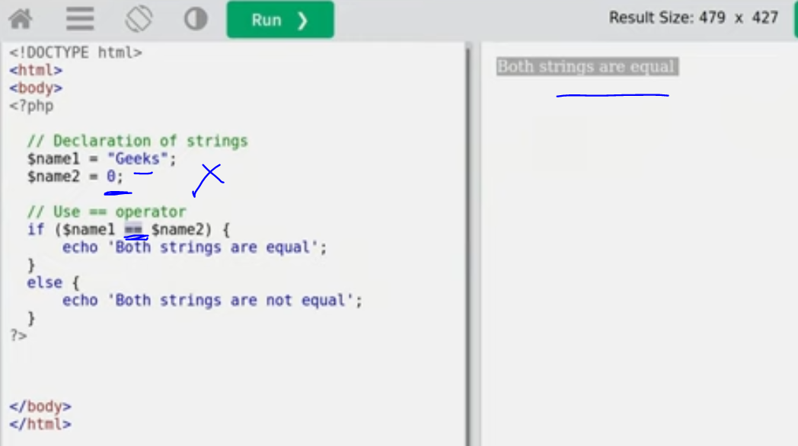
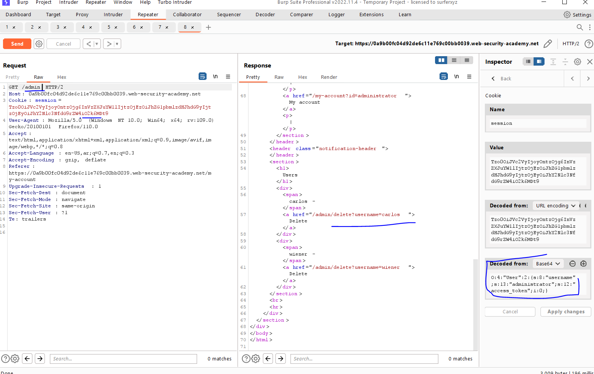
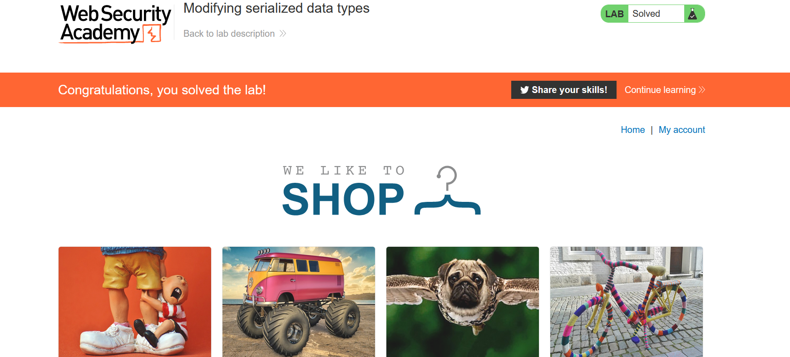

# Lab: Modifying serialized data types

**Link**: https://portswigger.net/web-security/deserialization/exploiting/lab-deserialization-modifying-serialized-data-types

**Solution**:

You will find this session cookie is object seralized

<p align="center" width="100%">
  
</p>

We will change wiener to `administrator` and string length to s:13

but it gives us an error that the value of `access_token` is not in the provided list

<p align="center" width="100%">
  
</p>

So, we now from here that PHP compare strings with existing array items,

PHP is not data type comparison sensitives 

[https://github.com/swisskyrepo/PayloadsAllTheThings/tree/master/Type Juggling](https://github.com/swisskyrepo/PayloadsAllTheThings/tree/master/Type%20Juggling)

<p align="center" width="100%">
  
</p>

So we will change the `access_token` value to integer `0` to pass the condition.

So the final object will be 

```bash
O:4:"User":2:{s:8:"username";s:13:"administrator";s:12:"access_token";i:0;}
```

<p align="center" width="100%">
  
</p>

<p align="center" width="100%">
  
</p>
