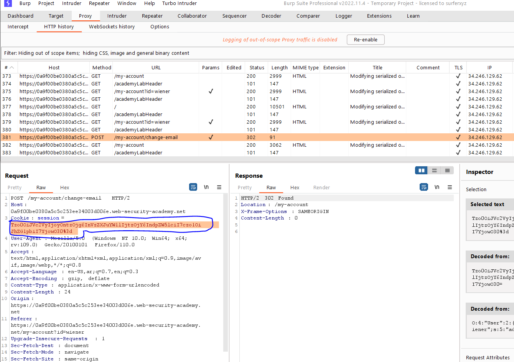
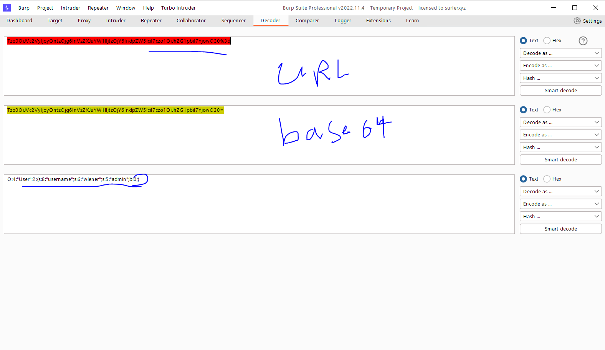
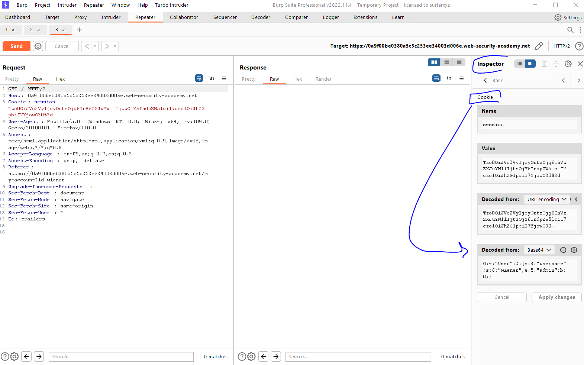
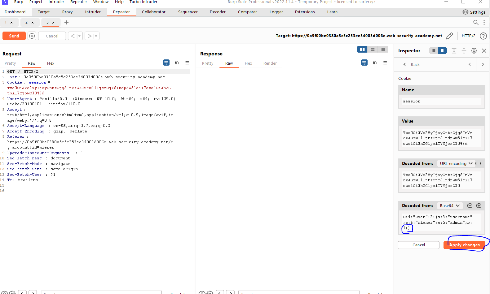
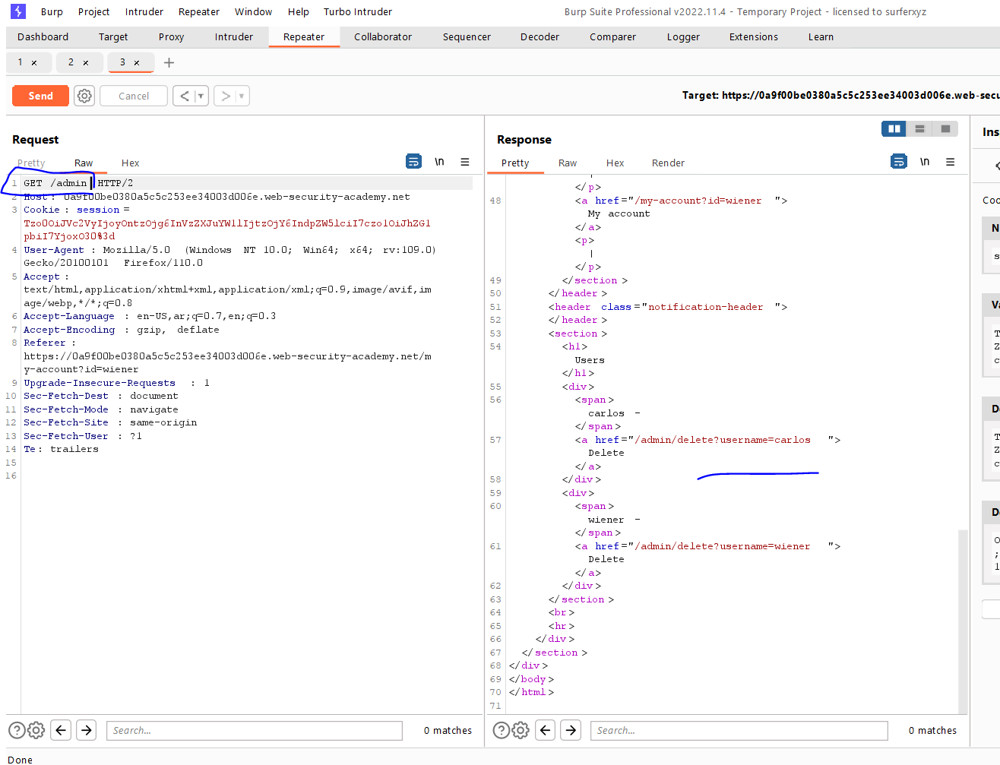
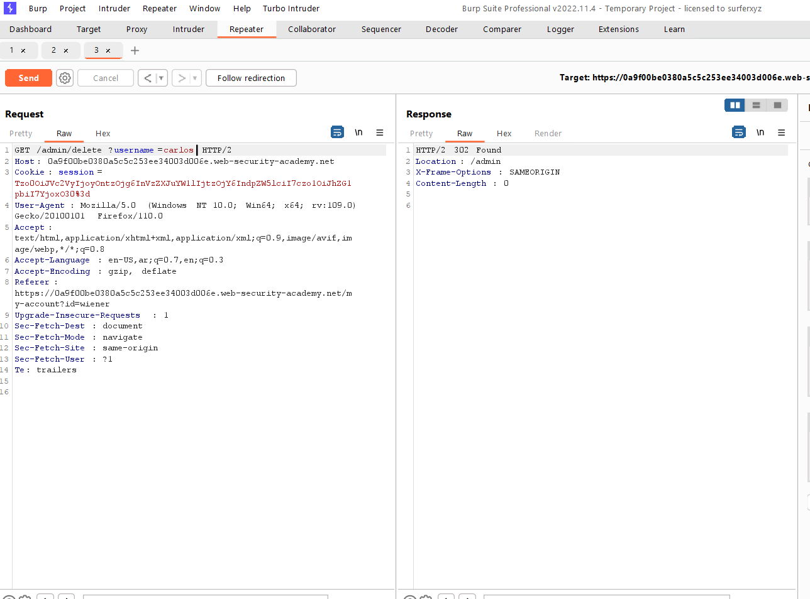
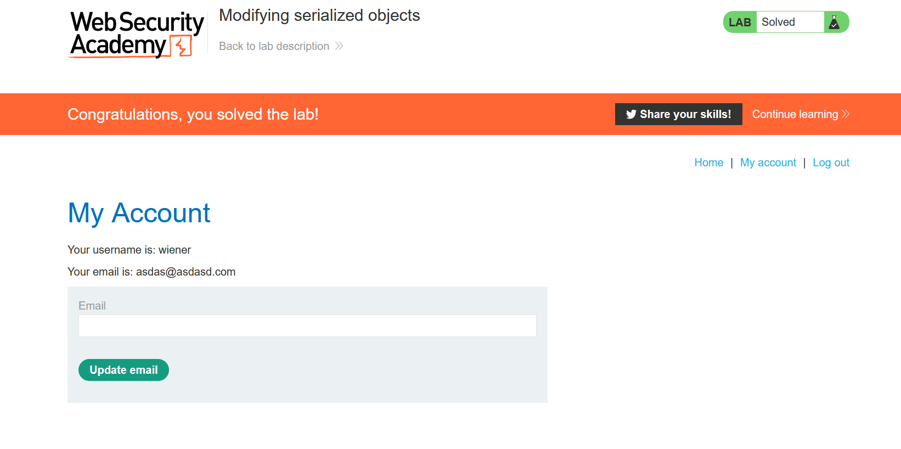

# Lab: Modifying serialized objects

**Link**: https://portswigger.net/web-security/deserialization/exploiting/lab-deserialization-modifying-serialized-objects

**Solution**:

In this lab, if we take the session string and decode it use URL encoding and then base64

  

We will see this object

  

Or we can use Burp inspector

  

we can modify it `b:0` (boolean: false) to `b:1` (admin:true) and encode it again

Edit the cookies and then `Apply Changes`

  

  

  

  

