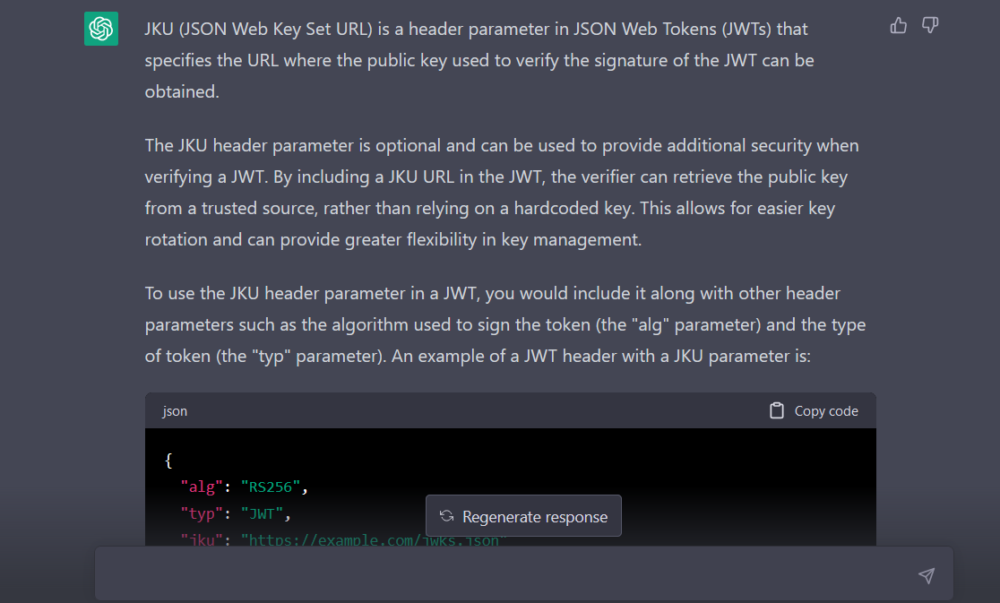
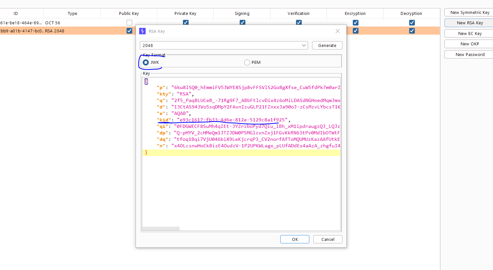
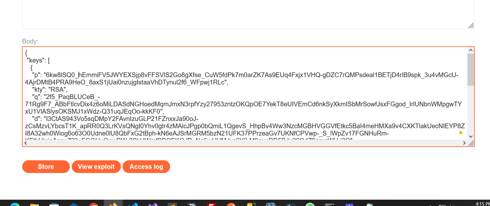

# Lab: JWT authentication bypass via jwk header injection

**Link**: https://portswigger.net/web-security/jwt/lab-jwt-authentication-bypass-via-jwk-header-injection

**Solution**:
In this lab, the web server supports the `jwk` parameter (this token is used by the server to verify the JWT token).

To solve it, we will create our own jwk and pass it to the request.

In JWT editors keys, create new RSA Key

  

In the request, Attack > Embedded JWT > Choose our created one.

  

  

  

